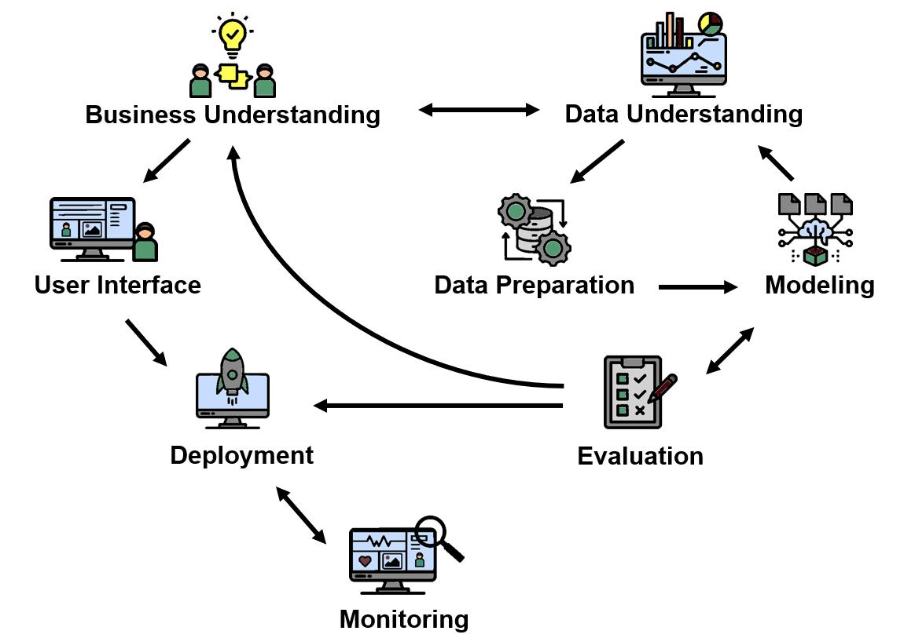

> **Navigation:** [<-- AI Ethics: A Primer](03-ethics-and-responsibility.md) | [Part Index](00-index.md) | [Main Index](../index.md) | [Academia vs. Business Data Science -->](05-academia-vs-business-ds.md)

---

# CRISP-DM

**Motivation**: Knowing what machine learning is does not tell you how a real project unfolds from first question to deployed result. Most tutorials start at modeling. But modeling is only one step in a longer process, and skipping the steps before and after it is one of the most common reasons data-science projects fail. You **don't** want projects to fail because the **process** was not right. 

> In this nugget you will get to know CRISP-DM (which stands for the handy _"Cross-Industry Standard Process for Data Mining"_). This process will be a good live orientation tool throughout your own project and data-science work. You'll learn the six standard CRISP-DM phases plus two useful extensions.

## Table of Contents

- [CRISP-DM: The Six Phases](#crisp-dm-the-six-phases)
- [The Inner Loop](#the-inner-loop)
- [Reading the Map as You Work](#reading-the-map-as-you-work)
- [Summary](#summary)

## CRISP-DM: The Six Phases

Most data-science tutorials start with a model. CRISP-DM starts before that, at the question.

**CRISP-DM** (Cross-Industry Standard Process for Data Mining) is a process framework introduced by Chapman et al. in 1999. It describes the full lifecycle of a data-mining or data-science project in six phases. The framework remains widely used in industry because it includes everything a project needs, not just the 'technically interesting' parts.

The phases do not run strictly in sequence. Most real projects loop back, sometimes multiple times. Let's review the phases.

### Business Understanding

> See [🖝 Part II](../part-02-ds-projects/00-index.md) in this course.

Here you define what you actually want to achieve.
- You identify the business or research objective,
- you assess the situation (available resources, constraints, risks),
- you translate the objective into a concrete data-mining goal
So essentially, you are doing some planning work.

> This phase answers the question: *What are we trying to do, and is it worth it?*

This phase is arguably the most important phase of all.

If you don't like to think of it exclusively as _business_ understanding, consider to replace business by _problem_ (I do prefer this framing).

### Data Understanding

> See [🖝 Part III](../part-03-data-understanding/00-index.md) in this course.

Data understanding is where you collect initial data and begin exploring it. You describe what you have, look for quality issues, and ask whether the data can support the goal you defined. Many projects discover at this stage that the original question needs adjusting.

### Data Preparation

> See [🖝 Part IV](../part-04-data-preparation/00-index.md) in this course.

Data preparation covers everything needed to turn raw data into a form a model can use: selecting relevant attributes, cleaning errors and missing values, constructing new features, integrating multiple sources, and formatting the result. In practice, this phase consumes more time than any other.

### Modeling

> See TBD.

Modeling is where you select and apply techniques, build models, and assess them against the test design established earlier. This is the phase most people picture when they hear "machine learning."

### Evaluation

> See TBD.

Evaluation is not a single check at the end. You evaluate the model against the original business objectives, review the whole process for overlooked steps or flawed assumptions, and decide whether to deploy, iterate further, or stop.

### Deployment

> See TBD.

The deployment turns a model into something useful. Depending on the project, this might mean a written report, a dashboard, an automated alert system, or a fully integrated production service.

### Bonus: Interfaces, Integration, Monitoring

The standard phases of CRISP-DM are already comprehensive. Nonetheless, I like to make to additional phases explicit because they are imporant to keep in mind when building systems.

#### Interface Design & Integration

Models and systems rarely work in isolation.
- When a deployed system directly interacts with  humans, it needs a user interface (UI). You want a good user experience: worth keeping in mind. Beyond the design itself it requires user testing and feedback mechanisms.
- even if a model does not directly interact with humans, it likely has to be embedded in a larger system

#### Operating Time (including Monitoring)

This covers what happens after deployment: monitoring model performance over time, tracking data drift, updating maintenance procedures, collecting user feedback, and retraining the model when necessary. A model that is not monitored will eventually fail silently.

---

## The Inner Loop

Traditionally, most day-to-day iteration in a data-science project happens inside an inner shorter loop that remains anchored to Business Understanding:

> The **inner** loop produces the model. The **outer** cycle determines whether it is the right model for the right reason.

The **inner loop** consists of Data Understanding, Data Preparation, and Modeling/Evaluation. You iterate through this loop repeatedly within a single project: explore the data, prepare it, train a model, evaluate it, revise the preparation, retrain, re-evaluate. Each iteration produces either a better model or a clearer understanding of what the data can and cannot support. 

> Inner-loops insights and actions should never be disconnected from Problem/Business Understanding.

Business Understanding and Deployment frame the inner loop from the outside. They are not where the repeated iteration happens, but they are what give the iteration its purpose. As we noted in [🖝 AI Ethics: A Primer](../part-01-the-big-picture/03-ethics-and-responsibility.md), keeping the work of building a model aligned with the actual objective is *always* a challenge. The outer cycle is the process-wise answer to that challenge.

---

## Reading the Map as You Work

The CRISP-DM map should be considered a live orientation tool, not an administrative formality.

- When you are deep in data preparation and losing sight of the goal, the map reminds you that the question was defined in **Business Understanding**.
- When your evaluation results are disappointing, the map suggests checking whether **Data Understanding** was thorough enough before you add model complexity.
- When a project is declared "done" but no one has thought about what happens after deployment, the map shows you that planning monitoring and maintenance were skipped.

Throughout this course, we'll revisit the process map. In fact, it defines the major parts of the course.

Return to this map whenever you feel lost in a project. It helps answer the question:

> Which phase am I in, and what does that actually require of me right now?

That question has a practical follow-up: *Which phases are actually yours to own?* The answer is not the same for everyone, and it depends heavily on the context you work in. We'll examine this next in the [🖝 Academia vs. Business Data Science](../part-01-the-big-picture/05-academia-vs-business-ds.md) nugget.

---

## Summary

- CRISP-DM defines six standard phases: Business Understanding, Data Understanding, Data Preparation, Modeling, Evaluation, and Deployment.
- Two additional phases extend the framework: Interface and Integration Design and Operating Time/Monitoring for deployed systems that must be maintained.
- The inner data-science loop from Data Understanding to Modeling/Evaluation is where much day-to-day iteration happens. Business Understanding and Deployment frame it from the outside and give it purpose.
- Use the CRISP-DM map as a live orientation tool throughout project work.

As always: Happy learning, happy life! 🫶

---

> **Navigation:** [<-- AI Ethics: A Primer](03-ethics-and-responsibility.md) | [Part Index](00-index.md) | [Main Index](../index.md) | [Academia vs. Business Data Science -->](05-academia-vs-business-ds.md)

Script v1.3 (2026-06-09) · FGN
