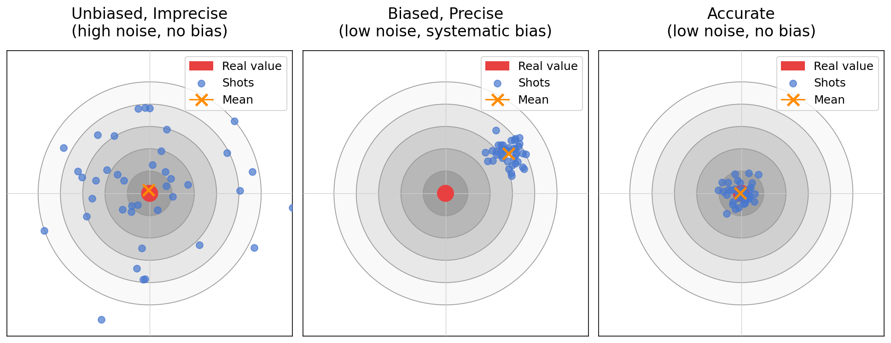
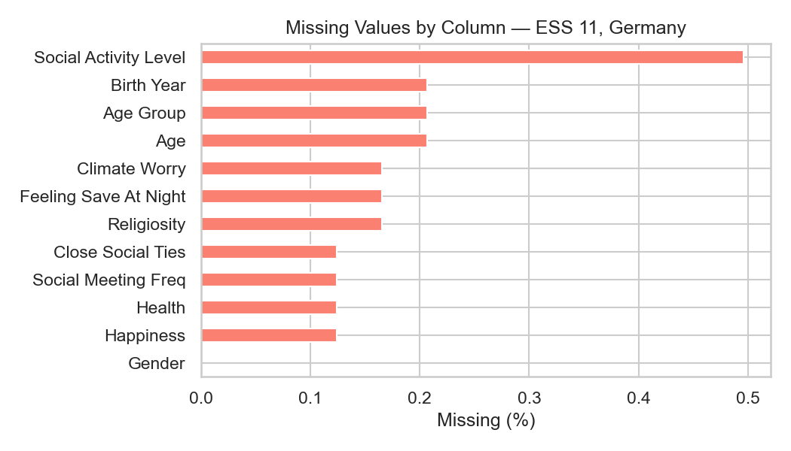

> **Navigation:** [<-- EDA: Descriptive Statistics](04-eda-descriptive-stats.md) | [Part Index](00-index.md) | [Main Index](../index.md) | [EDA: Distributions -->](06-eda-distributions.md)

---

# EDA: Data Quality

**Requires**: [EDA: Descriptive Statistics](04-eda-descriptive-stats.md)

**Motivation**: Summary statistics and first inspection give you the shape of the data. But numbers that appear in a column are not necessarily correct numbers. This nugget asks: what can go wrong at the level of individual measurements, records, and the collection process itself — and how do you recognize it?

> You will learn to classify data quality problems by their source — measurement errors, collection errors, and application-level concerns — and understand the key distinction between random and systematic missingness, which determines what handling strategy is appropriate.

## Table of Contents

- [Measurement and Collection Errors](#measurement-and-collection-errors)
- [Missing Values](#missing-values)
- [Application-Level Concerns](#application-level-concerns)
- [Summary](#summary)

## Measurement and Collection Errors

### Measurement errors

Measurement error arise during the measurement process. For a continuous attribute, it is the numerical difference between the measured value and the true value. Two subtypes matter in practice:

- **Noise**: This is the random component of measurement error. A temperature sensor that fluctuates around the true value by ±0.5°C produces noise. Noise in a single measurement can often not be avoided. Averaging repeated measurements can reduce it.

- **Artifacts**: These are deterministic (non-random) deviations. A camera that always produces a bright streak at the same pixel position introduces a systematic distortion. Averaging won't help here.

The following related concepts describe the costs of measurement errors:

- **Precision**: the closeness of repeated measurements to one another. High noise means low precision.
- **Bias**: systematic variation from the true value. A scale that reads 500 g too heavy every time is precise but biased.
- **Accuracy**: the closeness of measurements to the true value. Requires both low noise and low bias.

Here's a "dartboard" for illustration.

### Data collection errors

Next, we have data collection errors. Unlike measurement errors, they arise from failures in the collection process: omitting records that should be present, or including records that should not be.

> Data collection errors are harder to detect because they often leave no direct trace in the data.

Other types of quality problems that should be spotted include:

- **Inconsistencies**: These can range from attribute values contradict another value (like a city name that does not match its zip code). Typos and mismatched units can also cause inconsistencies that need fixing.

- **Duplicate records** are two or more records representing the same real-world entity. They inflate counts and bias statistics. When two records differ only in one or two fields, special attention may be needed: Were there data entry errors? Were datasets with different identifiers merged?

> **Note:** Some apparent duplicates are not duplicates at all. Two customers at the same address are not the same person. Verify the business logic before deleting any record. Same for editing data to fix an apparent inconsistency.

---

## Missing Values

Missing values are nearly universal in real datasets. The `count` row in `df.describe()` is your first check: it shows the number of non-null values per column (see [🖝 EDA: Descriptive Statistics](../part-03-data-understanding/04-eda-descriptive-stats.md)). Any column where count falls below the total row count contains missing values. But `df.describe()` does not always make this visible at a glance. A column can have an apparently normal mean and standard deviation and still carry 15% missing data you have not noticed. 

When there are many variables, a dedicated missing-value plot is an option. Here's one for a few variables from the ESS dataset. There are only few missing values for most columns (note the x-axis shows only a small range below 1%).

Understanding *why* values are missing matters more than just knowing how many are missing. The main question is whether missing values are random or systematic:

* **Random**: Missingness is unrelated to any variable. A sensor randomly dropping readings is random missing data. The remaining data is still representative. No bias.
* **Systematic**: Missingness depends on other variables (e.g., older respondents skip income questions) or on the missing value itself (e.g., high earners skip income questions). 

> Systematic missingness biases your results, which requires careful consideration. 

Handling strategies for missing values, including deletion and various forms of imputation, are covered in [🖝 Scaling and Imputation](../part-04-data-preparation/03-scaling-imputation.md).

---

## Application-Level Concerns

Some data quality problems have nothing to do with everything discussed so far, but with whether the data fits the intended use.

- **Timeliness**: Data ages. Customer behavior recorded three years ago may no longer reflect current patterns. Check when the data was collected and whether the underlying phenomenon could have shifted since then.

- **Relevance**: The data must contain the right attributes to answer the question. Predicting car accident rates without age or driving-experience information is unlikely to produce a useful model, regardless of how clean the data is.

- **Sampling bias**: The sample may not represent the population you care about. A voluntary survey reaches people who choose to respond, which systematically underrepresents disengaged groups. This is not a measurement error in individual records. It is a structural problem in how the data was gathered (survey like ESS take greate care to avoid this kind of bias).

Another concern is that well-maintained data is that of documentation.

> Good data should come with a **data card** (sometimes called a datasheet). This is a document that records _what_ was collected, by _whom_, _when_, under _what_ conditions, and for _what_ original purpose. Before trusting a dataset, check whether documentation exists and whether the original collection context matches your intended use.

---

## Summary

- Measurement errors include noise (random, can be averaged out) and artifacts (systematic, cannot). Precision, bias, and accuracy describe different ways measurement can fail.
- Data collection errors introduce omissions or inappropriate inclusions. Inconsistencies and duplicate records are structural quality problems that require domain knowledge to resolve.
- The `count` row in `df.describe()` is your first missing-value check. MCAR, MAR, and MNAR patterns determine which handling strategy makes sense. Strategies are covered in Part 4.
- Application-level concerns, including timeliness, relevance, sampling bias, and data documentation, determine whether data is fit for purpose regardless of its technical cleanliness.

As always: Happy learning, happy life! 🫶

---

> **Navigation:** [<-- EDA: Descriptive Statistics](04-eda-descriptive-stats.md) | [Part Index](00-index.md) | [Main Index](../index.md) | [EDA: Distributions -->](06-eda-distributions.md)

Script v1.1 (2026-05-18) · FGN
