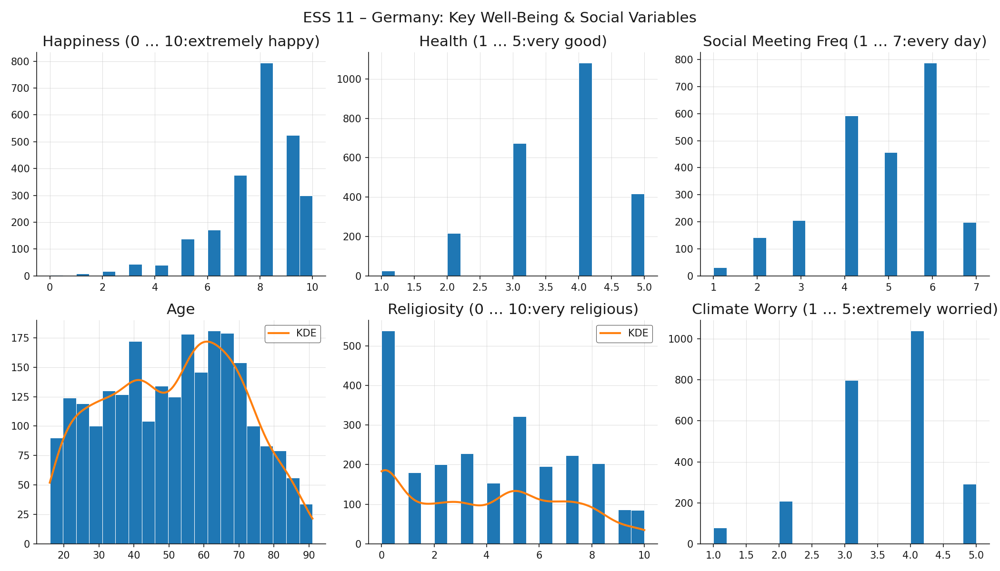
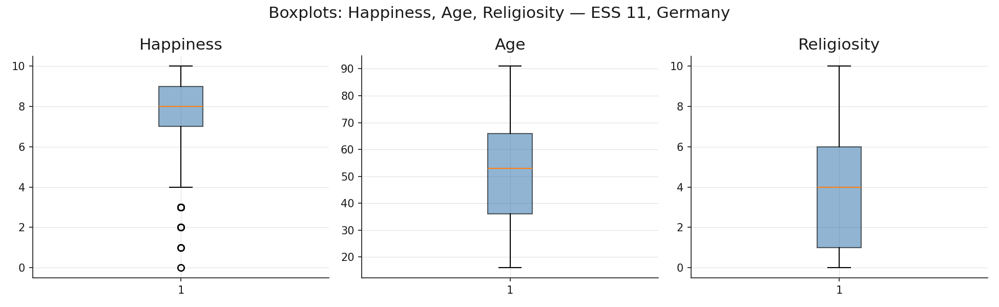
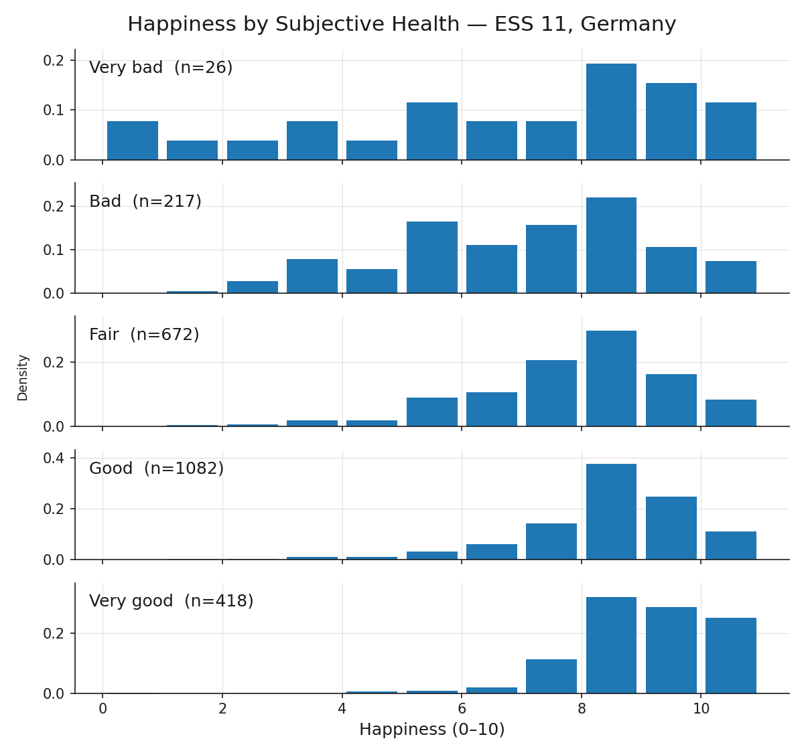

> **Navigation:** [<-- EDA: Data Quality](05-eda-data-quality.md) | [Part Index](00-index.md) | [Main Index](../index.md) | [EDA: Correlations -->](07-eda-correlations.md)

---

# EDA: Distributions

**Requires**: [EDA: Descriptive Statistics](04-eda-descriptive-stats.md)

**Motivation**: Summary statistics as from [🖝 EDA: Descriptive Statistics](../part-03-data-understanding/04-eda-descriptive-stats.md) compress a whole column into a handful of numbers. Now, two columns with the same mean and standard deviation can look completely different when plotted. So what does the actual shape of your data look like? Moreover, what might that shape tell you about the data and how it was collected?

> In this nugget, you'll learn to visualize distributions with histograms and boxplots, characterize their shapes (symmetric, skewed, bimodal), and distinguish genuine extreme observations from data artifacts. This gives you tools to decide whether an outlier warrants investigation, transformation, or retention.

## Table of Contents

- [Histograms and Distribution Shapes](#histograms-and-distribution-shapes)
- [Boxplots and Outliers](#boxplots-and-outliers)
- [Comparing Distributions Across Groups](#comparing-distributions-across-groups)
- [Summary](#summary)

## Histograms and Distribution Shapes

The first question to answer about any column is: what values does it actually contain, and how are they distributed? Summary statistics from `df.describe()` give you a starting point, but a single mean and standard deviation can describe two completely different distributions. We can use _histograms_ to make the actual shapes _visible_.

A **histogram** groups values into equally spaced intervals called bins and shows how many observations fall in each. **Bin width** is the main choice: too few bins hide structure; too many amplify noise.

Plotting many variables at once gives a rapid overview of them, here for some variables of the ESS well-being data:

For two variables, age and religiosity, there's also a smooth curve overlayed. This is a so-called kernel density estimate (KDE), which can be used if the right bin width is unclear (it makes less sense for data that has few values anyway).
Now let's take a look at what shapes we find in these plots:

- **Normal (bell curve)**: symmetric, with mean, median, and mode at the center and equal-weight tails on both sides. Many physical measurements approximate this when errors are random and independent. None of the ESS variables here follow it closely: this also tells us something.
- **Left-skewed (negative skew)**: a long tail extends to the left, pulling the mean below the median. **Happiness** follows this pattern: most respondents rate themselves fairly happy (7–9), with few in the lower range. The skew reflects something real about the German population, but it also means the lower end of the scale is data-sparse.
- **Right-skewed (positive skew)**: the opposite direction. Income and house prices are classic examples.
- **Uniform**: values are roughly equally frequent across the range. **Age** is close to uniform across the adult range. This is unusual for a population sample. It might signal quota sampling rather than purely random selection for the ESS survey.
- **Modality of distributions**: If distributions have more than one  distinct peak, it often signals that there are subpopulations pooled into one variable. For example, the histogram of **religiosity** contains two peaks, one at zero (secular), and a secondary mode around 5 (bimodal). This may be more of a meaningful divide rather than a skew. Distributions with three or more peaks (**multimodal**) prompt the same question: are there meaningful subpopulations present?

Distribution shapes raise questions not just about the numbers, but about how the data was collected and what the underlying reality looks like.

> **Discussion:** What would an unexpected distribution shape in a variable tell you about how the data was collected, or about what the underlying reality looks like?

---

## Boxplots and Outliers

A boxplot encodes the **five-number summary** (minimum, Q1, median, Q3, maximum) as a compact visual. You computed these quantities with `df.describe()` in [🖝 EDA: Descriptive Statistics](../part-03-data-understanding/04-eda-descriptive-stats.md). The boxplot makes them spatial.

The **box** spans from Q1 to Q3, covering the middle 50% of the data. This span is the **interquartile range (IQR)**. The **line inside the box** is the median. The **whiskers** extend from Q1 down to $Q1 - 1.5 \times \text{IQR}$ and from Q3 up to $Q3 + 1.5 \times \text{IQR}$, or to the furthest observed data point within those bounds, whichever is closer. Points beyond the whiskers are plotted individually as potential outliers.

Religiosity shows the widest spread and the most pronounced skew. The boxplot for happiness confirms the left skew seen in the histogram: the median sits closer to the top of the box than the bottom. Boxplots are compact enough to place several side by side for comparing spread across variables or groups.

### Investigating Outliers

The IQR criterion flags values as potential outliers. That flag is a starting point for investigation, not a verdict.

Two levels of outlier exist. A **data-object outlier** is an entire record that is unusual across several attributes simultaneously. A respondent with age 19, household income of €800,000, and 12 dependents is unusual as a whole, even if each individual value might be technically possible. These often signal data-entry errors or record-linkage mistakes.

An **attribute-value outlier** is a single value in one column that is extreme relative to the rest of that column. A weight of $-5$ kg is an impossible attribute-value outlier caused by a data-entry error. An income of €2,000,000 in a general-population survey may be a genuine extreme value.

An outlier is not automatically an error. Two questions guide the assessment.

- First, is the value **physically or logically possible**? Negative heights, ages above 150, and percentages above 100 are certainly errors.
- Second, is the value a **legitimate extreme observation** or a **measurement artifact**? A religiosity score of 10 in a predominantly secular population is surprising but real. A happiness score recorded as 99 when the scale runs 0–10 is most likely a sentinel value or an encoding error.

When you identify an outlier, decide among three responses: **investigate** (check the source data or collection process), **transform** (apply a log transformation or winsorization to reduce the influence of extremes), or **retain** (document it and proceed, especially when the value is genuine and the model should see it).

---

## Comparing Distributions Across Groups

Histograms and boxplots show the distribution of a variable across all records combined. Sometimes it is also interesting to see how the distribution of variable behaves in sub-populations obtained by grouping via the values of another variable.

**Faceted histograms** produce one histogram per group, arranged in a grid with a shared x-axis so that shapes are directly comparable. Here is an example of the happiness distribution after grouping the whole population by their indicated health values.

Based on the grouping value, the happiness distribution is shifting. Group differences, like the shift in center, spread and shape observed here, indicate an association between the variables. Group comparisons are therefore a natural bridge from distribution analysis to correlation analysis, which we will check out next: [🖝 EDA: Correlations](../part-03-data-understanding/07-eda-correlations.md).

---

## Summary

- Histograms reveal distribution shape; bin width is the main choice.
- A boxplot encodes the five-number summary spatially. The IQR criterion ($\pm 1.5 \times \text{IQR}$ from Q1/Q3) flags potential outliers for investigation, not automatic removal.
- Assess whether an outlier is a genuine extreme observation or an artifact, then decide whether to investigate, transform, or retain.
- Faceted histograms split a distribution by a categorical variable and reveal differences between groups.

As always: Happy learning, happy life! 🫶

---

> **Navigation:** [<-- EDA: Data Quality](05-eda-data-quality.md) | [Part Index](00-index.md) | [Main Index](../index.md) | [EDA: Correlations -->](07-eda-correlations.md)

Script v1.4.1 (2026-06-23) · FGN
