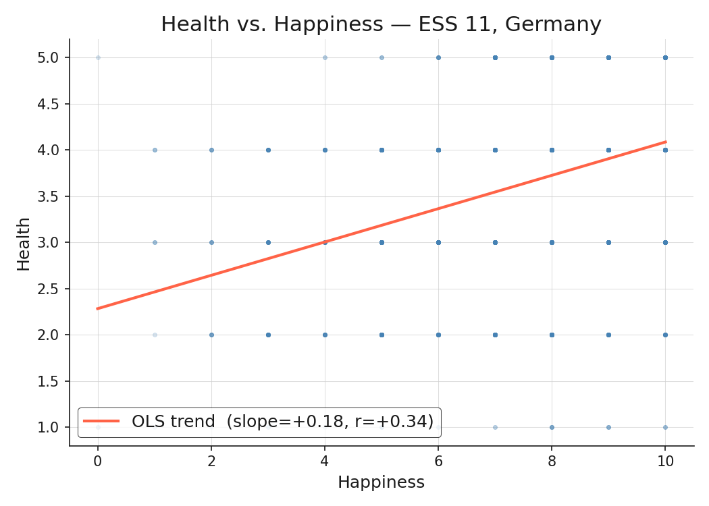
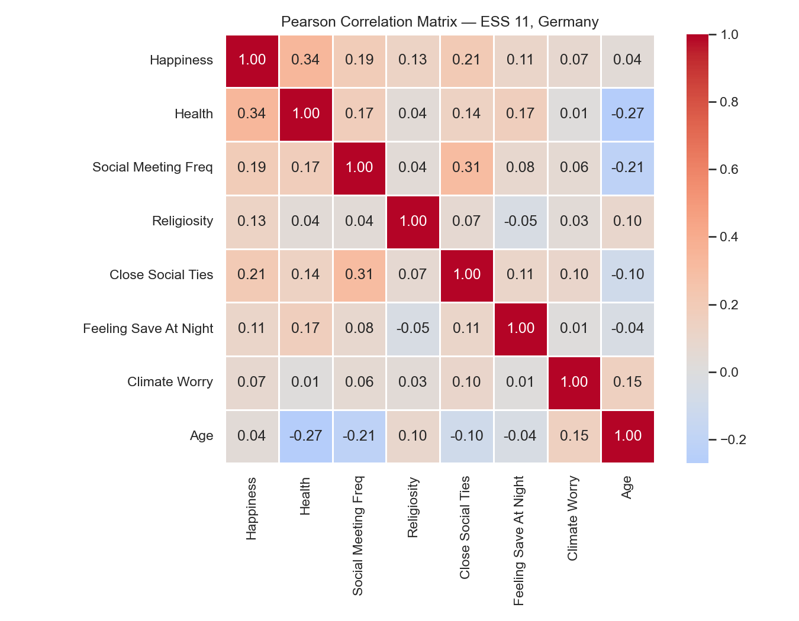
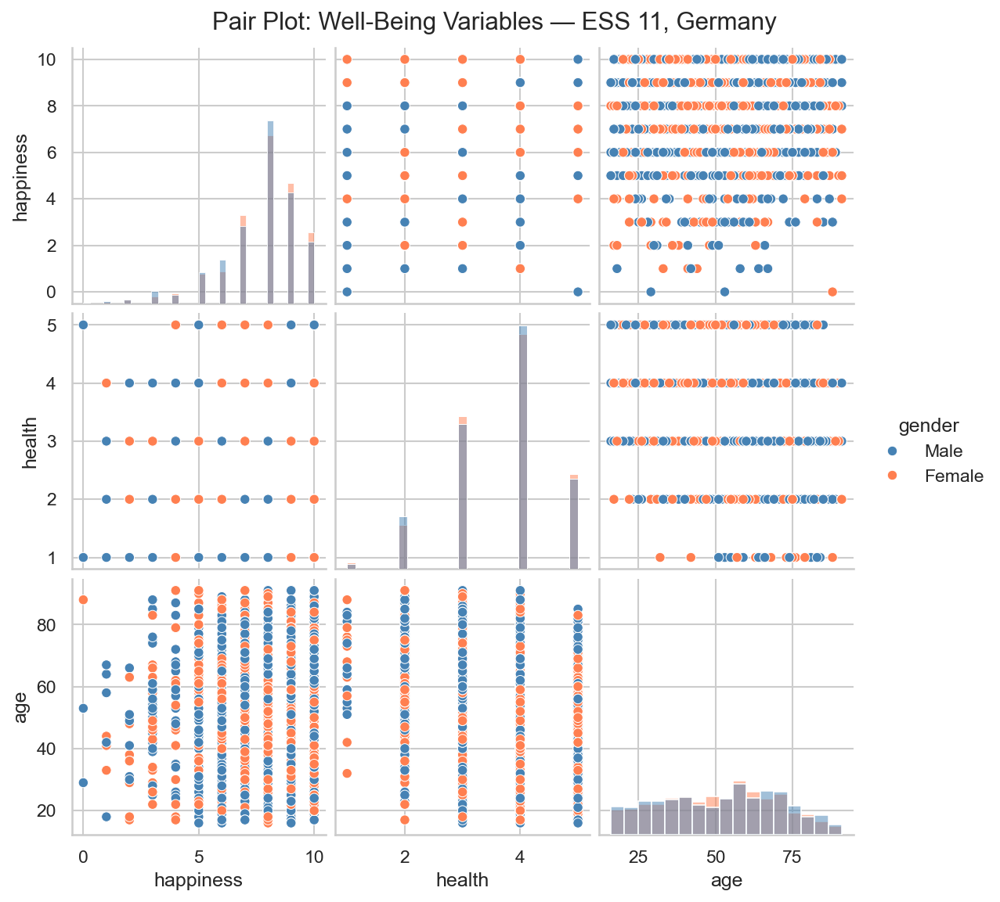

> **Navigation:** [<-- EDA: Distributions](06-eda-distributions.md) | [Part Index](00-index.md) | [Main Index](../index.md) | [Data Understanding: Best Practices -->](08-eda-best-practices.md)

---

# EDA: Correlations

**Requires**: [EDA: Distributions](06-eda-distributions.md)

**Motivation**: Histograms and boxplots describe each variable in isolation. But the interesting questions in data science are often relational: do people who rate their health higher also tend to report more happiness? Does age relate to climate worry? Does social contact matter for well-being? Answering these questions requires tools for examining **interactions** of variables.

> In this nugget you will learn to read and construct scatter plots and pair plots for exploring pairwise relationships, quantify those relationships with Pearson correlation, and know when Spearman is the better choice.

## Table of Contents

- [Scatter Plots](#scatter-plots)
- [Pearson Correlation](#pearson-correlation)
- [When Pearson Is Not Enough](#when-pearson-is-not-enough)
- [Pair Plots](#pair-plots)
- [Summary](#summary)

## Scatter Plots

The first tool is the **scatter plot**: each observation is drawn as a point, with one variable on the horizontal axis and the other on the vertical axis. This gives a cloud of points that reveals structure of the joint distribution.

The orange trend line is added - it's a simple linear fit between happiness and self-rated health that shows a positive trend.

> A scatter plot is most useful for numeric/continuous data. In this example, we have discrete/ordinal data from our ESS data set. We can still use a scatter plot, but some values will be plotted on top of each other.

In Python you can use `plt.scatter(x_var, y_var, ...)` from `matplotlib` to draw a scatter plot.

Reading a scatter plot: look for direction (do points slope up or down?), clusters (are there distinct subgroups that diverge from the overall trend?), outliers (isolated points far from the main cloud), and shape (linear, curved, or absent). TODO: continuous data example

<!-- The relationship is: slope = r × (std_health / std_age). The Pearson r is the slope you'd get if both variables were z-scored first. The sign and direction of the trend line are fully determined by r, just rescaled to the raw units of the axes.-->

---

## Pearson Correlation

A scatter plot shows the full picture, but browsing dozens of scatter plots for a large dataset is impractical. That's why we have the **Pearson correlation coefficient** $r$. It's a single number that summarizes the strength and direction of the linear relationship between two numeric variables:

$$r = \frac{\sum_{i=1}^{n}(x_i - \bar{x})(y_i - \bar{y})}{\sqrt{\sum_{i=1}^{n}(x_i - \bar{x})^2} \cdot \sqrt{\sum_{i=1}^{n}(y_i - \bar{y})^2}}$$

where $\bar{x}$ and $\bar{y}$ are the sample means. The numerator computes the covariance (unnormalized shared variation), and the denominator divides by the product of the standard deviations of both variables (see [🖝 EDA: Descriptive Statistics](../part-03-data-understanding/04-eda-descriptive-stats.md)).

> Intuitively, Pearson's $r$ computes correlation of both variables _after_ making them comparable via normalization.

The coefficient ranges from $-1$ to $+1$. A value..

* near $+1$ means the two variables increase together,
* near $-1$ means one increases as the other decreases,
* near $0$ means no linear relationship is detectable.

For practical EDA work, values above $0.3$ or below $-0.3$ are often worth investigating further, though what counts as "strong" depends on the domain. For the happiness–health scatter plot above, $r \approx +0.34$.

>  Correlation identifies pairs worth investigating. It does **not** establish causation.

A **correlation heatmap** extends pairwise correlation to all variable pairs simultaneously, representing each coefficient as a color cell.

Reading this heatmap for the ESS well-being data:

- **Happiness and health**: $r = +0.34$, the strongest signal in the dataset. Respondents who rate their health higher also tend to report higher happiness.
- **Social meeting frequency and happiness**: $r = +0.19$, a moderate positive association.
- **Age and climate worry**: a negative association, suggesting older respondents report less concern about climate.
- Most pairs cluster near zero, indicating limited linear dependence among the remaining variables.

Again: Correlation is a hypothesis starter, not a conclusion. A high $r$ value says two variables move together. It says nothing about which causes the other, or whether both are driven by an unmeasured third variable. This all too often confused!

---

## When Pearson Is Not Enough

Pearson correlation can sometimes be misleading:

- **Non-linearity**: Pearson only measure linear relationship. The same value $r$ can be obtained by all kinds of non-linear relationships (see this [wonderful demo](https://www.research.autodesk.com/publications/same-stats-different-graphs/)). Scatter plots are better at revealing non-linear relationships.

- **Outlier sensitivity**: Pearson is computed on raw values, so a single extreme point can strongly influence $r$.

- **Ordinal variables**: Pearson assumes that the intervals between scale points are equal. For ordinal variables such as the ESS health rating (1 = very bad, 5 = very good), the assumption that the gap between 1 and 2 equals the gap between 4 and 5 is not guaranteed.

### Spearman rank correlation

**Spearman rank correlation** addresses all three concerns. It replaces raw values with their rank orders and then applies the Pearson formula to those ranks. This makes it robust to outliers and appropriate for monotonic but non-linear relationships, as well as for ordinal data. The tradeoff is that Spearman discards information about the exact spacing of values: if intervals genuinely are equal, Pearson is more powerful.

| Situation | Preferred measure |
|---|---|
| Numeric variables, approximately linear, no strong outliers | Pearson |
| Ordinal variables | Spearman |
| Monotonic but non-linear relationship | Spearman |
| Outlier-heavy or heavily skewed data | Spearman |

---

## Pair Plots

For a dataset with several variables, a **pair plot** extends the scatter plot to all variable pairs at once. Single-variable histograms  appear along the diagonal; scatter plots occupy the off-diagonal cells.

For a dataset with three to ten variables, a pair plot gives a complete first look at pairwise structure in a single figure. Beyond - well it depends on the size of your screen.

> Use pair plots to identify which pairs are worth a closer scatter-plot examination and which heatmap cells carry real signal.

---

## Summary

- Scatter plots reveal the joint distribution of two variables: direction, shape, clusters, and outliers that a single coefficient cannot capture.
- Pearson correlation $r$ quantifies the strength and direction of the linear relationship. A heatmap shows all pairwise coefficients simultaneously.
- Spearman rank correlation is often better for ordinal variables, monotonic non-linear relationships, and outlier-heavy data.
- Pair plots extend scatter plots to multiple variable pairs at once.
- Correlation identifies pairs worth investigating. It does **not** establish causation.

As always: Happy learning, happy life! 🫶

---

> **Navigation:** [<-- EDA: Distributions](06-eda-distributions.md) | [Part Index](00-index.md) | [Main Index](../index.md) | [Data Understanding: Best Practices -->](08-eda-best-practices.md)

Script v1.1 (2026-05-18) · FGN
