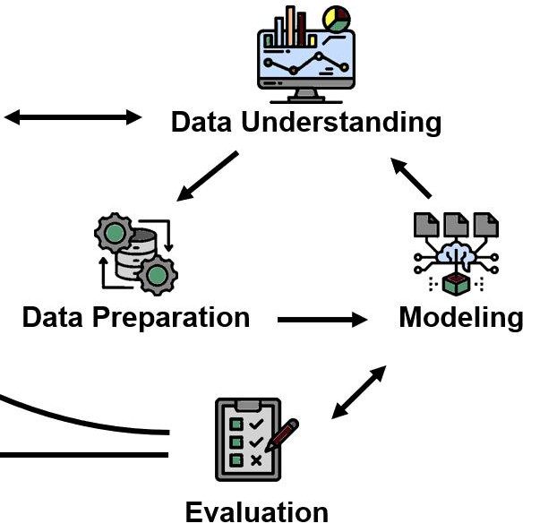

> **Navigation:** [Part Index](00-index.md) | [Main Index](../index.md) | [Linear Regression -->](02-linear-regression.md)

---

# Supervised Learning

**Motivation**: After exploratory data analysis and various data preparation steps, you'll naturally want to "ask" the data to predict something now. Yes, we'll start modeling now. Just before, it pays to get the framing right: What exactly does the model learn? What do you hand it in, and what do you expect back out?

> In this nugget you will learn what makes a learning problem "supervised", how to distinguish regression from classification, and where these tasks sit in the CRISP-DM inner loop. The vocabulary here is the shared language of every subsequent nugget in this part.

## Table of Contents

- [The Prediction Contract](#the-prediction-contract)
- [Regression vs. Classification](#regression-vs-classification)
- [CRISP-DM: The First Inner-Loop Pass](#crisp-dm-the-first-inner-loop-pass)
- [Summary](#summary)

## The Prediction Contract

**Supervised learning** is a form of machine learning where the model learns from labeled examples. Each example in the training set consists of two parts:

- **Features** (also called inputs, attributes, or the feature matrix $X$): the information the model receives. In the ESS dataset, features might be age, self-rated health, or frequency of social contact.
- **Target** (also called the label, output, or response variable $y$): the quantity the model must learn to predict. For regression, $y$ is a number (happiness score on a 0–10 scale). For classification, $y$ is a category (support EU membership yes/no).

The "supervision" in supervised learning comes from those known target values. During training, the model sees both $X$ and $y$ from the training data and adjusts its internal parameters to minimize prediction error. After training it receives only $X$ for new, unseen observations and must infer $y$. So, for any held-out/ test data, the model never sees its labels during training.

Let's now introduce the two main families of supervised models.

---

## Regression vs. Classification

The output type determines which supervised family you are in.

**Regression** predicts a continuous numeric value. The target can be any real number within a range.
Examples:

- Predicting a respondent's happiness score from their age, health, and social circumstances.
- Forecasting tomorrow's temperature from today's pressure and wind data.
- Estimating the load on a structural component from sensor readings.

**Classification** predicts a discrete category. The target is one of a fixed set of class labels.
Examples:

- Predicting whether a respondent supports EU membership (yes / no).
- Deciding whether an email is spam or not.
- Diagnosing whether a sensor vibration pattern indicates a machine fault (fault / normal).

For reference, here's an overview of both supervised learning families:

| | Regression | Classification |
|-|-----------|---------------|
| Output type | Continuous number | Discrete category |
| Evaluation metrics | MSE, RMSE, R² | Accuracy, precision, recall, F1:  [🖝 Classification Evaluation](../part-05-supervised-learning/08-classification-evaluation.md) |
| Typical algorithms | [🖝 Linear Regression](../part-05-supervised-learning/02-linear-regression.md) | [🖝 Decision Trees](../part-05-supervised-learning/09-decision-trees.md), [🖝 Support Vector Machines](../part-zz-appendix/06-support-vector-machines.md), [🖝 Logistic Regression](../part-zz-appendix/03-logistic-regression.md) |

The line between regression and classification can sometimes blur. Ordinal ratings (1–5 Likert scale) sit somewhere between the two, and many algorithms handle both. When in doubt, ask: does the distance between output values carry meaning? A happiness score of 8 is meaningfully more than 6. A category label "supported" is not numerically greater than "not supported".

> **Discussion:** You are building a model to flag patients who may be at risk of a medical condition. Would you frame this as regression or classification? What would you choose as the target variable, and what are the trade-offs of each framing?

---

## CRISP-DM: The First Inner-Loop Pass

From [🖝 CRISP-DM](../part-01-the-big-picture/04-crisp-dm.md), you'll recall that the Data, Modeling and Evaluation phases form a tight inner loop: prepare data, fit a model, measure its performance, adjust, and repeat. Within this part of the course, we "complete" that inner loop for the first time.

You enter the inner loop after Data Preparation and exit it, for now, with models that have been evaluated and compared on held-out data.

The insights from evaluation may prompt you to revisit earlier phases: You may discover that a feature needs re-engineering, that your training data has a class-imbalance problem, or that the problem is better framed differently.

This is the **first pass**: breadth over depth. In the next part, we'll pause for some deeper reflection, see [🖝 Part VI: Principles That Transfer (Reflection)](../part-06-reflection/00-index.md).

---

## Summary

- Supervised learning trains on labeled examples: each training point has a known output (target).
- **Regression** predicts a continuous numeric value.
- **Classification** predicts a discrete category.
- The feature matrix $X$ carries the inputs; the target vector $y$ carries the outputs. The model learns the mapping from $X$ to $y$.
- This part completes the CRISP-DM inner loop (Data, Modeling and Evaluation Phases) for the first time.

As always: Happy learning, happy life! 🫶

---

> **Navigation:** [Part Index](00-index.md) | [Main Index](../index.md) | [Linear Regression -->](02-linear-regression.md)

Script v1.3 (2026-06-09) · FGN
