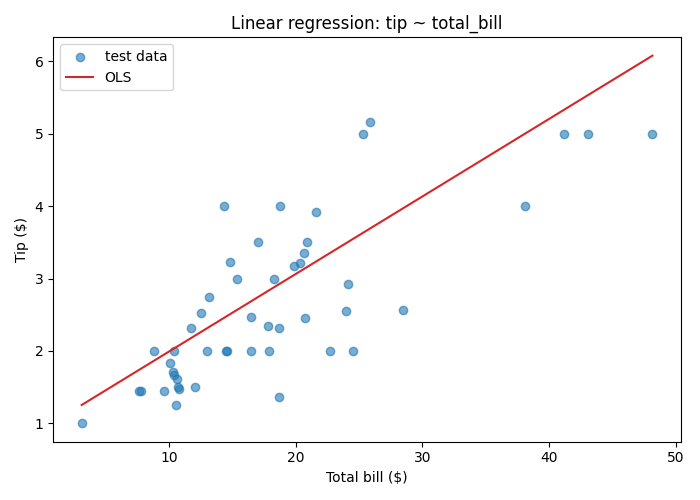
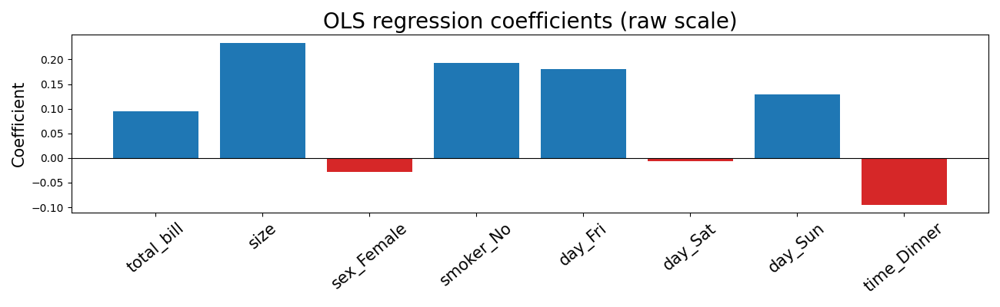
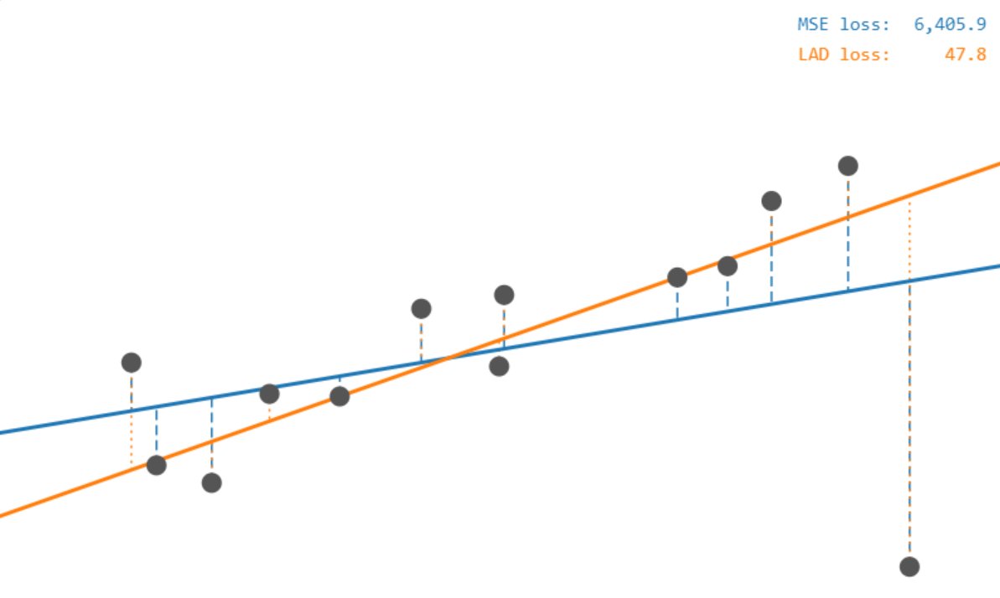

> **Navigation:** [<-- Supervised Learning](01-supervised-learning.md) | [Part Index](00-index.md) | [Main Index](../index.md) | [Gradient Descent -->](03-gradient-descent.md)

---

# Linear Regression

**Requires**: [Data Splits](../part-04-data-preparation/04-data-splits.md)

**Motivation**: Let's say you want to predict tips in a restaurant setting: larger bills tend to produce larger tips, but the relationship is not perfectly consistent. Group size, day of the week, and other factors all could play a role. Linear regression is the first tool for capturing that structure: it fits a line (or a hyperplane) through the data and uses it to make predictions.

> In this nugget you will learn how to fit a linear regression model to one or more input variables. You will see how the model's parameters are found by minimizing a loss function, and you will learn the standard metrics for evaluating a regression result.

> **Interactive demo note:** You can try everything explained here using the **Loss Functions** demo from my [✪ interactive data-science demos](https://github.com/fgnussbaum/ds-ml-interactive-demos) repository.

## Table of Contents

- [Fitting a Line: The Simplest Model](#fitting-a-line-the-simplest-model)
- [Choosing a Loss Function](#choosing-a-loss-function)
- [Evaluating Regression](#evaluating-regression)
- [Bonus: The Analytic Solution of OLS](#bonus-the-analytic-solution-of-ols)
- [Bonus: The Combinatorial Solution for LAD](#bonus-the-combinatorial-solution-for-lad)
- [Summary](#summary)

## Fitting a Line: The Simplest Model

Start with one input variable. In [🖝 EDA: Correlations](../part-03-data-understanding/07-eda-correlations.md) we considered pairwise correlations between features. Linear regression formalizes that relationship as a straight line:

With just one feature variable, the slope of the regression line is directly related to the Pearson correlation coefficient of feature and target variable. If both are standardized, they are the same.

The model for regression with just one input feature is:

$$h_{\mathbf{w}}(x) = w_0 + w_1 x.$$

Here, $x$ is the input `total bill`, $h_{\mathbf{w}}(x)$ is the predicted `tip`, $w_0$ is the intercept (constant offset), and $w_1$ is the slope of the line. Together, ${\mathbf{w}}=(w_0, w_1)$ are the **weights** the model learns. The subscript ${\mathbf{w}}$ in $h_w$ is a reminder that the hypothesis is parameterized by this vector ${\mathbf{w}}$. Now:

> **Linear regression** is the task of finding the weights $w$ that best fit the training data.

### From one variable to many

Many real prediction problems involve many features. For the tips dataset, useful inputs include total bill, group size, and categorical variables such as day of the week, recoded as binary indicator variables. The formula above generalizes naturally:

$$h_{\mathbf{w}}(\mathbf{x}) = w_0 + w_1 x_1 + w_2 x_2 + \cdots + w_k x_k.$$

Here, ${\mathbf{x}}=(x_1, \ldots, x_k)$: using **bold** notation for vectors. With $k$ input features the new equation defines a **hyperplane** in $k+1$ dimensions. The learning task remains the same: find the weights ${\mathbf{w}}=(w_0,\ldots, w_k)$ that minimize prediction error across the training set.
For many input features, visualizing the hyperplane is difficult, so we often describe it by the the learned weights/coefficients themselves:

---

## Choosing a Loss Function

To fit the model you need to define what "best fit" means. The standard choice for regression is the **mean squared error (MSE)**:

$$\text{MSE}(\mathbf{w}) = \frac{1}{n} \sum_{j=1}^{n} \bigl(y_j - h_\mathbf{w}(\mathbf{x}_j)\bigr)^2.$$

Each term $(y_j - h_\mathbf{w}(\mathbf{x}_j))$ is the **residual** for the $j$-th of $n$ observations: This is the gap between the actual `tip` and the model's prediction. Squaring the residuals achieves two things: negative and positive errors do not cancel, and large errors are penalized more heavily than small ones.

Training the model is now an optimization problem: find the weight vector $\mathbf{w}$ that minimizes the prediction error $\text{MSE}(\mathbf{w})$. For **ordinary least squares (OLS)**, setting the partial derivatives to zero yields an exact solution: see the bonus section below.

Closed-form solutions don't always exist, which then requires algorithms like [🖝 Gradient Descent](../part-05-supervised-learning/03-gradient-descent.md) that we discuss next.

---

There are usually several options for loss functions. MSE that we discussed so far sensitive to outliers: a single very large residual, once squared, can dominate the total. An alternative is **mean average error (MAE)**, which sums absolute residuals rather than squared ones:

$$\text{MAE}(\mathbf{w}) = \frac{1}{n} \sum_{j=1}^{n} \bigl|y_j - h_\mathbf{w}(\mathbf{x}_j)\bigr|.$$

MAE gives large errors the same linear weight as small ones, so outliers have less pull on the fitted line. You can try it in the **regression: loss functions** demo from [✪ interactive data-science demos](https://github.com/fgnussbaum/ds-ml-interactive-demos). This demo allows you to add/move points and see what happens with the fitted regression lines.

---

## Evaluating Regression

For evaluating a regression model, the workflow is to fit the model on the training set only (see previous nugget [🖝 Data Splits](../part-04-data-preparation/04-data-splits.md)), then compute the error on the held-out test set. That test-set error is your honest estimate of how the model generalizes.

**Mean Squared Error (MSE):** the average squared residual on the test set. Squaring ensures negative and positive errors do not cancel and penalizes large misses more than small ones.

$$\text{MSE} = \frac{1}{n_\text{test}} \sum_{j=1}^{n_\text{test}} (y_j - \hat{y}_j)^2$$

This is the same MSE used in the MSE loss function, now evaluated on the test set with the _learned_ weights.

**Root Mean Squared Error (RMSE):** $\sqrt{\text{MSE}}$. This restores the original unit. An RMSE of 0.90 on the tips dataset means predictions are off by about 90 cents on average. RMSE is the standard metric for reporting regression results to stakeholders.

> **Discussion 1:** Your regression model for restaurant tips achieves RMSE = $0.90. Is that a useful result? What would you need to know before answering?

**Coefficient of Determination (R²):** measures what fraction of the variance in the target is explained by the model:

$$R^2 = 1 - \frac{\sum_{j=1}^{n_\text{test}} (y_j - \hat{y}_j)^2}{\sum_{j=1}^{n_\text{test}} (y_j - \bar{y})^2} = 1 - \frac{\text{MSE}}{\text{Var}(y)}.$$

Here, the numerator represents the unexplained variance left in the residuals, and the denominator represents the total variance of the target.

A perfect model yields $R^2 = 1$, and the baseline model that always predicts the mean yields $R^2 = 0$. Negative values are possible when the model is worse than the mean baseline (see also [🖝 Baselines and the Good-Enough Bar](../part-06-reflection/03-baselines.md)). R² is unit-free, which makes it easy to compare models across different targets and scales.

> **Discussion 2:** Is trying to predict `tip` from `total_bill` really an interesting question? Or could there actually ba a far more interesting question? (Data science is about finding good questions: Here's one - can you spot it?)

See also [🖝 Regression: Interpretation and Assumptions](../part-zz-appendix/04-regression-depth.md) for additional details and aspects of evaluation.

---

## Bonus: The Analytic Solution of OLS

Recall the MSE loss from above:

$$\text{MSE}(\mathbf{w}) = \frac{1}{n} \sum_{j=1}^{n} \bigl(y_j - h_\mathbf{w}(\mathbf{x}_j)\bigr)^2.$$

Now, let's stack the $n$ training rows $\mathbf{x}_1, \ldots, \mathbf{x}_n$ into a matrix $\mathbf{X}$ (with a leading column of ones for the intercept) and the targets into a vector $\mathbf{y}$. Then, the optimal weights $\mathbf{w}^*$ that minimize MSE above are given by the analytic formula:

$$\mathbf{w}^* = (\mathbf{X}^\top \mathbf{X})^{-1} \mathbf{X}^\top \mathbf{y}.$$

Here, the matrix $\mathbf{X}^\top\mathbf{X} \in \mathcal{R}^{(k{+}1)\times(k{+}1)}$. It's $(i,j)$-th entry is the dot product of feature columns $i$ and $j$, so it encodes how features relate to each other, analogous to a covariance matrix, see [🖝 EDA: Correlations](../part-03-data-understanding/07-eda-correlations.md). For the inverse to exist, no feature may be a perfect linear combination of the others.

> As we discussed in [🖝 Structural Cleaning and Encoding](../part-04-data-preparation/02-cleaning-encoding.md), including all binary indicator  variables for a categorical feature violates this: one column is always the complement of the rest, making $\mathbf{X}^\top\mathbf{X}$ singular and the solution undefined. This is precisely why we drop one indicator column for categorical variables in regression.

---

## Bonus: The Combinatorial Solution for LAD

**Least absolute deviations (LAD)**
If you tilt or shift a candidate line slightly, every residual $r_j = y_j - h_\mathbf{w}(\mathbf{x}_j)$ changes smoothly, so $\sum |r_j|$ also changes smoothly: It decreases or increases at a "constant" rate. The only disruption comes when the line crosses a data point: This causes its residual to flip sign, and thereby the LAD loss changes its rate of change (intuively, the sign change causes this residual to contribute in the "other" direction).

The LAD loss is therefore **piecewise-linear**, with "kinks" only where the line passes through a data point, and the minimum always sits at one of those kinks. A line has two free parameters (slope and intercept), so the piecewise-linear loss surface has vertices where exactly two faces meet — two residuals are simultaneously zero — meaning **an optimal solution can always be found where the line passes through two data points**. You can find it in principle by checking all $\binom{n}{2}$ pairs and keeping the one with the smallest total absolute deviation.

**The equal-split condition** tells you when a candidate line is optimal: the points above and below must balance. Formally, the optimality condition is

$$\sum_{j=1}^{n} \operatorname{sgn}(r_j) = 0, \qquad \sum_{j=1}^{n} \operatorname{sgn}(r_j)\, x_j = 0.$$

The first equation says half the remaining points lie above the line and half below — the regression analogue of the median. The second adds a weighted balance: that split must also hold when points are weighted by their $x$-value, which pins down the slope.

---

## Summary

- Linear regression fits a weighted sum of features to a continuous target by minimizing MSE.
- The weights are the parameters the model learns. Training finds the weights that produce the lowest loss on the training data.
- Fit on the training set. Evaluate on the test set for an honest estimate of generalization error.

As always: Happy learning, happy life! 🫶

---

> **Navigation:** [<-- Supervised Learning](01-supervised-learning.md) | [Part Index](00-index.md) | [Main Index](../index.md) | [Gradient Descent -->](03-gradient-descent.md)

Script v1.3 (2026-06-09) · FGN
