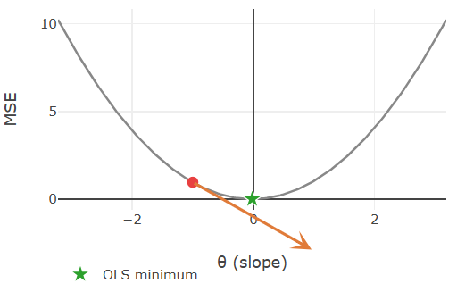
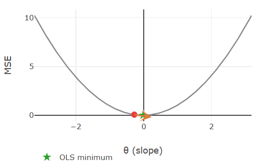
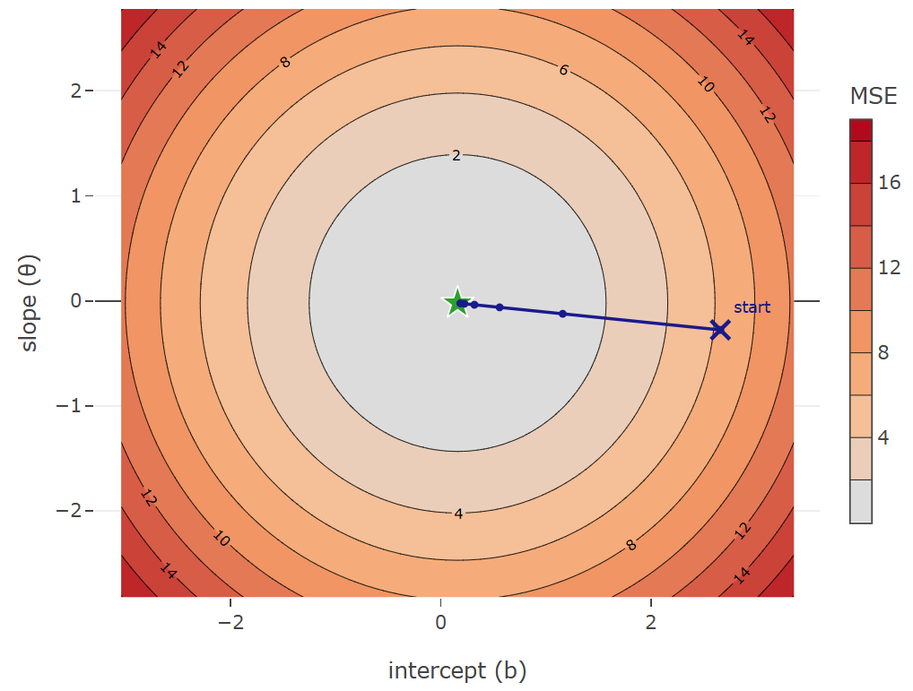

> **Navigation:** [<-- Linear Regression](02-linear-regression.md) | [Part Index](00-index.md) | [Main Index](../index.md) | [Underfitting and Overfitting -->](04-under-overfitting.md)

---

# Gradient Descent

**Requires**: [Linear Regression](02-linear-regression.md)

**Motivation**: In [🖝 Linear Regression](../part-05-supervised-learning/02-linear-regression.md) you found weights that minimize MSE by simply plugging in your data into a closed-form solution. Most models in machine learning have no such formula, like some of the [🖝 Regularized Regression](../part-05-supervised-learning/05-regularized-regression.md) models we'll discuss next. So we need to be prepared: How do we find good weights when we cannot solve for them analytically?

> In this nugget you will learn gradient descent, the general algorithm for minimizing a loss function by iteratively stepping in the direction that reduces it. You will see how the learning rate controls each step, what happens when it is set too large or too small, and why this algorithm is an indispensable building block for machine learning and AI.

> **Interactive demo note:** You can try everything explained here using the **Gradient descent** demo from my [✪ interactive data-science demos](https://github.com/fgnussbaum/ds-ml-interactive-demos) repository.

## Table of Contents

- [Stepping Downhill: The Update Rule](#stepping-downhill-the-update-rule)
- [The Loss Surface](#the-loss-surface)
- [When to Use Gradient Descent](#when-to-use-gradient-descent)
- [Summary](#summary)

## Stepping Downhill: The Update Rule

Let's begin with the simple example from the preceding [🖝 Linear Regression](../part-05-supervised-learning/02-linear-regression.md) nugget: Optimizing MSE as a function of just a single weight parameter: the slope $w_1$. Because MSE is a sum of squared terms, that function is a parabola with a single minimum at the best value of $w_1$.

At any point on the curve, the **gradient** is the derivative of the loss with respect to $w_1$: it points in the direction that increases the loss most steeply. The core idea is that stepping in the *opposite* direction decreases the loss. These opposite directions are marked by the orange arrows in the following figures:

 

These two screenshots are taken from the gradient descent demo from my [✪ interactive data-science demos](https://github.com/fgnussbaum/ds-ml-interactive-demos), where you can interactively explore gradient descent for the simple regression scenario. The MSE loss function for just the slope parameter is a parabola (here $\theta=w_1$). The length of the orange arrows represents the gradient magnitude:

- Far from the minimum the curve is steep, so the gradient is large and the step is substantial.
- Close to the minimum the curve flattens, the gradient shrinks, and the algorithm naturally takes smaller steps.

Here is the **general update rule** for gradient descent. After each pass over the data, it adjusts every weight by a small step in the opposite direction of the gradient (because want "downhill" not "uphill"):

$$w_i \leftarrow w_i - \alpha \frac{\partial}{\partial w_i} \text{MSE}(\mathbf{w})$$

In this update rule,

- the parameter $\alpha$ is the **learning rate**: it sets how large each step is.
- the gradient determines the direction: negative sign for "descent",
- the magnitude $|\frac{\partial}{\partial w_i} \text{MSE}(\mathbf{w})|$ of the gradient (_partial derivative_) tells you how steep the curve is at the current point in direction of the "axis" spanned by the parameter $w_i$.

Choosing the learning rate $\alpha$ is one of the first practical decisions you face when training a model. Set it too large and the updates overshoot the minimum: the loss bounces between the walls of the parabola and may diverge entirely. Set it too small and the algorithm converges correctly, but impractically slow.

---

## The Loss Surface

With two parameters, slope $w_1$ and intercept $w_0$, the loss is no longer a curve but a **surface** over the $(w_0, w_1)$ plane. Because MSE remains a sum of squared terms, the surface is _bowl_-shaped: smooth, convex, with a single global minimum.

A **contour plot** shows this surface from above. Each ring marks a constant loss value, and rings closer to the center correspond to lower loss. Gradient descent traces a path on this surface, always stepping in the steepest downhill direction (which happens to be **perpendicular** to the contour lines).

The gradient step in this example forms a straight line, but for less regular surfaces / bowl shapes it won't always be. Different scales of the parameters could for example make the bowl appear elongated. As a result, gradient descent may zigzag slowly toward the minimum. This is one concrete reason why the feature scaling from [🖝 Scaling and Imputation](../part-04-data-preparation/03-scaling-imputation.md) helps: It makes the bowl more "round" such that gradient steps point more directly toward the minimum.

---

## When to Use Gradient Descent

As we discussed in [🖝 Linear Regression](../part-05-supervised-learning/02-linear-regression.md), ordinary least squares has an analytic solution. Therefore, in practice, there is usually no reason to run gradient descent for it.

However, closed-form solutions are rare. Already in [🖝 Regularized Regression](../part-05-supervised-learning/05-regularized-regression.md), we'll encounter our first loss functions where iterative optimization algorithms like gradient descent are required.

For complex models like neural networks with millions of parameters, closed-form solutions are completely out of reach. Therefore, gradient descent and its variants like [🔗 stochastic gradient descent](https://en.wikipedia.org/wiki/Stochastic_gradient_descent) will be responsible for training most models you will encounter later in this course and in practice.

---

## Summary

- Gradient descent minimizes a loss function by repeatedly computing the gradient and stepping opposite to it.
- The **learning rate** $\alpha$ controls the step size. Too large causes overshooting and divergence; too small makes training needlessly slow.
- With multiple parameters, the loss becomes a surface. Gradient descent traces a downhill path across that surface toward the minimum.
- For linear regression a closed-form solution is available; gradient descent becomes essential for logistic regression, neural networks, and any model where no exact solution exists.

As always: Happy learning, happy life! 🫶

---

> **Navigation:** [<-- Linear Regression](02-linear-regression.md) | [Part Index](00-index.md) | [Main Index](../index.md) | [Underfitting and Overfitting -->](04-under-overfitting.md)

Script v1.4 (2026-06-10) · FGN
