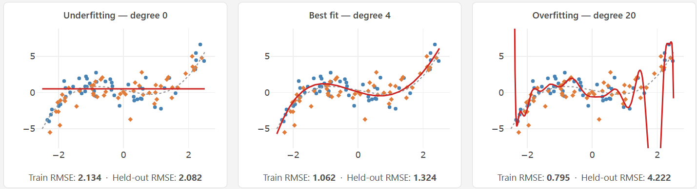
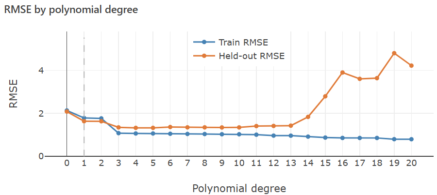
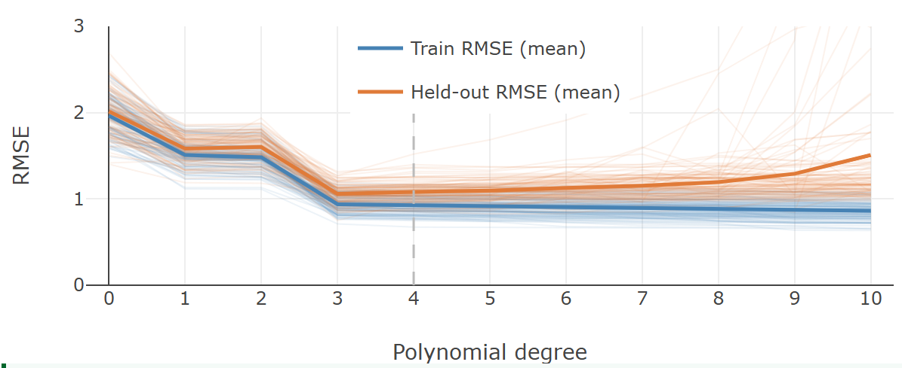

> **Navigation:** [<-- Gradient Descent](03-gradient-descent.md) | [Part Index](00-index.md) | [Main Index](../index.md) | [Regularized Regression -->](05-regularized-regression.md)

---

# Underfitting and Overfitting

**Motivation**: Every supervised model is trained to minimize error on training data. But the goal is to predict well on data the model has never seen. These two objectives can work against each other. When they do, the model fails in practice even when the training numbers look good.

> You will use polynomial regression as a visually transparent lens to study this problem. You will observe what underfitting and overfitting look like concretely Then, we'll consider bias-variance trade-off, the underlying tension that governs every supervised learning model.

> **Interactive demo note:** You can try everything explained here using the **Under- & Overfitting** demo from my [✪ interactive data-science demos](https://github.com/fgnussbaum/ds-ml-interactive-demos) repository.

## Table of Contents

- [The Generalization Problem](#the-generalization-problem)
- [Polynomial Regression as a Complexity Dial](#polynomial-regression-as-a-complexity-dial)
- [Underfitting, Overfitting, and the Sweet Spot](#underfitting-overfitting-and-the-sweet-spot)
- [Bias and Variance: Two Failure Modes](#bias-and-variance-two-failure-modes)
- [Summary](#summary)

## The Generalization Problem

A model's training error measures how well it fits the data it was trained on. Generalization error measures how well it performs on new, unseen data. These two quantities are not the same.

Consider what happens when a model has enough flexibility to fit every detail of the training data: it begins to capture not just the true underlying pattern, but also the random noise specific to that particular sample. Training error falls, sometimes to near zero. But the fitted model no longer represents the general pattern. It represents the quirks of one dataset, and applied to new data, performance is poor.

This is **overfitting**: the model has memorized the training sample rather than learned the pattern. The opposite failure is **underfitting**: the model is too rigid to capture the pattern at all, and both training and validation error are high.

The goal is a model that **generalizes**, one that performs well on data it has not seen. We need a setting where this trade-off is easy to observe directly.

---

## Polynomial Regression as a Complexity Dial

Polynomial regression provides exactly that. A polynomial of degree $d$ in a single input $x$ has the form:

$$\hat{y} = w_0 + w_1 x + w_2 x^2 + \cdots + w_d x^d$$

This is still linear regression: the weights $w_0, \ldots, w_d$ are fitted by minimizing the same MSE loss from [🖝 Linear Regression](../part-05-supervised-learning/02-linear-regression.md). What changes is the feature matrix. Instead of a single column for $x$, you construct $d$ columns for $x, x^2, \ldots, x^d$ and hand them to the linear model.

The degree $d$ is not a weight the optimizer adjusts. You set it before training begins. Turning $d$ up or down directly controls how flexible the model is, making it an ideal tool for observing what happens at the extremes.

---

## Underfitting, Overfitting, and the Sweet Spot

Consider a datasets is generated from a cubic relationship with noise added. The true pattern has degree 3, but you do not know that. You fit polynomial models of increasing degree and compare how each curve follows the data.

Three regimes are visible:

- **Underfitting (low degree):** A straight line cannot capture the curvature in the data. Both training and validation error are high. The model is too rigid to represent the relationship.
- **Good fit (intermediate degree):** The curve follows the underlying pattern without chasing noise. Training and validation error are both reasonably low.
- **Overfitting (high degree):** The curve threads through nearly every training point, including the noise. Training error approaches zero. Validation error climbs sharply. The model has memorized the particular sample rather than learned the pattern.

The RMSE plot below makes the story quantitative. It shows training and validation error across degrees 0 to 20 for a single training dataset.

Training error falls continuously as degree increases: more flexibility always reduces error on data the model is training on. Validation error follows roughly a U-shape. It decreases as the model gains enough capacity to represent the true pattern, reaches a minimum, then rises as the model begins fitting noise. The target is the degree that minimizes validation error, not training error.

Note that here the minimum sits in a plateau rather than a sharp point. Degrees 3 through roughly 5 perform similarly. The model does not need to match the exact true degree to generalize well.

> **Discussion:** You just used the validation error curve to pick the best degree. Recall from [🖝 Data Splits](../part-04-data-preparation/04-data-splits.md): if you consult a held-out set to make a decision, it is not your test set. Could you report the validation error as the final performance estimate on truly unseen data? Why or why not?

We'll discuss this question further in [🖝 Hyperparameter Optimization](../part-05-supervised-learning/06-hyperparameters.md).

---

## Bias and Variance: Two Failure Modes

The plots above show results for one particular training dataset. A natural question follows: How stable are these results? Would a different sample of the same size, drawn from the same population, give a similar picture?

The plot below from the [✪ Under-/Overfitting demo](https://github.com/fgnussbaum/ds-ml-interactive-demos) repeats the experiment across 100 different samples from the true population *(which here means: different noisy observations from the "true" cubic data-generating function.)*. For each sample and each degree, the model is trained and evaluated. Individual error curves are shown faintly behind the average error curves:

The plots provides a sense how much error rates varies across samples. Two distinct failure modes become visible:

**High bias (low degree).** Models of very low degree produce high error on both training and validation data, regardless of which sample they trained on. The error is consistently high because the model class itself cannot capture the pattern. This is **underfitting**. Its defining signature: both errors are high and close together, and adding more training data would not help.

**High variance (high degree).** Models of very high degree achieve low training error on every sample, but their validation errors are high and vary considerably across samples (do you see the "spagetthi" curves?). Explanation: Each model fits its particular training sample closely, including that sample's noise, so different samples produce very different fitted curves. This is overfitting. Its defining signature: a large gap between training error (low) and validation error (high).

The underlying tension has a name: the **bias-variance trade-off**. Increasing complexity reduces bias and increases variance. Decreasing it does the opposite. The sweet spot, where total validation error is lowest, lies between the extremes.

Here, the complexity dial was polynomial degree. Every supervised model has an analogous dial that governs this trade-off. How to treat it systematically will be the subject of [🖝 Hyperparameter Optimization](../part-05-supervised-learning/06-hyperparameters.md). How to measure and diagnose generalization more rigorously, including learning curves and cross-validation, is covered in [🖝 Generalization](../part-06-reflection/01-generalization.md). In the next nugget, we take another view on overfitting, when we discuss [🖝 Regularized Regression](../part-05-supervised-learning/05-regularized-regression.md).

---

## Summary

- Every supervised model is trained to minimize training error, but the real goal is low error on unseen data. A model that fits training data too closely memorizes noise and fails to generalize.
- Polynomial regression adds engineered feature columns $x^2, x^3, \ldots, x^d$ to linear regression. The degree $d$ controls model flexibility without changing the underlying MSE optimization.
- Low degree causes **underfitting**: the model class is too rigid to represent the true pattern, and both training and validation error are high.
- High degree causes **overfitting**: the model memorizes noise specific to the training sample. Training error is near zero; validation error is high.
- The bias-variance trade-off names this tension: simpler models have high bias and low variance; complex models have low bias and high variance.

As always: Happy learning, happy life! 🫶

---

> **Navigation:** [<-- Gradient Descent](03-gradient-descent.md) | [Part Index](00-index.md) | [Main Index](../index.md) | [Regularized Regression -->](05-regularized-regression.md)

Script v1.4.1 (2026-06-23) · FGN
