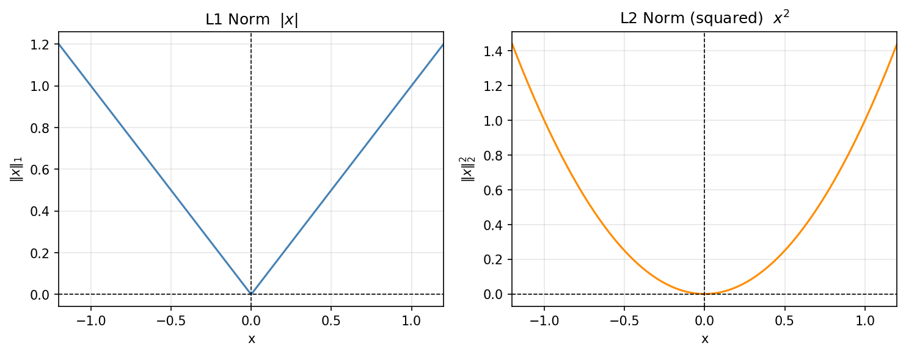

> **Navigation:** [<-- Gradient Descent](04-gradient-descent.md) | [Part Index](00-index.md) | [Main Index](../index.md) | [Hyperparameter Optimization -->](06-hyperparameter-optimization.md)

---

# Regularized Regression

**Requires**: [Linear Regression](03-linear-regression.md) · [Gradient Descent](04-gradient-descent.md)

**Motivation**: Linear regression has no constraint on weight size, so the optimizer can assign large, unstable coefficients that memorize noise rather than generalize. This is **overfitting** *(treated in depth in [🖝 Overfitting and Generalization](../part-06-reflection/01-overfitting-and-generalization.md))*. Regularization adds a weight-size penalty to the loss, forcing a trade-off between fit and simplicity.

> In this nugget you will learn two regularization strategies for linear regression. L2 (Ridge) shrinks all weights without eliminating any and handles correlated predictors gracefully. L1 (Lasso) performs implicit feature selection by driving some weights to exactly zero.

## Table of Contents

- [When Minimizing Loss Isn't Enough](#when-minimizing-loss-isnt-enough)
- [L2 Regularization (Ridge): Shrinkage](#l2-regularization-ridge-shrinkage)
- [L1 Regularization (Lasso): Sparsity](#l1-regularization-lasso-sparsity)
- [Summary](#summary)

## When Minimizing Loss Isn't Enough

The MSE loss has no opinion about weight size, only about prediction error. Given enough flexibility, the optimizer will fit the training data very closely, including random noise, producing weights that are large and unstable.

The fix is to add a **penalty term** to the MSE loss we introduced in [🖝 Linear Regression](../part-05-supervised-learning/03-linear-regression.md). Instead of minimizing MSE alone, the model now minimizes:

$$\text{Loss}(\mathbf{w}) = \text{MSE}(\mathbf{w}) + \lambda \cdot \text{Penalty}(\mathbf{w})$$

The **regularization strength** $\lambda \geq 0$ controls the trade-off. A larger $\lambda$ forces smaller weights, accepting higher training error in exchange for a simpler model. Setting $\lambda = 0$ recovers plain linear regression with no constraint.

The two main regularization strategies differ only in how the penalty term is defined.

---

## L2 Regularization (Ridge): Shrinkage

L2 regularization penalizes the sum of **squared** weight values:

$$\text{Loss}_{L2}(\mathbf{w}) = \text{MSE}(\mathbf{w}) + \lambda \sum_{j=1}^{k} w_j^2 = \text{MSE}(\mathbf{w}) + \lambda \| \mathbf{w}\|_2^2$$

The sum runs over the $k$ feature weights $w_1, \ldots, w_k$. This excludes the intercept $w_0$, which is not penalized by convention.

Squaring penalizes large coefficients far more than small ones. As a weight approaches zero the squared penalty becomes negligible, so the optimizer has little incentive to push any coefficient all the way to zero. Instead, all weights shrink toward zero but remain nonzero. This is called **weight shrinkage**.

L2-regularized regression, also known as **Ridge** regression, usually handles correlated predictors well. When two features carry similar information, Ridge distributes weight across both, producing stable estimates.

In practice, Python scikit-learn provides a ready-made model for L2-penalized linear regression (Ridge). It uses the parameter name `alpha` for what this nugget calls $\lambda$:

```python
from sklearn.linear_model import Ridge
model = Ridge(alpha=1.0) # alpha is sklearn's name for λ
model.fit(X_train, y_train)
```

Ridge shrinks every weight but usually does not zero them out entirely. That changes with our next type of penalty (regularization).

---

## L1 Regularization (Lasso): Sparsity

L1 regularization penalizes the sum of **absolute** weight values:

$$\text{Loss}_{L1}(\mathbf{w}) = \text{MSE}(\mathbf{w}) + \lambda \sum_{j=1}^{k} |w_j|= \text{MSE}(\mathbf{w}) + \lambda \| \mathbf{w}\|_1$$

Let's take a look at geometry to build some intuition why L1 sets weights to zero whereas L2 does not:
- The L2 penalty has a smooth shape: a down-hill optimizer like [🖝 Gradient Descent](../part-05-supervised-learning/04-gradient-descent.md) can usually improve a weight slightly without hitting a corner.
- The L1 penalty has a diamond shape: its corners sit exactly at coordinates where some weights are zero. Because of their sharpness, corners are often the optimum for the full loss function, too.

<p><center></center></p>

L1 therefore performs **implicit feature selection**: predictors whose weights reach exactly zero are dropped from the model, and the solution is **sparse**. Unlike Ridge, which shrinks all coefficients proportionally, Lasso tends to zero one correlated predictor while retaining another. This makes it well-suited when you suspect only a few features are genuinely informative.

In scikit-learn, L1-penalized linear regression is called **Lasso**:

```python
from sklearn.linear_model import Lasso
model = Lasso(alpha=0.1)  # alpha is sklearn's name for λ
model.fit(X_train, y_train)
```

Choosing $\lambda$ for either method is the central question in the next nugget on [🖝 Hyperparameter Optimization](../part-05-supervised-learning/06-hyperparameter-optimization.md).

Let's close this nugget with an observation and a discussion anchor:

> **Callback: analogy in form, not in function:** You have already seen absolute values in regression, in the LAD loss from the [🖝 Linear Regression](../part-05-supervised-learning/03-linear-regression.md) nugget. There, $|y_j - h_\mathbf{w}(\mathbf{x}_j)|$ measured the size of a *residual* in the loss, making the fit robust to outliers. Here, $|w_j|$ measures the size of a *weight* in a penalty term, pushing coefficients toward zero. Same mathematical operation, two completely different purposes.

> **Discussion:** You are predicting well-being from a dataset with 30 candidate features. You suspect only five or six are genuinely informative, and several of those correlate with each other. Would you start with Lasso or Ridge, and why? What would you look for in the results to confirm your choice?

---

## Summary

- Unregularized linear regression can overfit by assigning large, unstable weights, especially with many or correlated features.
- Adding a penalty term $\lambda \cdot \text{Penalty}(\mathbf{w})$ forces the optimizer to balance prediction error against weight size. The strength $\lambda$ controls this trade-off.
- L2 (Ridge) penalizes squared weight values and shrinks all coefficients toward zero without zeroing them, distributing weight evenly across correlated predictors.
- L1 (Lasso) penalizes absolute weight values and drives some coefficients to exactly zero, performing implicit feature selection.

As always: Happy learning, happy life! 🫶


---

> **Navigation:** [<-- Gradient Descent](04-gradient-descent.md) | [Part Index](00-index.md) | [Main Index](../index.md) | [Hyperparameter Optimization -->](06-hyperparameter-optimization.md)

Script v1.1 (2026-05-18) · FGN
