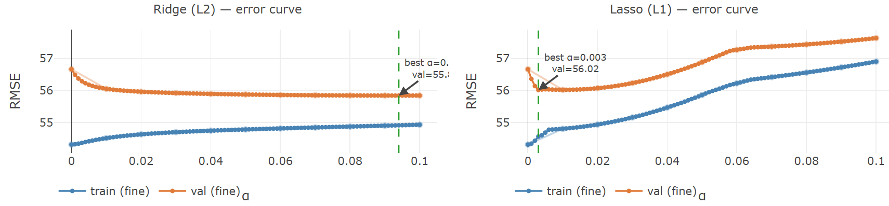
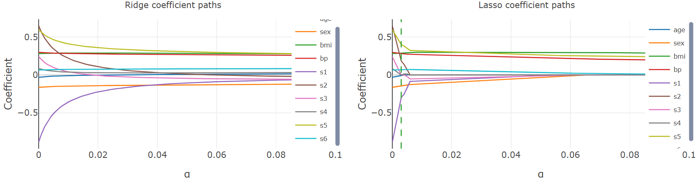

> **Navigation:** [<-- Regularized Regression](05-regularized-regression.md) | [Part Index](00-index.md) | [Main Index](../index.md) | [Classification Tasks -->](07-classification-tasks.md)

---

# Hyperparameter Optimization

**Requires**: [Regularized Regression](05-regularized-regression.md) · [Underfitting and Overfitting](04-under-overfitting.md)

**Motivation**: [🖝 Underfitting and Overfitting](../part-05-supervised-learning/04-under-overfitting.md) showed how held-out error curves reveal a good polynomial degree. [🖝 Regularized Regression](../part-05-supervised-learning/05-regularized-regression.md) introduced $\lambda$, which plays the same role but is harder to tune by eye. Both are settings called **hyperparameters** that live outside of the scope of the optimizer or whatever determines the **learnable parameters**. What exactly does this mean?

> In this nugget you'll learn what distinguishes hyperparameters from learned parameters, why you need a separate held-out set to evaluate them, and how special search techniques help to automate the tuning process. We'll focus on choosing $\lambda$ for regularization. However, everything we discuss transfers to other scenarios with hyperparameters.

## Table of Contents

- [What Are Hyperparameters?](#what-are-hyperparameters)
- [The Validation Set](#the-validation-set)
- [Grid Search and Beyond](#grid-search-and-beyond)
- [Summary](#summary)

## What Are Hyperparameters?

Every model has two kinds of parameters.

**Learned parameters** are adjusted during training to minimize the loss. The weights $\mathbf{w}$ in linear and regularized regression are examples. These parameters are handled by iterative optimizers like [🖝 Gradient Descent](../part-05-supervised-learning/03-gradient-descent.md) or closed-form solutions if existent.

**Hyperparameters** are fixed before training and remain outside the optimizer's reach. The regularization strength $\lambda$ in Ridge and Lasso is the example we have seen so far: it controls how strongly the penalty term pulls weights toward zero, but training cannot determine its value.

> If you let the optimizer select $\lambda$, it would simply drive it toward zero, removing the penalty entirely and recovering plain linear regression.

Degree $d$ from [🖝 Underfitting and Overfitting](../part-05-supervised-learning/04-under-overfitting.md) is another hyperparameter, explored informally there through held-out error curves. The same logic applies to any setting the optimizer cannot determine.

*Similar patterns of hyperparameters appear in other model families. A decision tree has a `max_depth` knob that limits how many splits it can make; a random forest has `n_estimators`. We return to these in [🖝 Decision Trees](../part-05-supervised-learning/09-decision-trees.md) and [🖝 Random Forests](../part-05-supervised-learning/10-random-forests.md).*

---

## The Validation Set

[🖝 Data Splits](../part-04-data-preparation/04-data-splits.md) already introduced the three-way train/val/test partition. Hyperparameter tuning is the central scenario that motivates it: the test set must not influence any training decision, including hyperparameter choice.

> **Callback:** In [🖝 Underfitting and Overfitting](../part-05-supervised-learning/04-under-overfitting.md), you read the held-out error curve to select a polynomial degree. That held-out set was playing a *validation* role: you consulted it to make a modeling decision, so its error can no longer serve as a clean estimate of final performance on truly unseen data. The discussion question at the end of that nugget pointed at exactly this tension.

> **A pitfall**: If you evaluated many candidate values of $\lambda$ on the test set and kept the best, you would effectively select the value that happened to look good on those specific examples. The test score would _no_ longer be a fair estimate of generalization.

To see the role each partition plays in this context:

- **Training/Train set**: to fit model weights,
- **Validation/Val set**: to compare hyperparameter candidates,
- **Test set**: touched only once, after the final model is chosen, to produce the number you report.

For small datasets, holding out a fixed validation slice wastes data. **Cross-validation** is the standard remedy: It splits training data into $k$ folds, each fold taking a turn as the validation set. This gives a more stable estimate at the cost of fitting the model $k$ times. You'll revisit cross-validation in [🖝 Generalization](../part-06-reflection/01-generalization.md).

---

## Grid Search and Beyond

With a validation strategy in place, hyperparameter tuning becomes a search problem: evaluate candidate settings, compare validation scores, keep the best.

### Grid Search

> **Interactive demo note:** You can try all of the following in the **Regularized Regression** demo from my [✪ interactive data-science demos](https://github.com/fgnussbaum/ds-ml-interactive-demos) repository.

**Grid search** defines an explicit set of candidate values and evaluates every one, using cross-validation to score each. To see it in action, consider predicting disease progression from certain clinical variables (age, sex, BMI, blood pressure, etc.) using the [🔗 sklearn diabetes dataset](https://scikit-learn.org/stable/modules/generated/sklearn.datasets.load_diabetes.html).

For the systematic search for the best regularization parameters, we reformulate the loss as

$$(1-\alpha)\cdot\text{MSE}(\mathbf{w}) + \alpha\cdot\|\mathbf{w}\|,\quad \alpha\in[0,1).$$

Here, $\alpha$ now acts as the _weight_ of the penalty term. Crucially, $\alpha$ is a bounded reparameterization of the $\lambda \in [0, \infty)$ that we used in [🖝 Regularized Regression](../part-05-supervised-learning/05-regularized-regression.md). This allows us to sweep the regularization strength $\alpha$ from 0 to 1 for both Ridge and Lasso. The trade-off is the same: $\alpha=0$ is unregularized, $\alpha=1$ would mean only regularization.

Here are the RMSE error curves for train/val sets of the diabetes dataset. Only the range $\alpha\in[0, 0.1]$ is shown with a fine **grid step size** of $10^{-3}$:

<p><center></center></p>

Observe that the training error (blue) increases as $\alpha$ increases. This is because more regularization give the model less opportunity to fit the training data closely. The validation error curve respectively shows a sweet spot where regularization improves generalization the most.

> Remember: Generalization is the main goal.

Grid search finds this sweet spot for $\alpha$ automatically. However, efficiency greatly depends on finding the right step size and sometimes the right sub-interval of $\alpha$-values where to look more closely.

Next, the coefficient paths reveal what is happening inside the model as $\alpha$ varies.

<p><center></center></p>

Ridge (L2, left) shrinks all coefficients gradually toward zero without eliminating any. Lasso (L1, right) drives several coefficients to exactly zero at higher $\alpha$ values, selecting a sparse subset of features. This matches the theoretical behavior that we discussed in [🖝 Regularized Regression](../part-05-supervised-learning/05-regularized-regression.md).

### Practical tips and alternatives

When tuning hyperparameters, there is a danger to spend too much time trying candidates in a region where the effect is negligible. Two strategies can help for grid search:

- **Coarse-to-fine**: starting with a coarse grid first, then iteratively refining to finer grids (smaller step size) in regions of interest
- using a **logarithmic grid**.

Here's some example code:

```python
from sklearn.model_selection import GridSearchCV
from sklearn.linear_model import Ridge

param_grid = {"alpha": [0.01, 0.1, 1.0, 10.0]}
search = GridSearchCV(Ridge(), param_grid, cv=5)  # cv: 5 folds for cross-validation
search.fit(X_train, y_train)
print(search.best_params_)
```

Grid search is exhaustive and predictable, but the number of evaluations grows exponentially in the number of hyperparameters. Instead you can also do **Random search**, which samples combinations randomly from a defined range instead of enumerating every point. This is often competitive with grid search at a fraction of the cost, because not all hyperparameters affect performance equally.

"Smart" random sampling could even be used to avoid wasting evaluations in regions that matter little. It's possible to build sophisticated strategies based on this insight. If you are curious, check out our paper [🔗 Efficient Regularization Parameter Selection](https://www.ijcai.org/proceedings/2019/0330.pdf) (2019). However, my honest recommendation in practice is this: [🖝 Start Simple](../part-06-reflection/02-start-simple.md).

---

## Summary

- Hyperparameters are settings fixed before training that the optimizer cannot tune automatically.
- Evaluating hyperparameter candidates on the test set inflates performance estimates. This is why a separate validation set is required (alternatively cross-validation).
- Grid search exhaustively evaluates a defined candidate set. For scale-sensitive parameters like regularization strength you may want to start with a coarse or logarithmic grid.
- Random search samples randomly from a range and is often equally effective at lower cost, especially when many hyperparameters are involved.

As always: Happy learning, happy life! 🫶


---

> **Navigation:** [<-- Regularized Regression](05-regularized-regression.md) | [Part Index](00-index.md) | [Main Index](../index.md) | [Classification Tasks -->](07-classification-tasks.md)

Script v1.4 (2026-06-10) · FGN
