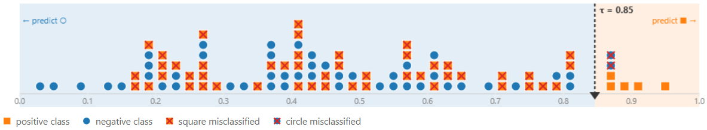
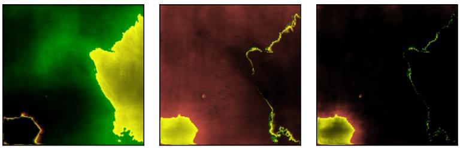

> **Navigation:** [<-- Hyperparameter Optimization](06-hyperparameters.md) | [Part Index](00-index.md) | [Main Index](../index.md) | [Classification Evaluation -->](08-classification-evaluation.md)

---

# Classification Tasks

**Requires**: [Supervised Learning](01-supervised-learning.md)

**Motivation**: Regression models predict a number. But many real decisions are not about a number, but a **category**. Is this email spam? Is this scan abnormal? Did this transaction look fraudulent? Categorical output variables changes how you encode the target and how you measure success.

> In this nugget you will learn what makes a problem a classification task, how a simple threshold turns a score into a binary decision, and why the labels you train on carry their own costs and uncertainties.

## Table of Contents

- [Introducing Classification Problems](#introducing-classification-problems)
- [A Simple Threshold-Based Classifier](#a-simple-threshold-based-classifier)
- [Challenges and Costs of Labeling](#challenges-and-costs-of-labeling)
- [Summary](#summary)

## Introducing Classification Problems

Regression predicts a number on a continuous scale. Classification predicts a **class label**, that is, a discrete category chosen from a fixed set. In this nugget, we discuss the most common starting point: **binary classification**, which has exactly two classes. By convention, we call them the **positive class** (the outcome we care about detecting) and the **negative class** (everything else).

Here are a few examples across domains:

| Domain | Input | Positive class |
|--------|-------|----------------|
| Email filtering | Message text and metadata | Spam |
| Medical imaging | Scan pixels | Tumor present |
| Finance | Transaction features | Fraudulent |
| Quality control | Sensor readings | Defective unit |

In each case, the target variable $y$ in your dataset encodes the class label, typically as 0 (negative) or 1 (positive). That label is what the model learns to reproduce.

The choice of which class is "positive" is a convention, not a mathematical requirement. It matters in practice because for binary classification, metrics and threshold behavior are defined relative to the positive class. Choose the class that represents the outcome you are actively trying to detect.

> **Discussion:** In a fraud detection system, what are the **real** cost of a false positive (a legitimate transaction flagged as fraud) versus a false negative (a fraudulent transaction missed)? Does that asymmetry affect how you would set the threshold?

---

## A Simple Threshold-Based Classifier

Many classifiers work in two steps: first they compute a continuous **score** for each example (a probability estimate, a distance, or a raw output), then they convert that score into a class label by comparing it to a **threshold** $\tau$:

$$\hat{y} = \begin{cases} 1 & \text{if score} \geq \tau \\ 0 & \text{otherwise} \end{cases}$$

The **classification** demo from the [✪ interactive data-science demos](https://github.com/fgnussbaum/ds-ml-interactive-demos) repository illustrates the idea:

In this chart, each point corresponds to a training example: circles are the negative class, squares are the positive class. The slider controls $\tau$, and every point above it is predicted positive. Examples that are classified incorrect are crossed out.

- Moving $\tau$ lower catches more positive examples but also misclassifies more negatives.
- Moving it higher reduces false alarms but misses real cases.

> **Good to know**: The threshold is usually chosen after training and before evaluation, so it is not a parameter the model learns.

For the evaluation of classification, a natural first question is: How many predictions are correct? This is what **Accuracy** measures:

$$\text{Accuracy} = \frac{\text{correct predictions}}{\text{total predictions}}$$

Accuracy is intuitive and easy to compute, but it conceals important structure. The upcoming [🖝 Classification Evaluation](../part-05-supervised-learning/08-classification-evaluation.md) nugget shows when accuracy misleads and introduces the full evaluation toolkit.

---

## Challenges and Costs of Labeling

A classifier learns from labeled examples. That means someone, at some point, had to assign a class to every training instance. This is not free: Let's discuss!

### Annotation cost

Building a labeled dataset for a new task requires work: a radiologist reads thousands of scans, a legal team reviews contracts, annotators label images one by one. Even with partial automation, generating **ground truth** takes time and resources. This is one reason why labeled datasets are scarce compared to raw data.

> A well-curated small dataset is sometimes more valuable than a large noisy one.

There's a saying about training machine learning models: **"Garbage in, garbage out".** Again, it turns out that good data ground work is important for projects, see also [🖝 Why Data Work Dominates](../part-03-data-understanding/01-why-data-work.md).

> **Data-centric AI**: This is the paradigma that emphasizes that data improvements often beat modelling improvements.

### Data uncertainty and label noise

Human annotators disagree, guidelines are ambiguous, and some cases are genuinely uncertain at the boundary. These are all versions of inherent **data uncertainty** (also called _aleatoric uncertainty_). The consequence is irreducible noise: More data won't help because the ambiguity is real.

Basically the labels in your dataset are noisy estimates of the ground truth, not the ground truth itself.

A model trained on noisy labels will partially learn the noise. The effect is usually manageable but worth tracking. In cases of real ambiguity, it could even be interesting to carry this uncertainty on to predictions.

_Here's an example from our own work [🔭 Fine-Grained Sampling
in Stochastic Segmentation Networks (NeurIPS 2022)](https://proceedings.neurips.cc/paper_files/paper/2022/file/b1a77a501bf32f8c7348fe39da2cf8c6-Paper-Conference.pdf). The visual teaser below shows different uncertainty components for landcover classification (image segmentation)._

### Class imbalance

In most detection tasks, the positive class is rare: fraud accounts for a small fraction of all transactions, diseases affect a minority of patients, defects occur in a small share of manufactured units.

> Class imbalance is usually not a data quality failure, but reflects reality.

If 99% of your training examples are negative, a model that always predicts "negative" achieves 99% accuracy without detecting a single real case. This is the **class imbalance problem**, and it is one of the main reasons why accuracy alone is not enough, as we discuss next in [🖝 Classification Evaluation](../part-05-supervised-learning/08-classification-evaluation.md).

It is common to balance training data by, for example, class over- or undersampling. However, artificially balancing the dataset needs to be done carefully as it can also produce misleading evaluation results.

---

All three aspects discussed shape classification project before you train models: Cost determines how much labeled data you can afford. Noise sets a ceiling on what any model can learn. Imbalance determines which metrics are meaningful.

---

## Summary

- Classification predicts a discrete class label. For binary classification tasks, we distinguish positive and negative class. The choice of which is "positive" determines how metrics and thresholds are interpreted.
- A threshold-based classifier classifies all examples with score above the threshold as positive. Higher thresholds capture more positives at the cost of more false alarms.
- Accuracy measures the fraction of correct predictions. It is a useful first metric, but breaks down when one class dominates the dataset.
- Labels carry real costs: annotation effort, label noise, and class imbalance all affect what a model can learn and how results should be interpreted.

As always: Happy learning, happy life! 🫶

---

> **Navigation:** [<-- Hyperparameter Optimization](06-hyperparameters.md) | [Part Index](00-index.md) | [Main Index](../index.md) | [Classification Evaluation -->](08-classification-evaluation.md)

Script v1.4 (2026-06-10) · FGN
