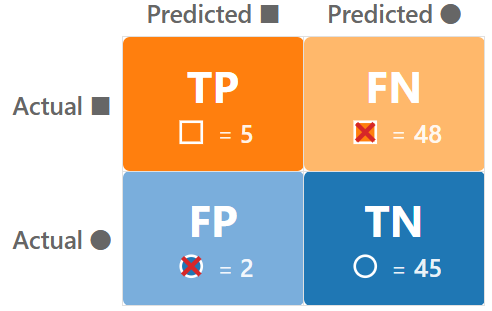
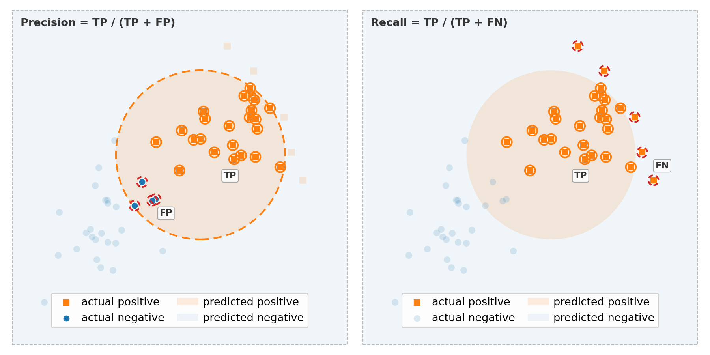
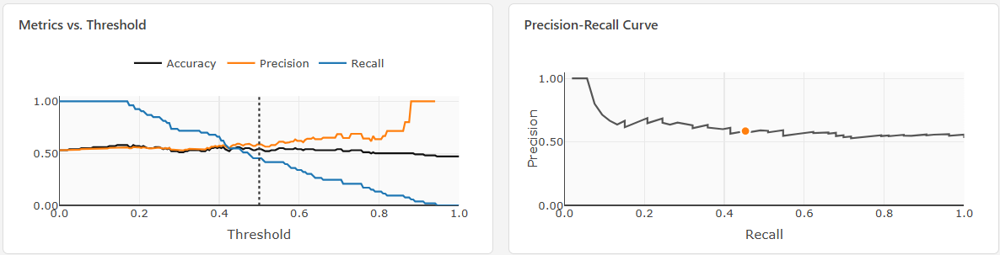
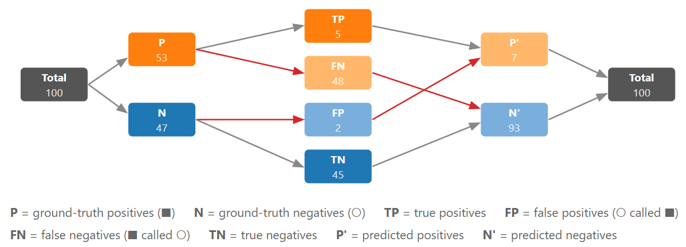

> **Navigation:** [<-- Classification Tasks](07-classification-tasks.md) | [Part Index](00-index.md) | [Main Index](../index.md) | [Decision Trees -->](09-decision-trees.md)

---

# Classification Evaluation

**Requires**: [Classification Tasks](07-classification-tasks.md)

**Motivation**: Your classifier reports 90% accuracy. That sounds good. But 90% of what? If 90% of examples in your dataset belong to the majority class, a model that always predicts "majority class" achieves 90% accuracy without learning a single pattern. So if accuracy is not the full story, how should we approach it?

> In this nugget you'll learn to read a confusion matrix, derive precision, recall, and F1 from it, and match the right metric to the problem at hand. These tools apply to any classifier.

> **Interactive demo note:** You can explore the behavior of all metrics in this nugget using the **Classification Threshold & Metrics** demo from my [✪ interactive data-science demos](https://github.com/fgnussbaum/ds-ml-interactive-demos) repository.

## Table of Contents

- [The Confusion Matrix](#the-confusion-matrix)
- [Precision, Recall, and F1: When Accuracy Is Not Enough](#precision-recall-and-f1-when-accuracy-is-not-enough)
- [First Metric Choice: Matching the Metric to the Use Case](#first-metric-choice-matching-the-metric-to-the-use-case)
- [Summary](#summary)

## The Confusion Matrix

In [🖝 Classification Tasks](../part-05-supervised-learning/07-classification-tasks.md), we introduced binary classification with positive and negative classes. For this scenario, each prediction falls into one of four cells:

|  | Predicted Positive | Predicted Negative |
|---|---|---|
| **Actual Positive** | True Positive (TP) | False Negative (FN) |
| **Actual Negative** | False Positive (FP) | True Negative (TN) |

The definitions in detail:

- **True Positive (TP):** the model predicted positive and was right = a correct detection.
- **True Negative (TN):** the model predicted negative and was right = a correct dismissal.
- **False Positive (FP):** the model predicted positive but was wrong = a false alarm.
- **False Negative (FN):** the model predicted negative but missed a real case = a miss.

In the **classification** demo from [✪ interactive data-science demos](https://github.com/fgnussbaum/ds-ml-interactive-demos) you can also explore the confusion matrix and what it change while you adjust the threshold slider:

> **Tipp:** A confusion matrix immediately reveals the potential pitfall of a classifier that just predicts the majority class (common for imbalanced classes). In the confusion matrix, one entire row will be empty or near-empty.

---

## Precision, Recall, and F1: When Accuracy Is Not Enough

### Introducing precision and recall

Class imbalance and assymetric error costs can be addressed by two complementary metrics.
For these formulas we also use $\text{P}$ and $\text{P'}$ - the number of _actual_ positives in the ground truth vs. the number of _predicted_ positives.

**Precision** answers: "Of all the records I predicted as positive, how many actually are?"

$$\text{Precision} = \frac{\text{TP}}{\text{P'}} = \frac{\text{TP}}{\text{TP} + \text{FP}}$$

**Recall** (also called sensitivity or true positive rate) answers: "Of all records that are actually positive, how many did I find?"

$$\text{Recall} =  \frac{\text{TP}}{\text{P}} = \frac{\text{TP}}{\text{TP} + \text{FN}}$$

Here's an illustration of both metrics, using Venn diagrams:

### Precision-recall trade-off

Precision and recall together represent a trade-off:

- You can always increase recall by predicting positive more aggressively, but then precision drops.
- You can increase precision by predicting positive only when very confident, but then recall drops.

The trade-off can be seen via precision-recall curves (their behavior is best explored with the interactive demo):

### F1 as a compromise between precision and recall

Next, **F1** is the harmonic mean of precision and recall. It penalizes extreme imbalance between the two:

$$F1 = \frac{2 \cdot\text{Precision} \cdot \text{Recall}}{\text{Precision} + \text{Recall}}$$

<!-- = \frac{2}{1/\text{Precision} + 1/\text{Recall}} -->

A model with precision = 0.9 and recall = 0.1 gets $F1 = 0.18$. In contrast, using arithmetic mean would give use a value of 0.5.
Therefore, the harmonic mean penalizes strong discrepancy between precision and recall more, which is often desired. For example, a model that almost never fires for positives is seldomly useful.

### Overview of all quantities

Finally, here's another view to build some intuition about the quantities that appear in the confusion matrix and the metric definitions. It shows how quantities _flow_ into one another: from $\text{Total}$ (all examples) → $\text{P}$ and $\text{N}$ (the number of _actual_ positive/negative examples) → $\text{TP}$, $\text{FN}$, $\text{FP}$, $\text{TN}$ (the confusion matrix cells, red arrows indicate "error" paths) → $\text{P'}$ and $\text{N'}$ (the number of examples that where _predicted_ as positve/negative) → $\text{Total}$ again (all predictions).

The left side in this diagram coresponds to the ground truth (actual labels) and the right side to "what the model predicts".

---

## First Metric Choice: Matching the Metric to the Use Case

The right metric depends on the cost of each type of error in your specific application.
We cover this in detail in [🖝 Choosing and Aligning Metrics](../part-06-reflection/04-aligning-metrics.md). Here's an overview already:

**When false negatives are more costly** (missing a real case is worse than a false alarm): prioritize **recall**.

> Examples: screening for a disease, flagging safety incidents.

**When false positives are more costly** (false alarms carry a high cost): prioritize **precision**.

> Examples: spam filtering where legitimate email must not be lost.

**When both error types carry similar cost and classes are roughly balanced**: **accuracy** is a fair summary.

**When both errors matter and classes are imbalanced**: use **F1**.

> **Discussion:** You build a model to predict whether a machine component is about to fail. Missing a failure (FN) causes expensive downtime and a safety risk. A false alarm (FP) triggers an unnecessary maintenance check costing a few hours. Which metric would you optimize for?

In real-world business applications, it is not uncommon to model the actual costs using the FN and FP rates of a model explicitly.

---

## Summary

- The confusion matrix shows the four outcome types for binary classification: TP, TN, FP, FN.
- Accuracy is misleading when classes are imbalanced.
- Precision measures the correctness of positive predictions. Recall measures the coverage of actual positives. F1 is their harmonic mean.
- Choose your primary metric based on which type of error is more costly in your application.

As always: Happy learning, happy life! 🫶

---

> **Navigation:** [<-- Classification Tasks](07-classification-tasks.md) | [Part Index](00-index.md) | [Main Index](../index.md) | [Decision Trees -->](09-decision-trees.md)

Script v1.5 (2026-06-24) · FGN
