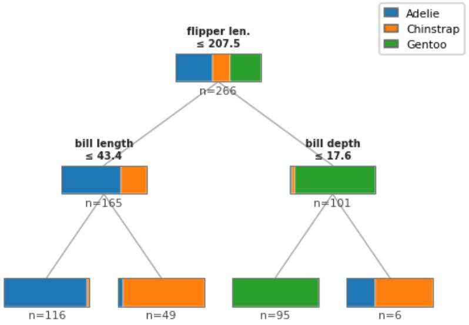

> **Navigation:** [<-- Classification Evaluation](08-classification-evaluation.md) | [Part Index](00-index.md) | [Main Index](../index.md) | [Random Forests -->](10-random-forests.md)

---

# Decision Trees

**Requires**: [Supervised Learning](01-supervised-learning.md) · [Classification Evaluation](08-classification-evaluation.md)

**Motivation**: The classifiers from [🖝 Classification Tasks](../part-05-supervised-learning/07-classification-tasks.md) turn a continuous score into a binary decision by applying a threshold. This was not yet end-to-end though: We left open where the scores come from. While we don't answer this question here, we want to introduce our first end-to-end classification model. We always want to start simple. So what about a model that you can read, audit, and explain to anyone?

> In this nugget you will learn how a **decision tree** converts training data into if-then-else rules and how the best splits are chosen. You will also extend the evaluation tools from [🖝 Classification Evaluation](../part-05-supervised-learning/08-classification-evaluation.md) to multi-class problems, where each class receives its own precision, recall, and F1 score. Finally, you will learn to interpret a trained tree and see why interpretability is the tree's defining strength.

## Table of Contents

- [Decision Trees](#decision-trees)
- [Multi-Class Evaluation](#multi-class-evaluation)
- [Interpreting Trees](#interpreting-trees)
- [Summary](#summary)
- [Bonus: Building the Tree](#bonus-building-the-tree)
- [References](#references)

## Decision Trees

A **decision tree** is a flowchart. Each internal node tests one feature against a threshold. Each branch follows one outcome of that test. Each leaf assigns a class label via the leaf's majority class (so among the training examples that end in this leaf). To classify a new example, you walk from the root to a leaf, following the branches that match the example's feature values.

Let's take a look at an example. The Palmer Penguins dataset has three species (Adelie, Chinstrap, Gentoo), four features, and 333 samples. The next figure shows a decision tree of depth 2. Colors in each node show the class proportions among the training examples that reached that node:

- The root splits on **flipper length ≤ 207.5 mm**: examples above the threshold flow right, the examples that land here are almost exclusively Gentoo.
- The right branch splits on **bill depth ≤ 17.6** next, which perfectly separates the Gentoo class on the training data.
- The left branch splits on **bill length ≤ 43.4**, which separates Adelie from Chinstrap quite well.

We could train deeper trees to get even better results on the training data. However, this can lead to overfitting easily.

> **Overfitting pitfall:** A fully grown tree memorizes the training set and generalizes poorly. So depth needs to be balanced.

To balance depth, several **pruning** strategies are available:
- either stop splitting early when the gain falls below a threshold, or
- grow the full tree and then remove branches that hurt held-out performance (post-pruning).

The simplest way to restrict maximum tree depth directly during fitting the tree.
When using scikit-learn `DecisionTreeClassifier`, all these options can be controlled via hyperparameters: `max_depth`, `min_samples_leaf`, and `min_samples_split`.

> **Discussion:** You train a decision tree that achieves 98% training accuracy and 67% test accuracy. Your manager says: "We should deploy this: 98% is excellent." How do you explain the problem, and what would you do next?

_See also: [🖝 Generalization](../part-06-reflection/01-generalization.md)._

---

## Multi-Class Evaluation

Up to this point, precision, recall, and F1 were defined for a **binary** problem with one positive class. Many real tasks have more than two classes: species, product categories, medical diagnoses. Decision trees handle multi-class problems natively, since leaves can predict any class, but evaluation needs to extend as well.

The key idea is straightforward: for each class, treat it as the positive class and all other classes as negative. This gives you a precision, recall, and F1 **per class**. Scikit-learn's `classification_report` does exactly this:

The report for the depth-2 penguins tree above is this (computed for test data, where we do evaluation):

| Class | Precision | Recall | F1 | n |
|-------|-----------|--------|----|---|
| Adelie | 0.97 | 0.97 | 0.97 | 29 |
| Chinstrap | 0.81 | 0.93 | 0.87 | 14 |
| Gentoo | 1.00 | 0.92 | 0.96 | 24 |

Chinstrap shows the weakest precision (0.81): some Adelie or Gentoo examples are misclassified as Chinstrap. This is expected given the depth-2 constraint, since the tree cannot separate Chinstrap perfectly with only two splits. Gentoo achieves perfect precision (1.00) because the "right-then-left" leaf is entirely Gentoo in the training data, though recall is slightly below 1 as a few Gentoo examples are still misclassified.

The column `n` counts actual examples of each class in the test set. Note: A class with few test examples (small `n`) gives an unreliable estimate of its metrics.

TODO: the other metrics in the report (not shown in table)...

> **Tip:** The `macro avg` row averages the per-class metrics without weighting by class size. The `weighted avg` weights by `n`. For imbalanced classes, `weighted avg` can mask poor performance on minority classes, so keep both in view.

---

## Interpreting Trees

Interpretability is the decision tree's defining strength. Follow any path from root to leaf and you have a complete, human-readable rule: _"If flipper length is above 207.5 mm and bill depth is smaller than 17.6 mm, predict Gentoo."_ No formula needed, no statistical background required.

Three signals to read from a trained tree:

- **The root split** uses the feature with the highest information gain on the training data. It is often a strong global predictor.
- **Leaf purity** shows how confident each prediction is. A leaf where 95% of training records belong to one class is a confident predictor. A 55/45 split is close to a coin flip.
- **Depth trades interpretability for expressiveness.** Trees with depth roughly greater than three become harder to explain to an audience.

This shows that trees are simple models with good [🖝 Explainability](../part-06-reflection/05-explainability.md) properties. *See also [🖝 Random Forests](../part-05-supervised-learning/10-random-forests.md) for how combining many trees addresses fragility, overfitting, and global feature importance.*

---

## Summary

- A decision tree classifies by recursively splitting on the feature and threshold that maximize information gain, producing a flowchart of if-then-else rules.
- For multi-class problems, precision, recall, and F1 are computed per class by treating each class as the positive class against all others. Scikit-learn's `classification_report` summarizes this directly.
- Interpretability is the decision tree's signature strength: each root-to-leaf path is a human-readable rule, and the root split identifies the feature with the highest information gain on the training data.
- Deep trees overfit. Depth-limiting and pruning are the primary remedies, and ensemble methods like random forests address the fragility of a single tree.

---

## Bonus: Building the Tree

The standard recursive procedure is **Hunt's Algorithm** (Tan et al., 2020):

1. If all training records at the current node belong to the same class, make that node a leaf.
2. Otherwise, choose the feature and threshold that best separates the records and split. Distribute records to the child nodes accordingly.
3. Repeat recursively for each child.

Here, "best" is defined by **impurity**. A pure node contains records from only one class. The most widely used measure is **Shannon entropy**:

$$H(v) = -\sum_{c} p_v(c) \log p_v(c),$$

where $p_v(c)$ is the proportion of class $c$ at node $v$. Entropy measures how mixed a node is. A perfectly pure node has entropy $0$: you always know the class, so there is no uncertainty. A node with equal proportions across all classes has maximum entropy: like a fair coin, the label is completely unpredictable.

<!--TODO: entropy plot?-->

The **information gain** of a split $s$ measures how much it reduces uncertainty.
Intuitively, it is entropy _before_ the split minus the entropy _remaining after_ the split:

<!-- https://en.wikipedia.org/wiki/Information_gain_(decision_tree) -->
$$\Delta(s) = H(v) - \sum_{j} \frac{N(v_j)}{N} \, H(v_j)$$

Here, the sum runs over the child nodes $v_j=v_j(s)$ produced by $s$ from parent node $v$, weighted by their fraction $N(v_j)/N$ of the parent's data points.
The second term is a size-weighted average of child entropies. A good split produces purer children, so that average is low and $\Delta$ is large. A split that does not separate the classes leaves each child as mixed as the parent, and $\Delta \approx 0$.

Ultimately, at each node, the algorithm selects the split with the highest information gain:

$$s^* = \underset{s}{\arg\max}\; \Delta(s)$$

where $s$ is a (feature, threshold) pair. The search is exhaustive: for each feature, every boundary between consecutive distinct values in the current node's records is a candidate threshold, giving a finite set of $O(N \cdot k)$ candidates, where $N$ is the number of records at the current node and $k$ is the number of features.

Concrete example: suppose a parent node has $N=10$ records, 5 of class A and 5 of class B, giving entropy $1$. A perfect split sends all A records to the left child and all B records to the right. Both children are pure with entropy $0$, so:

$$\Delta = 1 - \left(\frac{5}{10} \cdot 0 + \frac{5}{10} \cdot 0\right) = 1.$$

The split removed all uncertainty. Any less clean split yields a smaller $\Delta$, and the algorithm will prefer this one.

---

## References

Tan, P.-N., Steinbach, M., Karpatne, A., & Kumar, V. (2020). *Introduction to Data Mining* (2nd ed.). Pearson.

As always: Happy learning, happy life! 🫶

---

> **Navigation:** [<-- Classification Evaluation](08-classification-evaluation.md) | [Part Index](00-index.md) | [Main Index](../index.md) | [Random Forests -->](10-random-forests.md)

Script v1.2 (2026-05-26) · FGN
