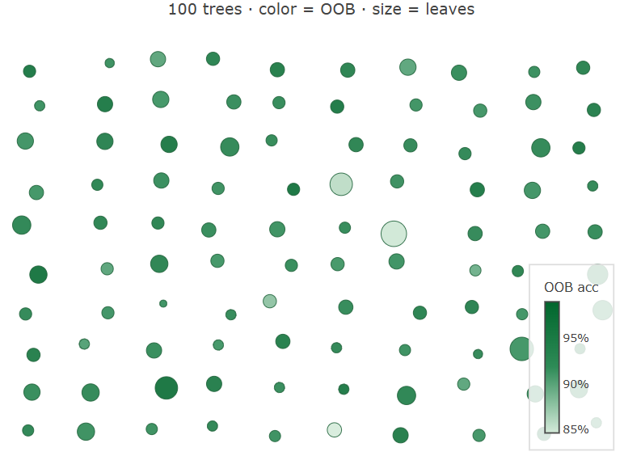
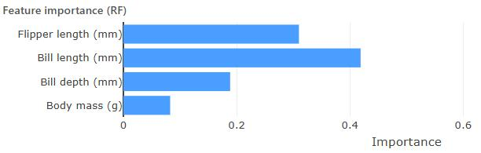

> **Navigation:** [<-- Decision Trees](09-decision-trees.md) | [Part Index](00-index.md) | [Main Index](../index.md) | [Part VI: Principles That Transfer (Reflection) -->](../part-06-reflection/00-index.md)

---

# Random Forests

**Requires**: [Decision Trees](09-decision-trees.md)

**Motivation**: A single decision tree, as introduced in [🖝 Decision Trees](../part-05-supervised-learning/09-decision-trees.md), tends to be sensitive to the training data: swap a handful of examples and the top splits may change entirely. That sensitivity limits how much you can trust any one tree. What if, instead of committing to one tree, you trained many slightly different trees and let them **vote**?

> In this nugget you'll learn how random forests reduce instability by training many trees on different data samples and different feature subsets. You will also get to know feature importance as a useful interpretability signal, and when to prefer a forest over a single tree.

> **Interactive demo note:** You can explore random forests in the **Decision trees** demo from my [✪ interactive data-science demos](https://github.com/fgnussbaum/ds-ml-interactive-demos) repository.

## Table of Contents

- [From One Tree to Many: The Ensemble Idea](#from-one-tree-to-many-the-ensemble-idea)
- [Feature Importance](#feature-importance)
- [When to Prefer a Forest Over a Single Tree](#when-to-prefer-a-forest-over-a-single-tree)
- [Bonus: Decision Trees for Regression](#bonus-decision-trees-for-regression)
- [Summary](#summary)

## From One Tree to Many: The Ensemble Idea

A single tree commits fully to the data it saw: small changes in the training set can shift the top splits, producing a very different tree. In statistical terms, the model has high **variance**.

The remedy is diversification: train many trees, each on a slightly different sample of the data, and combine their predictions. Because the errors of individual trees are partly independent, they tend to cancel when averaged. This is the core idea of a **random forest**.

Here's a visualization of a random forest from the interactive decision tree demo. Intuively, trees have different sizes and performance:

### How does the 'random' in random forests work?

A random forest introduces two sources of randomness to make sure the trees are different enough from each other:

- Each tree is trained on a **bootstrap sample**, that is, $n$ records drawn from the training set uniformly *with* replacement, where $n$ is the size of the original set. Some records appear multiple times; others are left out. Each tree therefore sees a different slice of the data and learns a slightly different model.

- At each split, only a random subset of features is considered as candidates, typically $\sqrt{k}$ features for classification, where $k$ is the total number of features. This **feature subsampling** prevents one dominant feature from appearing at the root of every tree, forcing the ensemble to draw on different signals and further diversifying predictions.

### How do random forests classify samples?

For any given sample, a random forests classifies it by combining the predictions from all trees;

1. First of all, for each individual tree, find the leaf where the sample lands.
2. Then, take the class probability vector from this leaf, that is, the fraction of training sample per class that landed at this leaf node.
3. average across all trees to obtain an ensemble "probability" estimate.
4. finally, to obtain a global prediction, take the argmax from this ensemble probability estimate to determine the class.

---

## Feature Importance

A decision tree is interpretable precisely because it is compact: one flowchart, one root split that identifies the feature with the highest information gain (see [🖝 Decision Trees](../part-05-supervised-learning/09-decision-trees.md)). A forest is not. With hundreds of trees there is no single flowchart to read and no single root to point to. How do you recover a global view of which features matter?

**Feature importance** provides an answer. Continuing our example from [🖝 Decision Trees](../part-05-supervised-learning/09-decision-trees.md), the plot above shows feature importances for a random forest (100 trees) trained on the Penguins dataset. We get an indication that `bill length` may be the most important feature on the training data for performing the classification task.

How does it work? For each feature, the importance score sums the information gain contributed by every split on that feature, weighted by the fraction of training records that reached that node, and averages the result across all trees. Intuitively, a feature that drives large purity gains, high up in many trees, accumulates a high score.

> **Note:** Feature importance is a useful first signal, but it can underestimate correlated features: When two features carry similar information, the total importance gets split between them, making each look less influential than it actually is. Do not over-interpret the relative ranking of highly correlated variables.

*See also: [🖝 Explainability](../part-06-reflection/05-explainability.md) for post-hoc tools (SHAP) that provide sharper per-prediction attribution.*

---

## When to Prefer a Forest Over a Single Tree

The core trade-off is accuracy versus interpretability.

**Prefer a random forest when:**
- Prediction accuracy is the primary goal and a non-interpretable result is acceptable.
- The dataset has at least a few hundred examples so the ensemble has diversity to draw on.
- You want a reliable feature importance ranking as a quick guide to which variables matter.
- You are establishing a strong baseline before exploring more complex models.

**Prefer a single decision tree when:**
- Every decision must be explainable in human-readable rules, e.g., for regulatory compliance, audit, or stakeholder sign-off.
- The dataset is very small and a forest may have too little diversity to outperform a single tree.
- Training or inference speed is a hard constraint.

**Random forests are among the most reliable default algorithms for tabular data**. Before investing in hyperparameter tuning or more exotic methods, a random forest with default settings often provides a strong baseline.

> **Discussion:** A colleague argues that single decision trees are always preferable because "you can see exactly what the model is doing." When would this argument hold up, and when would you push back? What is lost when you accept a less interpretable model in exchange for better accuracy?

---

## Bonus: Decision Trees for Regression

The decision trees and random forests so far predict class labels. The same algorithms extend naturally to **regression**, where the target is a continuous value.

Two things change when moving to regression trees:

- **Leaf prediction**: instead of the majority class, each leaf predicts the **mean** of the target values of the training records that reached it.
- **Split criterion**: instead of entropy, impurity is measured by **variance** (equivalently, mean squared error). A good split groups records with similar target values together, reducing variance within each child node.

Everything else carries over unchanged: Hunt's algorithm, greedy search over feature/threshold pairs, depth limits, pruning.

The random forest extension follows directly: train many regression trees on bootstrap samples with feature subsampling, then **average** their predictions (instead of the majority vote from classification random forests). The same ensemble logic applies: individual trees overfit, averaging reduces variance.

We have come to the end of this part, where we discussed [🖝 Supervised Learning](../part-05-supervised-learning/01-supervised-learning.md), specifically the fundamental regression and classification tasks. The decision tree family (single trees and random forests) handle both tasks with the same core procedure. 
As we have now completed a first pass over the inner loop of [🖝 CRISP-DM](../part-01-the-big-picture/04-crisp-dm.md), in the next part we'll step back and asks what generalizes across all of it.

---

## Summary

- A random forest trains many decision trees on bootstrap samples and combines their predictions by majority vote (classification) or averaging (regression).
- Feature subsampling at each split decorrelates the trees, increasing ensemble diversity and accuracy.
- Feature importance scores aggregate each variable's contribution to impurity reduction across all trees. This is a global interpretability signal.
- Random forests are a reliable default for tabular data: good accuracy, built-in feature importance, and relatively few hyperparameters to tune.

As always: Happy learning, happy life! 🫶

---

> **Navigation:** [<-- Decision Trees](09-decision-trees.md) | [Part Index](00-index.md) | [Main Index](../index.md) | [Part VI: Principles That Transfer (Reflection) -->](../part-06-reflection/00-index.md)

Script v1.3 (2026-06-09) · FGN
