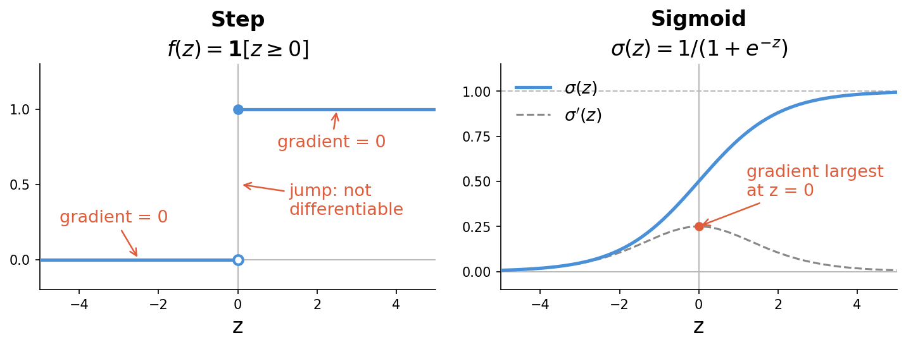
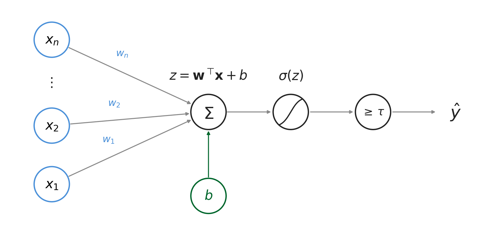
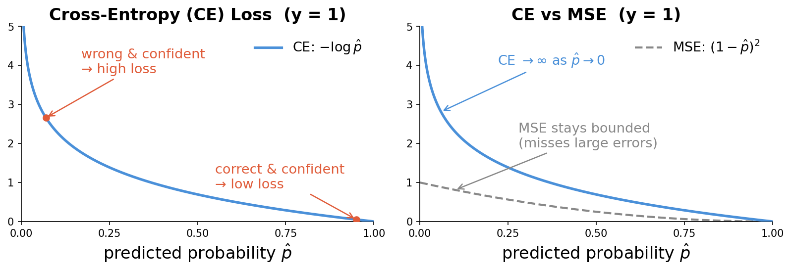

> **Navigation:** [<-- Random Forests](10-random-forests.md) | [Part Index](00-index.md) | [Main Index](../index.md) | [Part VI: Principles That Transfer (Reflection) -->](../part-06-reflection/00-index.md)

---

# Logistic Regression

**Requires**: [Linear Regression](02-linear-regression.md) · [Classification Tasks](07-classification-tasks.md)

**Motivation**: The supervised learning toolkit now covers regression and a range of classification methods. Our starting point was [🖝 Linear Regression](../part-05-supervised-learning/02-linear-regression.md), which can also be connected to classification. Let's do this, to wrap both regression and classification up. The obvious idea is to apply regression as is and somehow "round" the result. This turns out to need one key fix, and that fix reveals a direct path to neural networks.

> In this nugget you'll see why applying linear regression directly to a binary target requires modification, and how the sigmoid function bridges the gap. You'll get to know the cross-entropy loss for binary classification. Finally, we point at how logistic regression is a conceptual building block for neural networks.

> **Interactive demo note:** You can expore the sigmoid function and cross-entropy loss function presented here in the **Logistic Regression** demo from my [✪ interactive data-science demos](https://github.com/fgnussbaum/ds-ml-interactive-demos) repository.

## Table of Contents

- [From Linear Regression to Logistic Regression](#from-linear-regression-to-logistic-regression)
- [Cross-Entropy Loss](#cross-entropy-loss)
- [Bridge to Neural Networks](#bridge-to-neural-networks)
- [Summary](#summary)

## From Linear Regression to Logistic Regression

[🖝 Linear Regression](../part-05-supervised-learning/02-linear-regression.md) predicts a continuous value using a weighted sum of inputs:

$$h_{\mathbf{w}}(\mathbf{x}) = z = w_0 + w_1 x_1 + \cdots + w_n x_n$$

This cannot be applied directly to a binary classification problem because the output is unbounded from $-\infty$ to $+\infty$. Some transformation is needed.

For a binary target, what you want is a class label. The simplest way would just be to threshold on $z\geq0$. This amounts to passing the linear output through a **step function**.

However, the **step function is not differentiable.** The gradient of a step function is zero almost everywhere. [🖝 Gradient Descent](../part-05-supervised-learning/03-gradient-descent.md) requires a gradient to update the weights. Where the gradient is zero, nothing moves.

In addition to differentiability, it would also be desirable to get probability scores for each sample to indicate how likely it belongs to the positive class. We don't get that from a simple threshold on the unbounded raw scores $z$ of the linear model above.

All requirements are simultaneously obtained when we switch to the **sigmoid function** (also called logistic function):

$$\sigma(z) = \frac{1}{1 + e^{-z}}$$

where $z = h_{\mathbf{w}}(\mathbf{x})$ is the linear combination of features and weights. The sigmoid function maps any real number to the interval $(0, 1)$. This produces valid probability values, and it is differentiable everywhere, making [🖝 Gradient Descent](../part-05-supervised-learning/03-gradient-descent.md) applicable.

Here's a visual comparison of both step function vs. our solution, the sigmoid function:

The properties of the sigmoid funciton $\sigma(z)$ are:

- it is close to 1 for large positive $z$ (the model is confident about class 1),
- it is close to 0 for large negative $z$ (the model is confident about class 0),
- at $z = 0$ the output is exactly 0.5: maximum uncertainty.

To, sum up:

> **Dinstinction linear/logistic regression:** [🖝 Linear Regression](../part-05-supervised-learning/02-linear-regression.md) outputs $h_{\mathbf{w}}(\mathbf{x})$ directly: an unbounded number interpreted as a continuous target value. In contrast, **logistic regression** feeds the same linear combination $z$ through $\sigma$, outputting a probability score in $(0, 1)$ for the "positive" class.

You can also follow this distinction in the full compute flow for a single prediction using logistic regression, as shown here:

---

## Cross-Entropy Loss

With a probabilistic output you need a loss function that measures how wrong a probability estimate is. The typical choice is the **cross-entropy loss** (also called log loss):

$$L = -\bigl[y \log(\hat{p}) + (1 - y) \log(1 - \hat{p})\bigr]$$

where $y \in \{0, 1\}$ is the true label and $\hat{p} = \sigma(z)$ is the predicted probability.

- When $y = 1$: the loss is $-\log(\hat{p})$. A predicted probability of 0.99 gives near-zero loss. A predicted probability of 0.01 gives a large loss: the model was confidently wrong.
- When $y = 0$: the loss is $-\log(1 - \hat{p})$. The same logic applies in reverse.

This behavior is visualized here:

The second panel in this plot shows why MSE (mean squared error), the loss function from [🖝 Linear Regression](../part-05-supervised-learning/02-linear-regression.md), is poorly suited for classification: It does not penalize "confident" but wrong predictions enough because it is bounded.

The cross-entropy loss is differentiable with respect to the weights, so [🖝 Gradient Descent](../part-05-supervised-learning/03-gradient-descent.md) can minimize it. The gradient has a clean closed form that makes weight updates efficient to compute.

---

## Bridge to Neural Networks

Logistic regression computes a linear combination of inputs and passes it through a sigmoid. This is exactly the computation of a single artificial neuron.

> **Insight:** Logistic regression is a neural network with no hidden layers.

Logistic regression represents an input layer connected directly to one output neuron with a sigmoid activation. Stacking such units produces a deep network, where the outputs of one layer become the inputs of the next. Later, in [🖝 Building Blocks of Deep Networks](../part-08-deep-learning/02-deep-networks.md), we'll do a more comprehensive treatment.

This closes Part V on supervised learning. In the next part, we step back from individual algorithms and review the principles that cut across all of them, before moving on to deep learning.

---

## Summary

- The sigmoid function wraps the linear combination in a smooth, differentiable nonlinearity, converting an unbounded output into a probability. This is the key difference between linear and logistic regression.
- Cross-entropy loss is the appropriate loss function for probabilistic classification. It penalizes confident wrong predictions heavily and is differentiable everywhere, making gradient descent applicable.
- Logistic regression is a single neuron with a sigmoid activation. Stacking such units produces a neural network, as covered in Part VIII.

As always: Happy learning, happy life! 🫶

---

> **Navigation:** [<-- Random Forests](10-random-forests.md) | [Part Index](00-index.md) | [Main Index](../index.md) | [Part VI: Principles That Transfer (Reflection) -->](../part-06-reflection/00-index.md)

Script v1.4.1 (2026-06-23) · FGN
