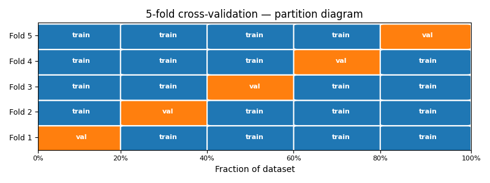
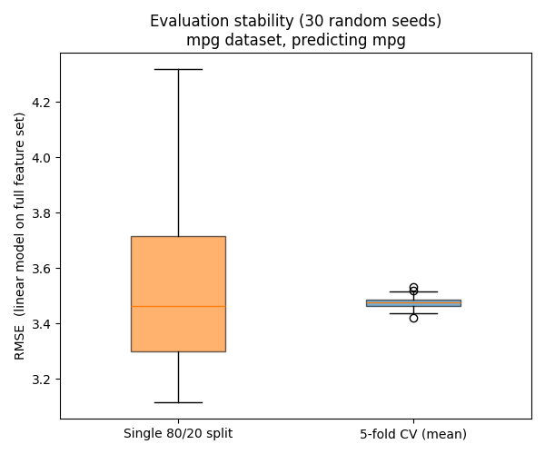
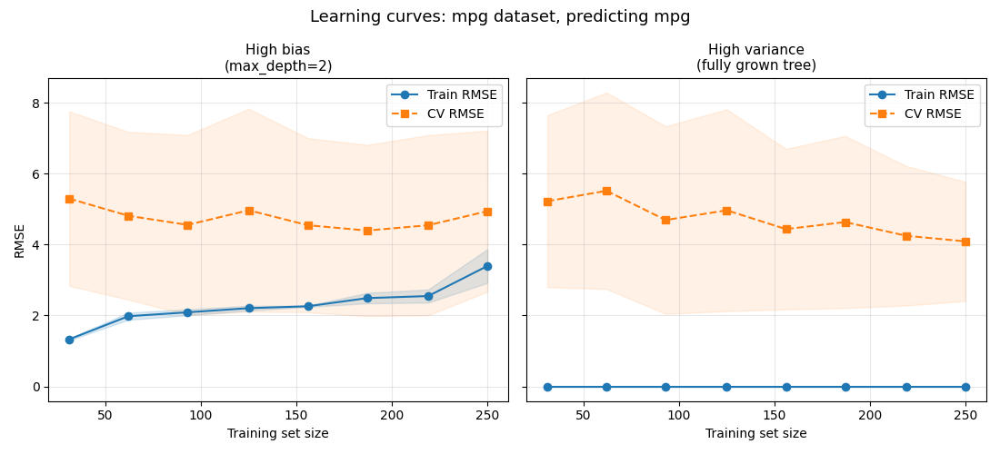
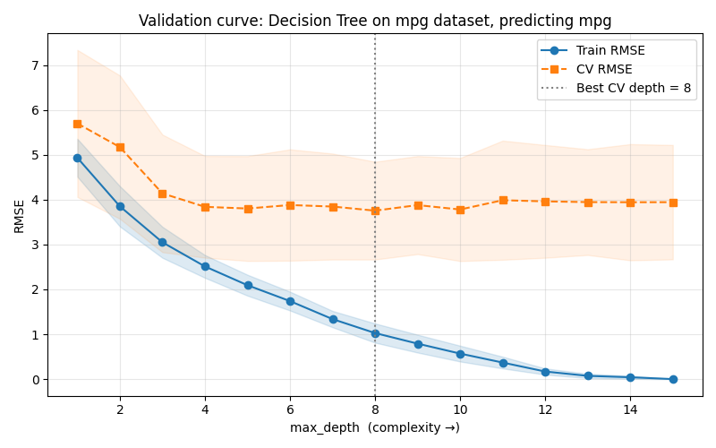

> **Navigation:** [Part Index](00-index.md) | [Main Index](../index.md) | [Start Simple -->](02-start-simple.md)

---

# Generalization

**Requires**: [Classification Tasks](../part-05-supervised-learning/07-classification-tasks.md) · [Data Splits](../part-04-data-preparation/04-data-splits.md) · [Underfitting and Overfitting](../part-05-supervised-learning/04-under-overfitting.md)

**Motivation**: Coming from part 5, you already know that training scores "flatter" and test scores tell the "truth". Now, there
s are some important observations: First, a single held-out split is a noisy estimate, and second consulting the test set repeatedly during development quietly contaminates it. Therefore, you need a principled evaluation strategy that works throughout model development, not just for the final evaluation at the end.

> In this nugget, you'll learn why training error is a biased estimator of generalization error and what cross-validation does to correct it. Learning curves and validation curves translate the bias-variance diagnosis from [🖝 Underfitting and Overfitting](../part-05-supervised-learning/04-under-overfitting.md) into actionable tools.

## Table of Contents

- [Why the Training Score Lies](#why-the-training-score-lies)
- [Cross-Validation](#cross-validation)
- [Diagnostic Curves](#diagnostic-curves)
- [Complexity Control via Regularization](#complexity-control-via-regularization)
- [Summary](#summary)

## Why the Training Score Lies

Training error is systematically biased downward. The model parameters were optimized to minimize this training error, so measuring performance on training examples is subject to the best possible conditions. The gap between training error and true generalization error grows with model complexity: More flexible model memorize more of the training examples.

A test set corrects this, as established in [🖝 Data Splits](../part-04-data-preparation/04-data-splits.md). However, it can cause a subtler problem during development time: Each decision guided by test performance implicitly fits that decision to it, eroding its value as a final audit. That's why it is better to use a separate validation set for these development decisions. We have already introduced this idea in [🖝 Data Splits](../part-04-data-preparation/04-data-splits.md), [🖝 Underfitting and Overfitting](../part-05-supervised-learning/04-under-overfitting.md), and [🖝 Hyperparameter Optimization](../part-05-supervised-learning/06-hyperparameters.md).
In the next section, we discuss a related validation strategy.

---

## Cross-Validation

**Cross-validation (CV)** is a way to estimate generalization performance using the training data itself, leaving the test set untouched.

Specifically, in **k-fold cross-validation**, the training data is divided into $k$ equally sized folds. The model is trained $k$ times: each time, one fold serves as the validation set and the remaining $k-1$ folds are used for training. The $k$ scores are averaged into a single stable estimate for the generalization error.

A typical choice is $k = 5$ or $k = 10$. Larger $k$ gives a more stable estimate at the cost of having to fit more models.

How much more stable can CV results be? The following figure for the [🔗 MPG dataset](https://www.kaggle.com/datasets/uciml/autompg-dataset) gives a hint (task: predicting `mpg` - miles per gallon):

To obtain this figure, for each of 30 random seeds,  respectively a model was trained using (a) a single random 80/20 split and (b) 5-fold cross cross validation (CV). So the box plot shows the distributions of generalization RMSE scores across these 30 trials, respectively. Both produce similar means. What differs is spread.

Here, if a model was trained on single split (left box plot), it scored in a range that is an order of magnitude larger than for five-fold CV (right box plot). This shows that unlucky splits can distort results, especially for small datasets where small sample numbers can cause substantial deviation from the underlying true distribution of the population.

Implementation note: In `sklearn`, CV can be done using `cross_val_score` function from `sklearn.model_selection`.

---

## Diagnostic Curves

Even with an evaluation strategy in place, you still need diagnostic tools to understand *why* a model generalizes well or not. Here, we discuss two commonly used curve types for that purpose. The examples still use the MPG dataset, trying to predict `mpg` using regression [🖝 Decision Trees](../part-05-supervised-learning/09-decision-trees.md).

### Learning Curves

A **learning curve** plots train vs. validation/CV error as the number of training examples increases for a fixed model.

The left panel (max_depth=2) shows the high-bias signature:

- Both curves move toward a poor RMSE value. The model's limited capacity is the ceiling, not the training size. Adding more data barely helps generalization.
- The model is too simple. Try a more complex model or add features.

The right panel (fully grown tree) shows the high-variance signature:
- Train RMSE is exactly zero at every size, and CV RMSE stays high. The model memorizes whatever it receives, and more data helps only slowly.
- The model is too complex. Reduce complexity, apply regularization, or collect more data.

### Validation Curves

A **validation curve** replaces training size with a complexity hyperparameter on the x-axis, making the bias-variance trade-off directly visible. We already saw that in [🖝 Underfitting and Overfitting](../part-05-supervised-learning/04-under-overfitting.md). Here's another example from the MPG dataset: 

The MPG curve for decision tree depth shows three zones.
- `max_depth` 1–4: both train and CV error fall together, every additional split captures genuine signal.
- `max_depth` 5–10: train error keeps falling while CV error flattens, the model is adding capacity that no longer generalizes.
- `max_depth` 11+: train error is approaching toward zero while CV error starts drifting upward.

Here, the CV minimum is a wide plateau spanning depths 4 to 10 roughly, not a sharp peak. The data itself shows no preference between models in that range.

> **Best Practice:** Within plateaus, always prefer simpler models for interpretability and robustness (here shallower depth). See also [🖝 Start Simple](../part-06-reflection/02-start-simple.md).

---

## Complexity Control via Regularization

The **regularization principle** replaces pure loss minimization with a combined objective:

$$\text{Cost}(h) = \text{EmpiricalLoss}(h) + \lambda \cdot \text{Complexity}(h)$$

The empirical loss rewards fit to training data. The complexity term penalizes hypotheses $h$ that are too elaborate. $\lambda$ controls how heavily the model is penalized for using that extra capacity. A large $\lambda$ produces a simpler model that may underfit. A small $\lambda$ gives the model room to overfit. There is no universal right value, so it must be tuned via cross-validation techniques.

In [🖝 Regularized Regression](../part-05-supervised-learning/05-regularized-regression.md), we saw how Ridge and Lasso instantiate the formula above using the L1 and L2 norms on the weights.
$$\text{MSE}(\mathbf{w}) + \lambda \|\mathbf{w}\|_1,\quad\text{and}\quad\text{MSE}(\mathbf{w}) + \lambda \|\mathbf{w}\|_2^2$$
The same penalty idea extends beyond linear models: neural networks routinely apply L2 weight decay across all layers, an equivalent of Ridge regularization regardless of network depth.
It is even possible to combine different regularization terms. For example, Elastic Net combines L1 and L2 terms for the "best of two world" - sparsity and stability:
$$\text{MSE}(\mathbf{w}) + \lambda_1 \|\mathbf{w}\|_1 + \lambda_2 \|\mathbf{w}\|_2^2.$$
The significant cost is that more hyperparameters need to be tuned.

For tree-based models, hyperparameters like `max_depth` and `min_samples_leaf` are **capacity constraints**: they restrict the hypothesis space itself. Technically, they still fit the framework with a penalty that is "infinity" where the capacity constraints is violated, and zero otherwise.

> **Key insight:** Penalty-based regularization and capacity constraints all trade training fit for generalization. In both cases, the controlling parameter must be tuned via cross-validation, never on the test set.

---

## Summary

- Training error systematically underestimates generalization error. Consulting the test set repeatedly during development transfers that bias, making the test score unreliable too.
- Cross-validation estimates generalization performance from the training data alone by averaging scores across $k$ held-out folds. It is far more stable than a single split and leaves the test set intact for a final one-shot audit.
- Learning curves (train/CV vs. training size) and validation curves (train/CV vs. a complexity hyperparameter) can help to diagnose failure modes and find the bias-variance sweet spot.

As always: Happy learning, happy life! 🫶

---

> **Navigation:** [Part Index](00-index.md) | [Main Index](../index.md) | [Start Simple -->](02-start-simple.md)

Script v1.3 (2026-06-09) · FGN
