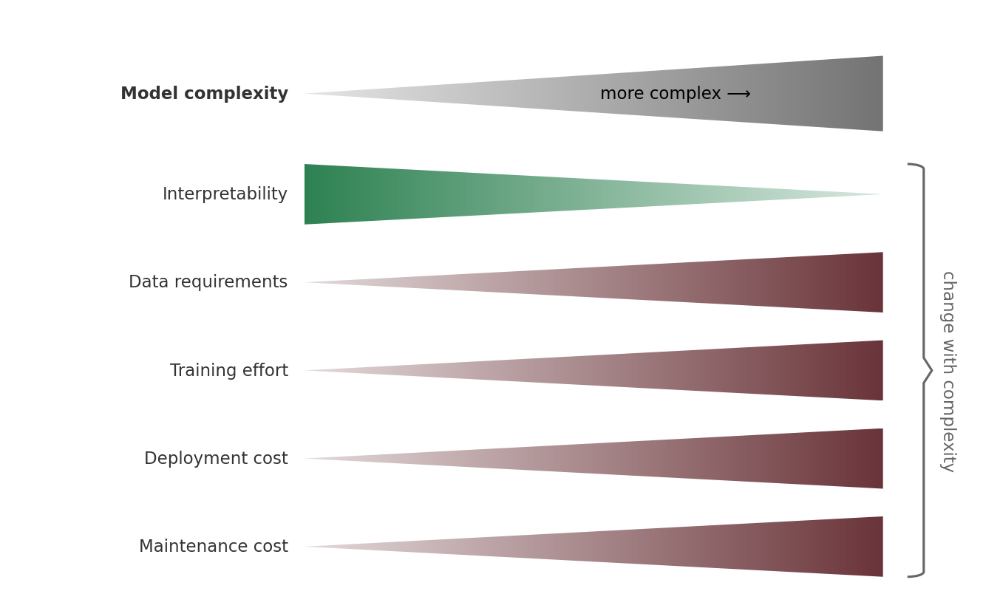
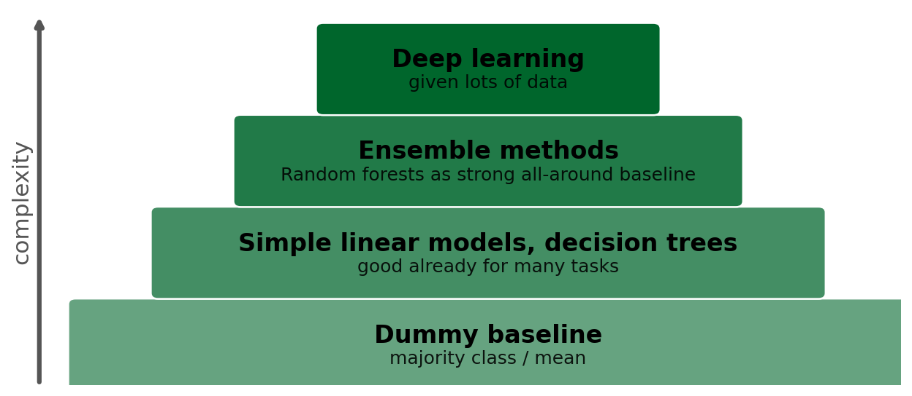

> **Navigation:** [<-- Generalization](01-generalization.md) | [Part Index](00-index.md) | [Main Index](../index.md) | [Baselines and the Good-Enough Bar -->](03-baselines.md)

---

# Start Simple

**Requires**: [Generalization](01-generalization.md)

**Motivation**: For any problem, there are usually dozens of potential solutions. Where to start? Almost without the exception the answer is: Start simple. Pick the simplest plausible model. Simple models will not always end up being the best choice, but they set a standard that any more complex model must beat. Since complexity also adds costs, beating simple models is often hard.

> In this nugget, you'll see why simpler models are often the right choice. We'll discuss related principles, like building and evaluating models incrementally so each change teaches you something.

## Table of Contents

- [Occam's Razor in Machine Learning](#occams-razor-in-machine-learning)
- [One Change at a Time](#one-change-at-a-time)
- [The Complexity Ladder](#the-complexity-ladder)
- [Summary](#summary)

## Occam's Razor in Machine Learning

In the 14th century, the philosopher William of Ockham articulated what became known as **Occam's razor**: Among competing hypotheses that explain the evidence equally well, prefer the one that requires the fewest assumptions. In plain words, this means:

> If you have different alternatives that perform similarly: Prefer simple over complex.

This is a universal principle. It applies to machine learning in particular. The reason is that adding model complexity also adds costs:

Simpler models:

- **Are easier to explain to stakeholders**: A shallow decision tree can be shown as a flowchart in a presentation. The internals of a [🖝 Random Forests](../part-05-supervised-learning/10-random-forests.md) ensemble cannot. 
- **Require less data**: Since simpler models usually have less parameters, they are less likely to overfit. This means they often work better when data is limited.
- **Are easier to train**: Not only is training faster, failures are also easier to debug. When a [🖝 Linear Regression](../part-05-supervised-learning/02-linear-regression.md) gives a poor result, the reasons are often visible in the residuals or the coefficient values. When a blackbox deep learning model fails, diagnosis is much harder.
- **Deploy faster and cost less**: A [🖝 Logistic Regression](../part-zz-appendix/03-logistic-regression.md) runs in microseconds on any hardware. A large neural network requires a GPU and careful infrastructure.
- **Are easier to maintain**: As data distributions shift over time, a simple model is easier to retrain, update, and explain to future maintainers.

---

The right question when facing a new problem is not "What is the most powerful model?", but "What is the least complex model that solves this problem adequately?"
Complex models are like a _hammer_: powerful, but not the best tool for everything:

In everyday life, when communicating with stakeholders, you can often replace "complex models" by "AI" in the hammer analogy above. AI is often too complex a solution. Many problems can be solved in much simpler and better ways. As an AI expert, you'll often tell stakeholders who might believe "AI can solve everything" when it actually should not.

Counterintuitive, right?

> **Key Insight:** Even if AI can solve a problem, it should not always be actually used as a solution. In fact, one of the main added values of you being an AI expert is knowing when NOT to use AI for a problem. And convincing stakeholders of that.

---

## One Change at a Time

Suppose you switch from a decision tree to a random forest, add three new features, and normalize the inputs. If you do all of this at once and performance improves, you have no idea which change was responsible.

> Model development is most productive when treated as a **sequence of controlled experiments**: change one thing, measure the effect, decide whether to keep the change.

This applies at every level of the development cycle.

- **Data:** modifying any data (relabeling, adding new data, etc)
- **Features:** Add one feature at a time, or one coherent group of features. Measure the cross-validated performance before and after. If the feature does not help, leave it out.
- **Hyperparameters:** Tune one parameter at a time before using automated search. This is slower, but you will understand your model's behavior much better.
- **Models:** Before switching to a more complex algorithm, ask whether a deeper hyperparameter search or better features can close the gap.

Keep an experiment log. For small projects it can be minimal. Example:

| Experiment | Change | CV/Val score |
|------------|--------|----------|
| 1 | Decision tree, default | 0.71 |
| 2 | Add feature: age group | 0.74 |
| 3 | Depth limited to 5 | 0.73 |
| 4 | Random forest, default | 0.77 |

A log like that costs little to maintain, but you'll keep a better overview of your experiments and decisions.

> **Discussion:** Under time pressure, the temptation is to "try everything and see what sticks." When is that a reasonable tactic, and when does it backfire? How do you build in incremental discipline when a deadline is close?

---

## The Complexity Ladder

The following practical hierarchy of model complexity applies to most supervised learning problems with tabular data. Start with a baseline, see the next nugget [🖝 Baselines and the Good-Enough Bar](../part-06-reflection/03-baselines.md). Then and only step up only when evidence demands it.

The evidence to step up typically is **persistent underfitting**: Both training and validation/CV errors are high, the gap between them is small, and adding more data does not help. In contrast, if the problem is **overfitting** (large training-validation gap), adding complexity will make it worse.

For the vast majority of real-world tabular data problems, a well-tuned [🖝 Random Forests](../part-05-supervised-learning/10-random-forests.md) (or gradient boosted trees) handles the task well. Due to its complexity costs, deep learning is by far not the most common solution.

*See also [🖝 Generalization](../part-06-reflection/01-generalization.md): Learning curves are the diagnostic tool that tells you whether stepping up is warranted.*

---

## Summary

- Simpler models generalize better, fail more interpretably, and are cheaper to build, deploy, and maintain. Prefer the least complex model that solves the problem adequately.
- Build models incrementally: one change at a time, with measurements after each change. Simultaneous changes produce results you cannot interpret.
- The simplicity ladder (dummy → linear / shallow tree → random forest / gradient boosting → deep learning) is a default progression for tabular data. Step up only when the learning curve shows persistent underfitting at the current level.

As always: Happy learning, happy life! 🫶

---

> **Navigation:** [<-- Generalization](01-generalization.md) | [Part Index](00-index.md) | [Main Index](../index.md) | [Baselines and the Good-Enough Bar -->](03-baselines.md)

Script v1.3 (2026-06-09) · FGN
