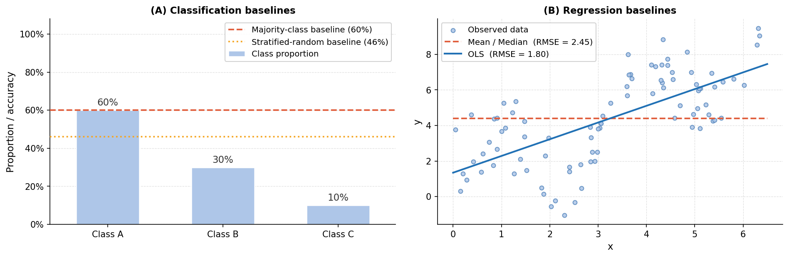

> **Navigation:** [<-- Start Simple](02-start-simple.md) | [Part Index](00-index.md) | [Main Index](../index.md) | [Choosing and Aligning Metrics -->](04-aligning-metrics.md)

---

# Baselines and the Good-Enough Bar

**Requires**: 

**Motivation**: In [🖝 Start Simple](../part-06-reflection/02-start-simple.md) you saw that complexity must be earned: step up only when simpler models fall short. But fall short relative to what? Model development relies on two reference points that serve different purposes. First, the baseline floor: what a model that learned nothing at all would achieve. Second, there is a good-enough bar: the minimum performance the application actually requires. The first provides a development signal. The second is a deployment criterion.

> In this nugget, you'll learn what a baseline is, how to construct one for both classification and regression, and how to use it to check whether a model has genuinely learned something. You'll also see that domain goals determine when a model is good enough.

## Table of Contents

- [Always Beat the Dummy Baseline First](#always-beat-the-dummy-baseline-first)
- [Setting the Good-Enough Bar](#setting-the-good-enough-bar)
- [Summary](#summary)

## Always Beat the Dummy Baseline First

A **dummy baseline** is the performance achievable by a model that uses no learned relationships between features and target. For classification and regression the standard choices are majority class and mean, respectively:

- The **dummy classifier** predicts the majority class for every input. Its accuracy equals the proportion of the most frequent class in the training set.
- The **dummy regressor** predicts the mean of the training targets for every input. Its mean squared error (=MSE) equals the variance of the training target.

There are variations of these baselines, like using a median or adjusting to a particular domain (like using seasonal means). But in general, that's it. Simple.

Implementation-wise sklearn provides `DummyClassifier` and `DummyRegressor`. Fit them on the training data, score them on the held-out data, report them.

> **Tip:** Always include the baseline score when reporting model results.

A relative performance difference as in "Our model achieves 88% accuracy, compared to 85% from the majority-class baseline" tells you what the model actually learned.

### What a Baseline Reveals

A model that barely beats the dummy baseline is usually not a candidate for hyperparameter tuning. It rather calls for investigation. Potential causes for a weak model relative to the baseline are:

- **The features do not carry signal about the target.** More features or better data may be needed.
- **Data quality problems.** The target or features may be measured inconsistently or contain systematic errors. Noisy labels give a hard limit to what patterns a model can learn, regardless of complexity.
- **Issues with problem definition.** The prediction task may need to be adjusted. Perhaps the target variable is not well-defined for what the system actually needs to do.

Checking the baseline is therefore a cheap diagnostic step at the beginning of the modeling process. It also aligns with [🖝 Start Simple](../part-06-reflection/02-start-simple.md).

---

## Setting the Good-Enough Bar

In addition to the "floor" baseline, a model often also needs to achieve a minimum performance to become a candidate for deployment. It needs to be **good enough**. Here, good enough is a domain and problem-dependent judgment, not a universal threshold:

- A fraud detection model that catches 45% of a new type of fraudulent transactions may represent enormous business value, even though it misses the majority.
- A medical risk-scoring model that explains only 25% of the variance of the target variable may be insufficient to justify treatment decisions.
- A recommendation engine that improves click-through rate by 3% above the popularity baseline may generate significant revenue at scale.

At best, domain requirements appear as explicit thresholds: "catch at least 80% of fraud cases" or "stay within ±5% of demand." If you are given such requirements, you should translate them into a minimum acceptable value on a specific metric. For example, a minimum recall value of 0.8 for the fraud domain requirement.

> **Practical note:** In many cases, domain requirements might not yet be explicit. In these cases, they must be negotiated with stakeholders as part of business understanding. When would a model be good enough to do real work? 

Domain requirements inform which metrics to use. Metrics must be chosen before training, not after: If the domain requirement is recall-based, optimizing for accuracy may yield a model that clears the baseline but fails the requirement.

Taken together, the baseline floor and the good-enough bar anchor modeling decisions: One establishes that the model has learned something. The other defines what the application actually needs, which we'll explore further in the next nugget [🖝 Choosing and Aligning Metrics](../part-06-reflection/04-aligning-metrics.md).

TODO: link business nugget (Part IX).

---

## Summary

- The dummy baseline predicts the majority class (classification) or the training mean (regression). It is a development gate: any learned model must beat it before investing further effort.
- A model that barely beats the baseline signals a problem with the data, the features, or the problem definition. It does not signal a need for a more complex model.
- "Good enough" is defined by domain requirements like a minimum recall or a maximum error rate. These requirements must be translated into data-science metrics and corresponding threshold before training begins.

As always: Happy learning, happy life! 🫶

---

> **Navigation:** [<-- Start Simple](02-start-simple.md) | [Part Index](00-index.md) | [Main Index](../index.md) | [Choosing and Aligning Metrics -->](04-aligning-metrics.md)

Script v1.3 (2026-06-09) · FGN
