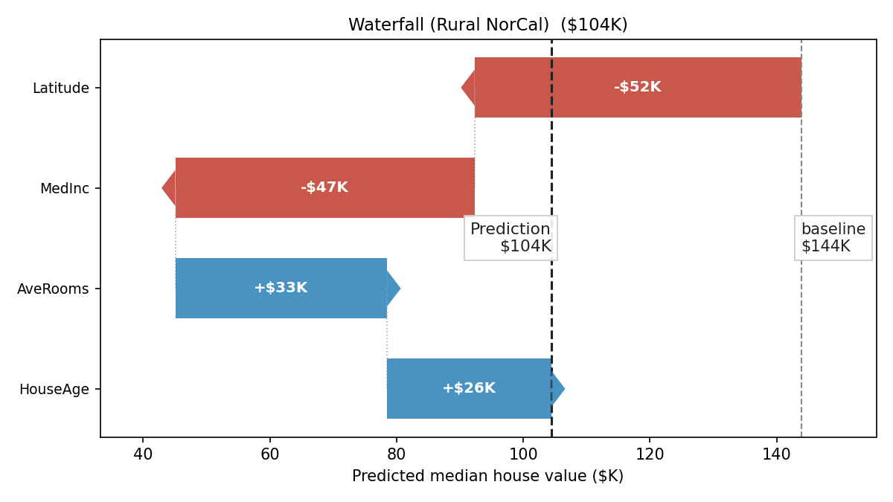
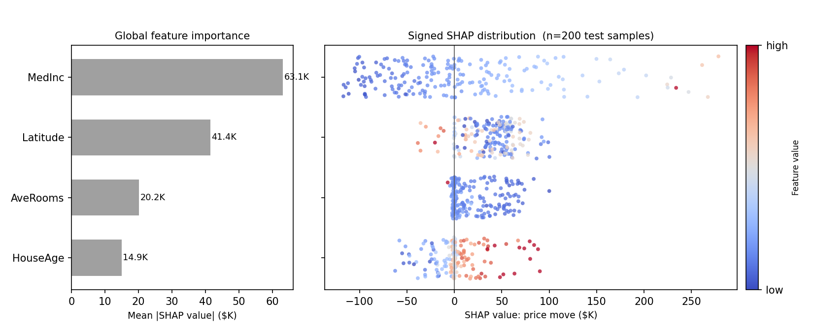

> **Navigation:** [<-- Choosing and Aligning Metrics](04-aligning-metrics.md) | [Part Index](00-index.md) | [Main Index](../index.md) | [Part VII: Unsupervised Learning -->](../part-07-unsupervised-learning/00-index.md)

---

# Explainability

**Requires**: [Start Simple](02-start-simple.md) · [Random Forests](../part-05-supervised-learning/10-random-forests.md)

**Motivation**: Your model predicts something, but can a human understand why? Models that are **explainable/interpretable** help both the people who act on their decisions and those affected by them, like a patient receiving an AI-assisted diagnosis. As a rule of thumb, more complex models are less interpretable: this is yet another reason to [🖝 Start Simple](../part-06-reflection/02-start-simple.md), since something like a [🖝 Random Forests](../part-05-supervised-learning/10-random-forests.md), with its thousands of branches, already resists explanation almost as much as a black-box neural network. Beyond debugging and calibrating trust, explainability is increasingly becoming a legal requirement.

> Here you'll learn what interpretability means as a design paradigm, how to read the explanations that certain model types provide intrinsically. You'll also get to know SHAP values as a first post-hoc method to attribute explanations to predictions from models that do not explain themselves.

## Table of Contents

- [Interpretability as a Design Paradigm](#interpretability-as-a-design-paradigm)
- [Reading What a Model Says](#reading-what-a-model-says)
- [Post-Hoc Tools: A Brief Introduction to SHAP](#post-hoc-tools-a-brief-introduction-to-shap)
- [Summary](#summary)

## Interpretability as a Design Paradigm

**Interpretability** is the degree to which a human can understand the mechanism behind a model's predictions. It is first of all a property of the model itself, chosen at design time. It cannot not always be added adequately later.

A [🖝 Linear Regression](../part-05-supervised-learning/02-linear-regression.md) model, for example, is highly interpretable: Each coefficient tells you the direction and magnitude of each feature's contribution to the prediction. A 100-tree [🖝 Random Forests](../part-05-supervised-learning/10-random-forests.md) is not. Any attempt to interpret this intrinsically black bock model has to make compromises.

In this light, the first and most powerful interpretability strategy is to [🖝 Start Simple](../part-06-reflection/02-start-simple.md): Choose the least complex model that solves the problem well enough.

It is true that in some domains, there is a **accuracy-interpretability tradeoff**. For tabular data in particular, it is often overstated: A well-tuned linear model or shallow decision tree frequently comes within a few percentage points of a complex model's performance, with dramatically more transparency.

### Contexts that require interpretability

There are contexts where interpretability is not optional:

- **Regulatory compliance:** Many applications (like credit scoring decisions, insurance pricing, and hiring tools) must provide explanations for individual decisions in many jurisdictions. Black-box models cannot be deployed in these contexts regardless of their performance.
- **Debugging:** An interpretable model lets you verify that it is using the right features. If a model predicts patient outcomes primarily based on the day of the week, that is a signal of data quality or leakage. Insights like that require being able to read the model.
- **Stakeholder trust:** There are all kinds of stakeholders: managers, users and people affected from model outputs (like patients). Stakeholders who cannot understand the model cannot validate or trust it. Trust is fundamental in many model deployment decisions and if you want stakeholders to act on the model's outputs.

---

## Reading What a Model Says

### Linear and logistic regression: coefficients

In [🖝 Linear Regression](../part-05-supervised-learning/02-linear-regression.md), you already saw this plot with coefficients from a regression model for the tips dataset:

The coefficient $w_j$ in a linear model represents the predicted change in the target for a one-unit increase in feature $j$, provided all other features are held constant.

For the comparison of coefficients across features, the input features must be standardized first. Otherwise, on raw features, a large coefficient may simply reflect a small unit of measurement rather than a strong effect. The feature scaling is best done before training, see [🖝 Scaling and Imputation](../part-04-data-preparation/03-scaling-imputation.md).

> **Note:** Correlated features complicate coefficient interpretation. If two features are highly correlated, the coefficient of each reflects their shared contribution in a way that can be misleading individually. This is a limitation of linear model coefficients as explanations.

For [🖝 Logistic Regression](../part-05-supervised-learning/11-logistic-regression.md), coefficients describe the log-odds of the positive class. The direction (positive/negative) is directly interpretable, but the magnitude requires care.

### Decision trees: the decision path

For any prediction made by a decision tree, you can trace the exact path from root to leaf, for example, "If Age > 35, and then trust in institutions ≤ 4 -> predict: high satisfaction". This is a human-readable and verifiable explanation of a single prediction.

We noted this strength in [🖝 Decision Trees](../part-05-supervised-learning/09-decision-trees.md): The flowchart structure is the primary reason to prefer decision trees when individual predictions must be explained.

### Random forests: feature importance

Random forests no longer produce a single decision path. It is not possible to combine the hundreds of paths as they will often conflict.

One interpretation method for random forests is **feature importance**: It is the aggregate reduction in impurity attributed to each feature, summed across all trees and all splits.
We covered this in [🖝 Random Forests](../part-05-supervised-learning/10-random-forests.md).

Feature importance is a useful global ranking of which variables drive the model's predictions overall. However, it is not a per-prediction explanation, and it has the same "correlated-feature limitation" that we discussed above for the coefficients from  regression models. These kind of "interpretability" questions and limitations have been tried to solve via post-hoc analysis of models.

---

## Post-Hoc Tools: A Brief Introduction to SHAP

> **Interactive demo note:** You can explore everything said here using the **Shapley** demo from my [✪ interactive data-science demos](https://github.com/fgnussbaum/ds-ml-interactive-demos) repository.

When a less interpretable model genuinely outperforms simpler alternatives and must still be explained, post-hoc explanation methods assign explanations to individual predictions from any model. **SHAP (SHapley Additive exPlanations)** is one of the most principled and widely used of such methods (Lundberg & Lee, 2017). Grounded in cooperative game theory, it answers a simple question for any single prediction: How much did each feature push it up or down from the model's average output?

In the interactive demo, we have a random forest trained on the [🔗 California housing dataset](https://www.kaggle.com/datasets/camnugent/california-housing-prices) to predict median house value (in thousands of dollars) from `MediumIncome`/`MedInc`, `HouseAge`, `AverageRooms`/`AveRooms`, and `Latitude`. Across the training data, its average prediction, the **base value**, is 144K. For one district, nicknamed "Rural NorCal", it predicts only 104K, a gap of 40K below the base value. Let's explore the feature SHAP values:

This waterfall plot gives an indication where that gap comes from: `Latitude` pulls the prediction down by 52K and `MedInc` by 47K, while `AveRooms` adds back 33K and `HouseAge` adds 26K. Add these four contributions to the base value and you land exactly on 104K. Intuitively, nothing is left unexplained.

That additive property is what the SHAP formula captures. For a prediction $\hat{y}$ on a specific instance:

$$\hat{y} = \text{base value} + \sum_j \phi_j$$

where $\phi_j$ is the SHAP value of feature $j$, precisely the bars in the waterfall plot above. Each $\phi_j$ can be positive (pushing the prediction up) or negative (pushing it down).

A single waterfall plot explains one data point (here: district). To see whether it is typical, we can compute SHAP feature importances for the predictions on many samples and then average them to obtain global feature importances.

Across 200 test districts, the ranking shifts slightly from what "Rural NorCal" suggested: `MedInc` now has the largest average effect (+63.1K), `HouseAge` the smallest (+14.9K). Coloring each point by the district's actual feature value adds what a ranking cannot: direction. Low income (blue) reliably drags predictions down and high income (red) lifts them, while `AveRooms` does not show such clean pattern: similar feature values land on both sides of zero.

To compute SHAP values, the `shap` Python library is available.

---

## Summary

- Interpretability is a design property that is foremost chosen at model-selection time. The first interpretability strategy is choosing a simpler model: logistic regression models and shallow decision trees provide explanations for free.
- Linear models explain through coefficients (direction and magnitude per feature, on standardized inputs). Decision trees explain through the decision path from root to leaf. Random forests provide feature importance as a global signal.
- SHAP assigns per-prediction feature attributions to any model. Each SHAP value measures how much a feature shifted a specific prediction away from the model's average. The sum of all SHAP values exactly decomposes the prediction.

As always: Happy learning, happy life! 🫶

---

> **Navigation:** [<-- Choosing and Aligning Metrics](04-aligning-metrics.md) | [Part Index](00-index.md) | [Main Index](../index.md) | [Part VII: Unsupervised Learning -->](../part-07-unsupervised-learning/00-index.md)

Script v1.5 (2026-06-24) · FGN
