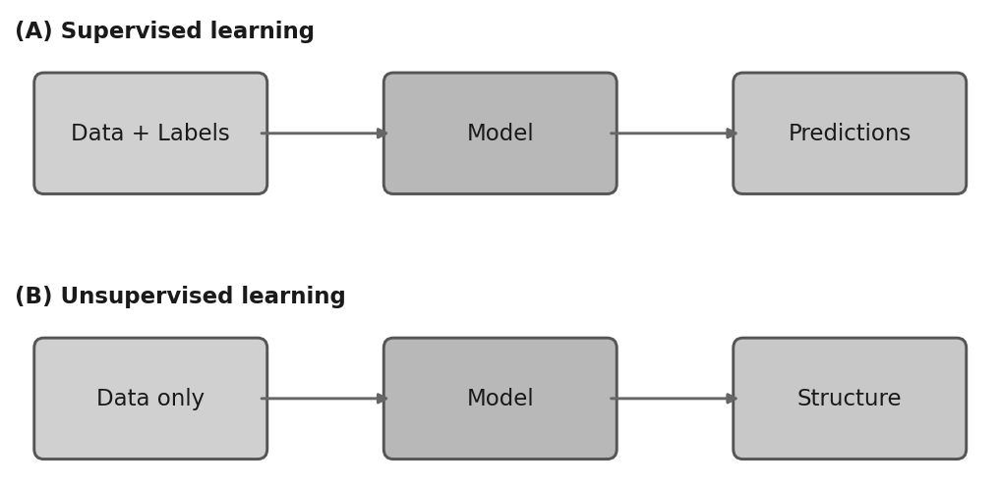

> **Navigation:** [Part Index](00-index.md) | [Main Index](../index.md) | [k-Means Clustering -->](02-k-means-clustering.md)

---

# Unsupervised Learning

**Requires**: [Supervised Learning](../part-05-supervised-learning/01-supervised-learning.md) · [CRISP-DM](../part-01-the-big-picture/04-crisp-dm.md)

**Motivation**: Throughout Part V we considered models with a target column at hand: like the happiness score in the ESS survey data.
Real data is often not like that. A new production line produces thousands of readings per hour before anyone has decided which patterns to call "good", and a customer database may contain transactions without any segment labels. Can you still find structure in data when no one has told you what to look for?

> You'll see what changes when the target column disappears, learn the two main families of unsupervised tasks (grouping and detection), and revisit the CRISP-DM loop to understand what evaluation looks like when there are no ground-truth labels to check against.

## Table of Contents

- [When There Are No Labels: The Unsupervised Shift](#when-there-are-no-labels-the-unsupervised-shift)
- [Two Families: Grouping and Detection](#two-families-grouping-and-detection)
- [Supervised or Unsupervised? Choosing the Right Frame](#supervised-or-unsupervised-choosing-the-right-frame)
- [Evaluation for Unsupervised Learning](#evaluation-for-unsupervised-learning)
- [Summary](#summary)

## When There Are No Labels: The Unsupervised Shift

In [🖝 Supervised Learning](../part-05-supervised-learning/01-supervised-learning.md), every training example had a known "answer": a numeric target for regression or a class label for classification. The model's job was to find the mapping from inputs to that answer (= target, output).

**Unsupervised learning** removes the target column entirely. You have a dataset of observations, and you want to discover structure in it: natural groups, unusual instances, or compact representations. The task is to find structure without being specifically told what to look for.

In many real situations, labels simply do not exist yet.

- A new vibration sensor on a machine produces readings before anyone has characterized what a fault looks like.
- Customer transactions accumulate before analysts have agreed on what segments are meaningful.

Unsupervised methods are the right tool for these situations.

---

## Two Families: Grouping and Detection

There are two main task families in unsupervised learning.

**Clustering** (grouping) partitions the data into groups called **clusters**. The idea is that observations within a group are similar to each other and dissimilar to observations in other groups. The groups are not defined in advance. Examples:

- You might cluster survey respondents into segments with similar wellbeing profiles,
- or cluster machine measurements to find common operating pattern.

> In this part, we'll cover [🖝 k-Means Clustering](../part-07-unsupervised-learning/02-k-means-clustering.md), which is arguably the most widely used clustering method.

**Anomaly detection** assigns each observation a score reflecting how unusual it is relative to the rest of the data. High-scoring observations are flagged as anomalies. Examples:

- detect sensor readings that deviate sharply from the typical pattern,
- flag financial transactions that looks nothing like the others.

> In this part, we'll cover basic statistical methods in [🖝 Anomaly Detection](../part-07-unsupervised-learning/03-anomaly-detection.md) and an ensemble method that builds on the random forests idea: [🖝 Isolation Forests](../part-07-unsupervised-learning/04-isolation-forests.md).

Both clustering and anomaly detection ask different questions.
Clustering is about structure in the "main body" of the data.
Anomaly detection is about what falls outside that body.

> **Discussion:** Think of a dataset you have access to without labels and a research question. Might the task more naturally be framed as a clustering problem or as an anomaly detection problem? What would "structure" mean in that context?

---

## Supervised or Unsupervised? Choosing the Right Frame

The primary question when choosing between supervised and unsupervised learning is: Do labels exist, and if not, can you get them?

If labels are available and if they capture what you care about, supervised learning is usually the stronger choice. A labeled dataset lets you optimize directly for the task, measure error on a held-out set, and make calibrated predictions.

In contrast, choose unsupervised methods when:

- labels do not exist and collecting them is expensive or impractical,
- the goal is to discover patterns rather than to confirm a prediction.

A common practical sequence is unsupervised first, then supervised: For exampl, you might run clustering to identify potential groups, then have a domain expert label a sample from each group, and then train a classifier.

This brings us to **semi-supervised learning**. Here, an  unsupervised step generates initial labels. There are many variations of how to do it. For example, a small labeled set can be used alongside a large unlabeled one to perform pseudo-labeling: train on the labeled data, use that model to assign tentative labels to the unlabeled data, then retrain on both. Possibly repeat.

---

## Evaluation for Unsupervised Learning

The [🖝 CRISP-DM](../part-01-the-big-picture/04-crisp-dm.md) process applies also for unsupervised learning, especially the inner loop between modeling and evaluation. However, the meaning and difficulty of evaluation changes:

- In supervised learning, you minimize a loss function and measure performance on a held-out test set.
- In unsupervised learning, both are less straightforward.

When no labels exist at all, a held-out set cannot verify correctness, but it can verify transferability: apply the learned structure (centroids, density model, anomaly scoring model) to held-out data and check whether the same patterns persist.
This comes with nuances depending on the considered unsupervised family.

<!--A general evaluation technique is stability analysis, which runs the algorithm on bootstrap subsamples and check whether results agree. High variance across subsets signals that the algorithm is fitting sample noise rather than real structure.-->

The ultimate check in the unsupervised setting, however, is **domain validation**:

- Do the results make sense to a practitioner?
- Do the clusters correspond to groups a domain expert recognizes?
- Do the flagged anomalies correspond to problems the engineer would investigate?

These are the real criterion.

---

## Summary

- Unsupervised learning operates without a target column. The task is to find structure (groups or anomalies) in the data itself.
- Two main families: (1) clustering for discovering natural groups, and (2) anomaly detection for flagging unusual observations that do not fit the pattern of the rest.
- Supervised learning is preferrable when labels are available and meaningful. Unsupervised methods are the right choice when labels do not exist, when the task is exploratory, or when you want to generate labels for a future supervised step.
- The CRISP-DM loop applies as before. Evaluation is the hard part: without ground-truth labels, the ultimate check is domain validation.

As always: Happy learning, happy life! 🫶

---

> **Navigation:** [Part Index](00-index.md) | [Main Index](../index.md) | [k-Means Clustering -->](02-k-means-clustering.md)

Script v1.4.1 (2026-06-23) · FGN
