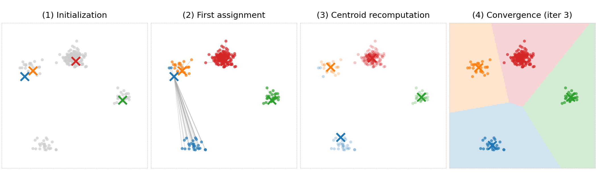
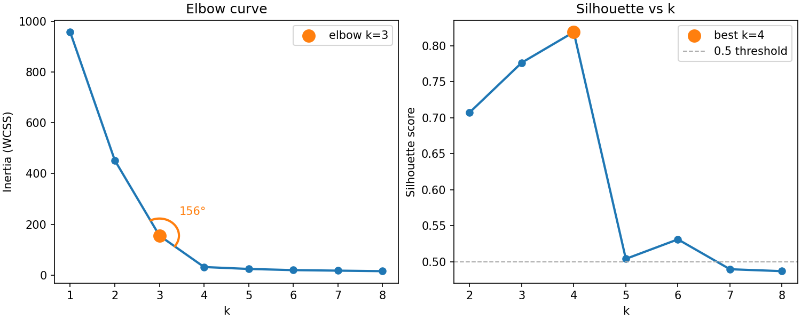
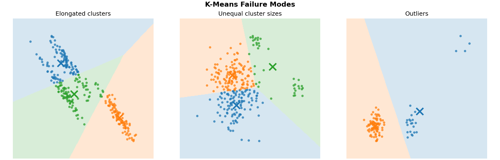

> **Navigation:** [<-- Unsupervised Learning](01-unsupervised-learning.md) | [Part Index](00-index.md) | [Main Index](../index.md) | [Anomaly Detection -->](03-anomaly-detection.md)

---

# k-Means Clustering

**Requires**: [Unsupervised Learning](01-unsupervised-learning.md) · [Hyperparameter Optimization](../part-05-supervised-learning/06-hyperparameters.md)

**Motivation**: You have a dataset, where you are interested in "natural" groups in the data: something like distinct segments in a survey population or different operating modes in a machine. You don't know yet how many groups there are or where they are. Clustering is the tool for this. How does an algorithm find groups in data without being told what a group looks like?

> Here, you'll work through the k-means algorithm step by step, learn how to evaluate whether the clusters it produces are meaningful, and understand where k-means fails so you know when to trust it and when to look elsewhere.

> **Interactive demo note:** You can explore everything said here using the **k-means clustering** demo from my [✪ interactive data-science demos](https://github.com/fgnussbaum/ds-ml-interactive-demos) repository.

## Table of Contents

- [Centroids and Assignment: How k-Means Works](#centroids-and-assignment-how-k-means-works)
- [Evaluating Clusters and Choosing k](#evaluating-clusters-and-choosing-k)
- [Assumptions and Failure Modes](#assumptions-and-failure-modes)
- [Bonus: k-means++](#bonus-k-means)
- [Summary](#summary)

## Centroids and Assignment: How k-Means Works

**k-Means** partitions a dataset into $k$ clusters by iterating two steps until the assignments stop changing.

First, choose $k$ and intitialize the algorithm with $k$ starting centroids for the clusters. Then, alternate the following steps:

**Step 1: Assignment.** Assign each observation to the nearest centroid. For observation $\mathbf{x}_i$ and centroids $\boldsymbol{\mu}_1, \ldots, \boldsymbol{\mu}_k$, the assignment is:

$$c_i = \arg\min_{j} \|\mathbf{x}_i - \boldsymbol{\mu}_j\|^2$$

**Step 2: Update.** Recompute each centroid as the mean of all observations currently assigned to it:

$$\boldsymbol{\mu}_j = \frac{1}{|C_j|} \sum_{\mathbf{x}_i \in C_j} \mathbf{x}_i$$

Repeat these alternating steps until the assignments no longer change. This is guaranteed to converge: the total within-cluster sum of squared distances (called **inertia**, see below) can only decrease or stay the same at each step, so the algorithm must terminate.

This plot show intermediate results of a k-means run on a dataset with four "overlapping blobs". (1) a random initialization, (2) visualization of the assignment step, (3) recomputed centroid means, and (4) the final result after convergence. For the final results, also shaded background is shown. These are the so-called **Voronoi-cells** that partition the whole space into cluster regions.

K-means is very sensitive to initialization. Different starting positions for the centroids can lead to different final clusters. The standard practice is to run k-means multiple times with different random initializations and keep the run with the lowest final inertia.

---

## Evaluating Clusters and Choosing k

Choosing $k$ is the central hyperparameter decision in k-means. While you can generally follow the procedure in [🖝 Hyperparameter Optimization](../part-05-supervised-learning/06-hyperparameters.md), there are no held-out labels to compare against as in supervised learning. You need different criteria/metrics:

**Inertia** measures total within-cluster spread: The sum of squared distances from each point to its assigned centroid. Lower inertia means tighter clusters. The problem is that inertia always decreases as $k$ increases: Setting $k = n$ produces zero inertia trivially. Inertia alone cannot tell you the right $k$. That's why two other methods are commonly used.

First, the **elbow method** plots inertia against $k$ and looks for a bend where the rate of improvement slows sharply ("biggest angle"). The "elbow" suggests a $k$ beyond which adding clusters captures noise rather than structure.

In practice the elbow is often gradual rather than sharp, which is why you need a second criterion.
The **silhouette score** gives that. For each observation $\mathbf{x}_i$, it computes:

$$\text{silhouette}_i = \frac{\bar{b}_i - \bar{a}_i}{\max(\bar{a}_i, \bar{b}_i)}\quad\in [-1, 1].$$

Here, $\bar{a}_i$ is the mean distance from $\mathbf{x}_i$ to all other observations in the same cluster (cohesion) and $\bar{b}_i$ is the mean distance from $\mathbf{x}_i$ to observations in the nearest other cluster (separation). The score ranges from $-1$ (misassigned) to $+1$ (perfectly placed). Averaging $\text{silhouette}_i$ over all observations gives a summary of cluster quality that is comparable across different values of $k$.

Use the two criteria together: look for a $k$ where the elbow plot levels off and the silhouette score peaks. When the two criteria suggest different values, defer to domain knowledge. In the plot above, $k=3$ or $k=4$ are suggested.

A $k$ that produces clusters a domain expert can name and interpret is better than a $k$ that optimizes a metric but produces uninterpretable groups.

This is the same logic behind cross-validated hyperparameter selection from [🖝 Hyperparameter Optimization](../part-05-supervised-learning/06-hyperparameters.md): Use the metric to narrow down candidates, then make the final call with domain context.

> **Discussion:** If you ran k-means on a dataset and computed silhouette scores for $k = 2$ through $k = 10$, what would you do if the silhouette scores were nearly equal across that range? What additional information would help you decide?

<!-- Prefer the smallest $k$: equal silhouette scores mean no statistical reason to add complexity.-->

---

## Assumptions and Failure Modes

k-Means assumes that clusters are roughly spherical, roughly equally sized, and that each observation belongs to exactly one cluster. When these assumptions are violated, the results can be misleading in ways that are not obvious from the metrics alone.

Elongated or crescent-shaped clusters will be cut arbitrarily by k-means, because the algorithm can only separate _convex_ regions. Clusters of very different sizes or densities cause centroids to drift: the centroid of a large or sparse cluster pulls toward a smaller or denser neighbor. A handful of outliers can shift a centroid away from the true center of its cluster, distorting every assignment in it. The following final solutions of k-means runs seek to demonstrate these "pitfalls".

This data already is 2D, but typically you run k-means on data with higher dimensions. In these cases, it can sometimes be helpful to plot a 2D projection of the data (e.g., the first two principal components) with cluster assignments colored. Check whether clusters look visually plausible.

When hard assignment is not enough, for instance, when an observation sits ambiguously between two groups and you want an assignment probability for each, then **Gaussian Mixture Models (GMMs)** are a natural extension of k-means (see, e.g., [🔗 Mixture models](https://en.wikipedia.org/wiki/Mixture_model)). GMMs model each cluster as a Gaussian distribution and output probabilistic memberships rather than hard labels.

---

## Bonus: k-means++

The standard k-means algorithm initializes centroids uniformly at random. If two initial centroids happen to land in the same natural cluster, the algorithm can converge to a poor partition.

**k-Means++** chooses initial centroids more carefully. The first centroid is chosen uniformly at random. Each subsequent centroid is chosen with probability proportional to its squared distance from the nearest already-chosen centroid. This spreads the initial centroids across the data, reducing the chance of redundant initialization.

In practice, k-means++ produces lower final inertia and converges faster than random initialization at negligible extra cost. It is the default in `sklearn`'s `KMeans` implementation (`init='k-means++'`).

---

## Summary

- k-Means alternates between assigning each observation to the nearest centroid and recomputing each centroid as the mean of its assigned observations. It always converges, but the result depends on initialization. Run multiple times and keep the best.
- Inertia always decreases with more clusters and cannot alone determine the right $k$. Use it together with the silhouette score, and validate the final choice with domain knowledge.
- k-Means assumes spherical, equally-sized clusters with hard assignments. It struggles with elongated clusters, large density differences, and outliers. Always plot the clusters visually before trusting the results.

As always: Happy learning, happy life! 🫶

---

> **Navigation:** [<-- Unsupervised Learning](01-unsupervised-learning.md) | [Part Index](00-index.md) | [Main Index](../index.md) | [Anomaly Detection -->](03-anomaly-detection.md)

Script v1.4.1 (2026-06-23) · FGN
