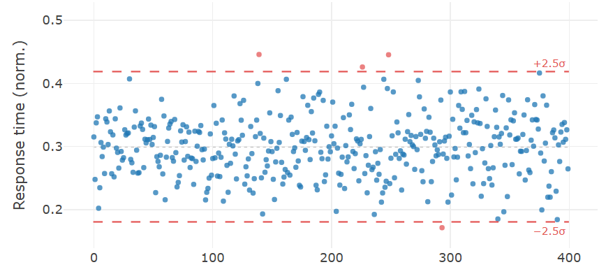

> **Navigation:** [<-- k-Means Clustering](02-k-means-clustering.md) | [Part Index](00-index.md) | [Main Index](../index.md) | [Isolation Forests -->](04-isolation-forests.md)

---

# Anomaly Detection

**Requires**: [Framing Unsupervised Learning](01-unsupervised-learning.md)

**Motivation**: You are monitoring a production machine and want to flag readings that look unusual before they become failures. The difficulty is that you have very few labeled examples of faults: most of the time the machine runs normally, and a fault is precisely what has not happened yet. Anomaly detection is the branch of unsupervised learning built for this situation. Its goal is to find observations that do not fit the pattern of the rest, without a labeled training set to learn from.

> In this nugget, you'll learn why framing what counts as an anomaly matters for anomaly detection, and you'll get to know the simplest statistical baselines that can be used for anomaly detection when you want interpretable, fast results on single features.

> **Interactive demo note:** You can explore everything said here using the **anomaly detection** demo from my [✪ interactive data-science demos](https://github.com/fgnussbaum/ds-ml-interactive-demos) repository.

## Table of Contents

- [What Counts as Abnormal: The Framing Problem](#what-counts-as-abnormal-the-framing-problem)
- [Baselines: Statistical Anomaly Detection](#baselines-statistical-anomaly-detection)
- [Summary](#summary)

## What Counts as Abnormal: The Framing Problem

**Anomaly detection** assigns each observation a score reflecting how unusual it is relative to the rest of the data. Typically, observations above a chosen threshold are flagged as anomalies.

There is no universal definition of "abnormal". What counts as anomalous depends entirely on the domain.

- A temperature reading of 80°C might be normal for one machine and catastrophic for another.
- A transaction of $€50\,000$ might be routine for a corporate account and suspicious for a student account.

> **Important:** The definition of normality must be derived from the data's domain context.

Any anomaly detector you build encodes an implicit definition of normality. Making that definition explicit is part of the modeling work.

### Pathways depending on label availability

There are three typical pathways in practice:

- **No labels at all.** The data contains no record of which observations were genuine anomalies. You build a model of normality from all the data and flag deviations from it.
- **Partial labels.** Some known anomalies have been flagged by engineers or analysts. They are not enough to train a supervised classifier, perhaps also because new types of anomalies are expected. However, the partial labels are useful to guide threshold setting or evaluating performance on a held-out sample.
- **Full labels.** Enough labeled anomalies exist to train a supervised model. In that case, supervised classification is typically stronger than unsupervised anomaly detection.

The partial-label setting is the most common in practice. For example, ground truth emerges gradually as engineers investigate flagged cases.

### Anomalies vs. outliers

It is worth distinguishing **anomaly** from the related term **outlier**. In [🖝 EDA: Distributions](../part-03-data-understanding/06-eda-distributions.md), we discussed outliers and the IQR criterion for flagging statistical extremes for further investigation.

An anomaly, by contrast, is a domain-meaningful deviation. A true anomaly usually warrants some kind of action. The two come apart in both directions.

- A billionaire's large transaction is a statistical outlier in a general-population dataset but not a fraud signal.
- Conversely, subtle sensor drift can stay well within the statistical norm while still being a known precursor to failure.

Whether a statistical extreme is also an anomaly is a domain question, not a statistics question.

---

## Baselines: Statistical Anomaly Detection

Before reaching for sophisticated models, it is always good to start with a statistical baselines (compare [🖝 Start Simple](../part-06-reflection/02-start-simple.md) and [🖝 Baselines and the Good-Enough Bar](../part-06-reflection/03-baselines.md)). Statistical baselines for anomoaly detection are fast, interpretable, and surprisingly effective when the data is reasonably well-behaved.

### The z-score method

Z-score measures how many standard deviations an observation lies from the mean. As in  [🖝 Scaling and Imputation](../part-04-data-preparation/03-scaling-imputation.md), for a feature $x$ with mean $\mu$ and standard deviation $\sigma$:

$$z = \frac{x - \mu}{\sigma}$$

Observations above a certain threshold are flagged as anomalies, for example $|z| > 3$. This works well when the data is approximately normally distributed. For scientific measurements that follow a near-Gaussian distribution (voltages, temperatures in stable conditions, spectroscopic intensities) the z-score is often the right starting point.
Here's an example from the interactive demo that marks a few anormal (server) response times using a z-score:

> **Warning:** The z-score is sensitive to the very outliers it is trying to detect. A single extreme value inflates the mean and standard deviation, making the score less sensitive to moderately unusual points. Compute it on a clean reference period rather than on the full dataset when possible.

### The interquartile range method

The **IQR method** (interquartile range) is slightly more robust than the z-score method (see [🖝 EDA: Descriptive Statistics](../part-03-data-understanding/04-eda-descriptive-stats.md) and [🖝 EDA: Distributions](../part-03-data-understanding/06-eda-distributions.md) for background on IQR). It flags observations that fall more than $1.5 \times \text{IQR}$ below the first quartile or above the third quartile:

$$\text{lower} = Q_1 - 1.5 \cdot \text{IQR}, \qquad \text{upper} = Q_3 + 1.5 \cdot \text{IQR}$$

Because it is based on order statistics rather than the mean and standard deviation, it is not pulled by extreme values. Use it when the data is skewed or when you have reason to expect a few extreme values that should not distort the threshold.

### Statistical process control

Statistical process control (SPC) applies the ideas we discussed over time. Control charts (such as the [🔗 Shewhart chart](https://en.wikipedia.org/wiki/Shewhart_individuals_control_chart)) track a signal over time and flag observations that fall outside control limits, typically set at $\pm 3\sigma$ from the process mean estimated from a stable reference period. SPC is the baseline for manufacturing and process monitoring.

---

All three methods share the same logic: Flag distance from the center of the distribution. They are interpretable, require no model training, and produce immediately explainable results. Their limitations are

- they assume a simple distributional shape (near-normal or symmetric), and
- they operate on one feature at a time.

When anomalies are defined by combinations of features (like a reading that is individually normal but unusual together with another reading), then statistical methods will miss them. That is where model-based methods come in.

<!-- Source: statistical process control and Shewhart charts — standard quality engineering references -->

In the next nugget, we discuss [🖝 Isolation Forests](../part-07-unsupervised-learning/04-isolation-forests.md) as a first such model-based method that handles multivariate anomalies.

---

## Summary

- Anomaly detection has no universal definition of "abnormal". The definition of normality is domain-dependent and must be made explicit in the modeling choices.
- Three common data situations: (1) no labels (build a normality model from all data and flag deviations), (2) partial labels (build normality model on good data, use known anomalies to guide threshold setting and evaluation), (3) full labels (switch to supervised classification).
- Statistical baselines (z-score, IQR, and SPC control charts) flag distance from the center of the distribution. They are interpretable and effective for single features with approximately symmetric distributions, but miss anomalies defined by combinations of features.

As always: Happy learning, happy life! 🫶

---

> **Navigation:** [<-- k-Means Clustering](02-k-means-clustering.md) | [Part Index](00-index.md) | [Main Index](../index.md) | [Isolation Forests -->](04-isolation-forests.md)

Script v1.4 (2026-06-10) · FGN
