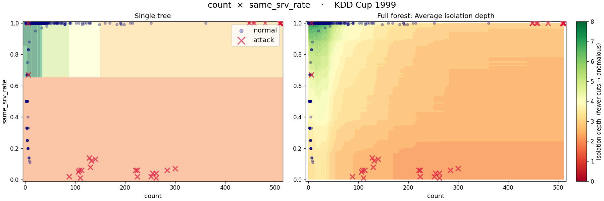
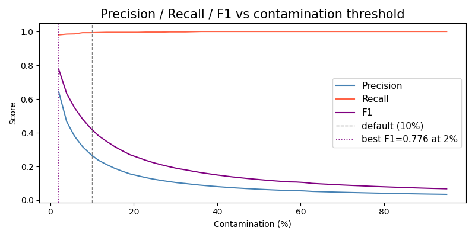

> **Navigation:** [<-- Anomaly Detection](03-anomaly-detection.md) | [Part Index](00-index.md) | [Main Index](../index.md) | [Part VIII: 3rd Pass — Deep Learning -->](../part-08-deep-learning/00-index.md)

---

# Isolation Forests

**Requires**: [Anomaly Detection](03-anomaly-detection.md) · [Random Forests](../part-05-supervised-learning/10-random-forests.md)

**Motivation**: Statistical baselines work well when anomalies deviate from a single feature's distribution.
However, real anomalies are often multivariate: Individual feature values may be plausible, but collectively they might not be. You need a method that captures this joint structure without assuming any particular distribution and without labeled examples to train on. Isolation forests do exactly that, and they generalize across problem types in a way that makes them a reliable first model-based choice.

> You will understand the core isolation idea: Why anomalies are structurally easier to isolate than normal points. You'll also learn how to evaluate an anomaly detector when labeled data is scarce or absent.

## Table of Contents

- [The Isolation Idea](#the-isolation-idea)
- [When to Use Isolation Forests](#when-to-use-isolation-forests)
- [Evaluating Anomaly Detectors](#evaluating-anomaly-detectors)
- [Summary](#summary)

## The Isolation Idea

**Isolation forests** are built on the same ensemble structure as random forests from [🖝 Random Forests](../part-05-supervised-learning/10-random-forests.md), just for a different purpose. Instead of growing trees to predict a target, they grow trees to measure how easy each observation is to isolate.

A single isolation tree is computed as follows: Pick a feature at random, then pick a split value at random within that feature's range. Repeat recursively until all individual observations end up isolated in leaves. What happens intuitively is:

- Anomalies are isolated quickly with just a few splits because they sit in sparse regions of the feature space.
- Normal observations are surrounded by neighbors and require many splits to separate them.

Formally, the number of splits required for an observation is its **isolation depth**. Averaging the isolation depth across many trees gives an average isolation depth.
The followig plot shows isolation depth for in a 2D feature space for a single isolation tree (left) and an isolation forest (right).

<p><center></center></p>

The `kddcup99` dataset contains labeled network connection records from a simulated Air Force LAN, tagged as normal or one of several attack types (DoS, probe, R2L, U2R). The two plotted features are `count` (connections to the same host in a 2-second window) and `same_srv_rate` (fraction of those hitting the same port), which together separate major attack families from normal traffic.

The average isolation depth across the forest becomes a continuous **anomaly score** by normalizing against the depth a typical point would reach: short relative depth scores near 1 (anomalous), long relative depth scores near 0 (normal). This normalization keeps the score comparable regardless of dataset size.

In `sklearn`, the `contamination` parameter sets the expected fraction of anomalies and determines where the threshold falls:

```python
from sklearn.ensemble import IsolationForest
iso = IsolationForest(contamination=0.05).fit(X_train)
labels = iso.predict(X_test)
```

Set `contamination` based on domain knowledge, or tune it against a labeled holdout if one is available.

---

## When to Use Isolation Forests

Two properties make isolation forests a reliable default for model-based anomaly detection.

- First, they make no distributional assumption: no assumed mean, spread, or shape. Therefore, they work directly on any given data.
- Second, they operate across all features simultaneously, so they catch anomalies that are unusual only in combination: a sensor reading that looks fine in isolation but is suspicious given what other sensors report at the same time.

This makes isolation forests a strong first choice when you have no labels (or very few), no strong prior on the distribution, and a moderately sized tabular dataset. When the normal pattern is highly complex or structured and isolation forests don't produce meaningful results, you may consider an autoencoder-based approach instead, see [🖝 Autoencoder-Based Detection](../part-08-deep-learning/06-autoencoder.md).

---

## Evaluating Anomaly Detectors

Evaluation is the hardest part of anomaly detection, because the data characteristics that make the problem interesting (rare events, few or no labels) also make standard metrics unreliable.

### When partial ground truth is available

If you have labeled anomalies, those labels should be held out before fitting the model (compare [🖝 Data Splits](../part-04-data-preparation/04-data-splits.md)). Beyond the general split philosophy to obtain fair evaluation results, the reasons is this:

> Anomaly detection models usually **only train on "good observations"**, allowing the model to discover new types of anomalies later, not just the ones for which already labels exist.

Anomalies are rare by definition. In a dataset where 1% of observations are anomalies, predicting "normal" for every single observation achieves 99% accuracy while detecting zero anomalies. Therefore, accuracy is useless under extreme class imbalance.

With a held-out labeled set, you can compute precision and recall across thresholds and choose the operating point that matches your use case (compare [🖝 Classification Evaluation](../part-05-supervised-learning/08-classification-evaluation.md)). 
The plot below shows an example for tuning the contamination parameter for the isolation forest on the `kddcup99` dataset:

<p><center></center></p>

The metrics precision and recall in the anomaly detection context read as:

- **Precision** is the fraction of flagged observations that are genuine anomalies. Low precision means many false alarms.
- **Recall** is the fraction of genuine anomalies that were flagged. Low recall may mean dangerous misses.

Which matters more depends on the cost of each error type. In predictive maintenance, a missed fault may mean an unplanned shutdown; a false alarm means an unnecessary inspection. In fraud detection, a missed fraud means financial loss; a false alarm means inconveniencing a legitimate customer.

### When no labels exist at all

In this scenario, standard classification metrics cannot be computed. The evaluation strategy becomes pure **domain validation**: show the flagged observations to a domain expert and ask whether they correspond to known problem patterns, edge cases, or genuinely surprising events.

Domain validation is the correct check for any anomaly detector operating in a new environment. Only a practitioner can tell you whether it is catching the right things.

> **Discussion:** You deploy an isolation forest on a manufacturing line and a domain expert reviews the first 50 flagged observations: 35 look like genuine anomalies, 15 look like normal production variance. How would you adjust your approach (e.g., the `contamination` parameter, the threshold, or the feature set)? And in what order?

*See also: [🖝 Autoencoder-Based Detection](../part-08-deep-learning/06-autoencoder.md) for when the normal pattern is highly complex and a deep learning approach to reconstruction error is warranted.*

---

## Summary

- Isolation forests isolate each observation by randomly splitting features. Anomalies, which sit in sparse regions, tend to be isolated in fewer splits than normal observations. The average isolation depth across many trees becomes the anomaly score.
- The method makes no distributional assumptions and operates in the full feature space, catching anomalies defined by combinations of features that no single-feature statistical baseline would detect.
- Accuracy is useless for anomaly detection under class imbalance. Use precision and recall with a labeled held-out set when labels exist.
- When no labels exist, domain validation (reviewing flagged cases with a domain expert) is the correct evaluation strategy.

As always: Happy learning, happy life! 🫶


---

> **Navigation:** [<-- Anomaly Detection](03-anomaly-detection.md) | [Part Index](00-index.md) | [Main Index](../index.md) | [Part VIII: 3rd Pass — Deep Learning -->](../part-08-deep-learning/00-index.md)

Script v1.4 (2026-06-10) · FGN
