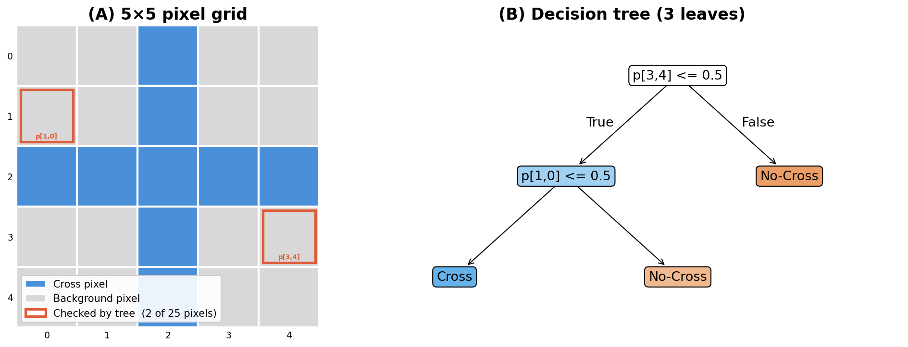

> **Navigation:** [Part Index](00-index.md) | [Main Index](../index.md) | [Building Blocks of Deep Networks -->](02-deep-networks.md)

---

# When Shallow Models Fail

**Requires**: [Start Simple](../part-06-reflection/02-start-simple.md)

**Motivation**: Throughout Parts V and VI, you built predictive models from structured data: each input feature already had a clear meaning, a measurement scale, and an interpretable relationship to the target. [🖝 Linear Regression](../part-05-supervised-learning/02-linear-regression.md), [🖝 Decision Trees](../part-05-supervised-learning/09-decision-trees.md), and [🖝 Random Forests](../part-05-supervised-learning/10-random-forests.md) are powerful tools within that setting. According to [🖝 Start Simple](../part-06-reflection/02-start-simple.md), these models should be tried first unless there is proper justification that they may not be well-suited for a task. For example, what happens when your input happens to be images of handwriting, a long-running sensor vibration data, or free-text notes? 

> In this nugget, you'll see the decision-boundary limits of linear models and trees, understand why hand-crafting features from raw signals quickly becomes infeasible, and learn how these limitations motivate the deep learning approach.

## Table of Contents

- [The Limits of Linear and Tree-Based Models](#the-limits-of-linear-and-tree-based-models)
- [The Need for Learned Features](#the-need-for-learned-features)
- [CRISP-DM Callback: Third Inner-Loop Pass](#crisp-dm-callback-third-inner-loop-pass)
- [Summary](#summary)

## The Limits of Linear and Tree-Based Models

A concrete example: classifying whether a 5×5 image (25 pixels) shows a cross. Let's consider using [🖝 Decision Trees](../part-05-supervised-learning/09-decision-trees.md) for such a task. Decision trees learn non-linear boundaries by splitting features one at a time. For tabular data this is effective. For pixel grids, the splits happen on individual pixel values: A split like "pixel (3,4) <= 0.5" is almost always meaningless in isolation. The tree has no structural prior about spatial locality: two adjacent pixels are no more related in its eyes than two pixels in opposite corners.

The issue described here is sometimes described as the **locality problem**: the information in an image is carried by local groups of pixels, not individual pixels. Any model that treats features as independent misses this structure entirely.

The same limitations apply to linear models like [🖝 Linear Regression](../part-05-supervised-learning/02-linear-regression.md) and [🖝 Logistic Regression](../part-05-supervised-learning/11-logistic-regression.md). They assume that the target depends on the features through a linear combination. When a boundary in the input space is a straight line (or hyperplane), linear models are well-suited. Even when the boundary is a "smooth" curve, you can often get close with manual [🖝 Feature Engineering](../part-04-data-preparation/01-feature-engineering.md): squaring a term, computing ratios, etc.

However, some boundaries are not well-behaved curves. They are interlocking regions, nested shapes, or patterns with spatial structure (like the pixels in images). When the domain becomes too complex, manual featuring engineering is often no longer feasible: It is no longer possible to enumerate all the relevant patterns.

---

## The Need for Learned Features

**Deep learning** replaces manually crafted features with **learned features**: the model itself discovers which patterns in the raw input are predictive, guided only by the training data and the loss function. You train a model that has to figure out the features itself.

This shift is what makes deep learning useful where simpler methods hit a wall: It applies to domains where the raw input has structure that matters, but that structure is hard to specify in advance. The main application domains break along input type:

| Input type | Examples | DL family |
|---|---|---|
| 2D images | Medical imaging, defect detection | [🖝 Convolutional Neural Networks (CNNs)](../part-08-deep-learning/03-cnns.md) |
| Text and sequences | Document classification, machine translation | [🖝 Transformers](../part-08-deep-learning/07-transformers.md) |
| Audio waveforms | Fault detection, speech | 1D CNNs, [🖝 Transformers](../part-08-deep-learning/07-transformers.md) |
| Time series | Sensor data, financial signals | [🖝 Convolutional Neural Networks (CNNs)](../part-08-deep-learning/03-cnns.md), RNNs, [🖝 Transformers](../part-08-deep-learning/07-transformers.md) |
| Tabular data | Most structured business data | Usually simpler methods first: [🖝 Start Simple](../part-06-reflection/02-start-simple.md) |

For tabular data with structured features with clear meanings (like age, weight, temperature, count), simpler methods almost always outperform a deep learning model _at the same data size_. This is not to say that deep learning will never be the best choice for such datasets: This is a rule of thumb.

> **Key insight:** Deep learning generally pays off when the raw input has spatial, temporal, or sequential structure that shallow methods cannot exploit AND enough training data is available.

> **Discussion:** You work with sensor data from a production machine. The raw signal is a one-second vibration waveform sampled at 10 kHz (10,000 values per sample). A domain expert says that faults produce a characteristic frequency pattern between 200 Hz and 400 Hz. Would you compute that frequency feature manually and pass it to a random forest, or would you train a deep learning model on the raw waveform? What information does each approach assume you have, and what do you give up?

---

## CRISP-DM Callback: Third Inner-Loop Pass

In [🖝 Supervised Learning](../part-05-supervised-learning/01-supervised-learning.md), you completed your first inner-loop pass through CRISP-DM. In [🖝 Unsupervised Learning](../part-07-unsupervised-learning/01-unsupervised-learning.md), you ran the loop again for the labelless setting. This part is your third pass. We'll build the concepts you need to navigate the deep learning regime.

Here are some typical questions to consider when heading for deep learning solutions:

- Are the inputs images, audio signals, or free text? If so, feature engineering by hand is likely to be the bottleneck.
- Is labeled training data available, or only unlabeled data? The answer changes whether you head toward supervised or unsupervised deep learning approaches (for example, [🖝 Autoencoders](../part-08-deep-learning/06-autoencoder.md) for unsupervised)
- What compute resources do you have? Deep learning models are more expensive to train and deploy than shallow models (although techniques like [🖝 Transfer Learning](../part-08-deep-learning/05-transfer-learning.md) help).

*See also: [🖝 Deep Learning in Practice: Choosing and Applying](../part-08-deep-learning/08-dl-in-practice.md) for a structured decision guide that uses these questions.*

---

## Summary

- On raw images, audio, and sequences, the information is in local relationships between inputs. Independence-assuming models like linear models and trees miss such local relationships.
- Manual feature engineering can work for structured, well-understood signals. It hits a ceiling when the number of relevant patterns is large or unknown.
- Deep learning learns its own features from raw inputs, which makes it the right tool for image, audio, text, and time-series problems at scale.
- This is your third inner-loop pass through CRISP-DM. The key new question in the Data Understanding phase is: does the raw input have spatial, temporal, or sequential structure that shallow methods cannot exploit?

As always: Happy learning, happy life! 🫶

---

> **Navigation:** [Part Index](00-index.md) | [Main Index](../index.md) | [Building Blocks of Deep Networks -->](02-deep-networks.md)

Script v1.5 (2026-06-24) · FGN
