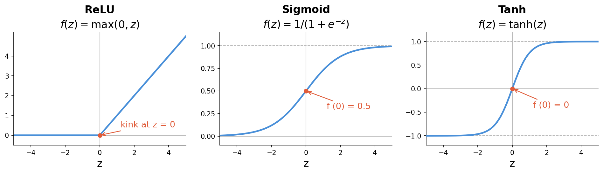
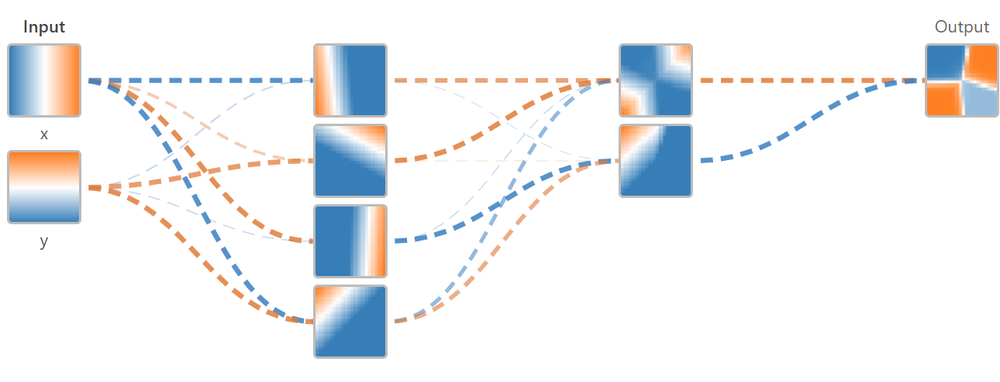

> **Navigation:** [<-- When Shallow Models Fail](01-when-shallow-fails.md) | [Part Index](00-index.md) | [Main Index](../index.md) | [Convolutional Neural Networks (CNNs) -->](03-cnns.md)

---

# Building Blocks of Deep Networks

**Requires**: [When Shallow Models Fail](01-when-shallow-fails.md)

**Motivation**: In [🖝 When Shallow Models Fail](../part-08-deep-learning/01-when-shallow-fails.md), you saw that learning features is usually necessary for raw images, audio, and sequences. "Learning features automatically" needs appropriate models. What is the smallest building block of a neural network, how do they gain the ability to learn complex features, and how do models update based on prediction errors?

> You'll see how a single neuron computes a prediction, how stacking neurons into layers builds increasingly abstract representations, and how backpropagation and gradient descent are used for adjusting weights (training). You will also meet some common techniques applied during training: dropout and early stopping. Both control overfitting in deep networks.

> **Interactive demo note:** You can play around with a simple classification neural network in the **Neural Networks** demo from my [✪ interactive data-science demos](https://github.com/fgnussbaum/ds-ml-interactive-demos) repository.

## Table of Contents

- [Single Neuron: Weighted Sum and Activation](#single-neuron-weighted-sum-and-activation)
- [Layers and Network Architecture](#layers-and-network-architecture)
- [Training: Backpropagation and Optimization](#training-backpropagation-and-optimization)
- [Summary](#summary)

## Single Neuron: Weighted Sum and Activation

A **neuron** takes a vector of inputs $\mathbf{x} = (x_1, x_2, \ldots, x_n)$, multiplies each input by a **weight** $w_i$, sums the results, adds a **bias** $b$, and passes the sum through a nonlinear function:

$$\begin{align*}
z &= w_1 x_1 + w_2 x_2 + \cdots + w_n x_n + b = \mathbf{w}^\top \mathbf{x} + b \\
a &= f(z)
\end{align*}$$

The function $f$ is called the **activation function**. It is the nonlinear element of deep networks. Without it, stacking neurons would still produce a linear model because any combination of weighted sums is itself a weighted sum. However, nonlinearity is crucial for being able to represent complex functions.

Two activation functions dominate modern practice:

- **ReLU** (Rectified Linear Unit): $f(z) = \max(0, z)$. Outputs $z$ for positive inputs, zero otherwise. Fast to compute, does not saturate for positive inputs, and trains well in deep networks. The practical default for hidden layers.
- **Sigmoid**: $f(z) = 1 / (1 + e^{-z})$, which squashes output to $(0, 1)$. Used for output neurons in binary classification to produce a probability score. It is rarely used elsewhere in neural networks today because gradients become very small for large $|z|$ (the saturation problem). A single neuron with a sigmoid output is essentially [🖝 Logistic Regression](../part-05-supervised-learning/11-logistic-regression.md).
- **Tanh**: $f(z) = \tanh(z)$, which squashes output to $(-1, 1)$. Zero-centered (unlike sigmoid), which can make learning slightly faster. Like sigmoid, it saturates for large $|z|$, so it is less common in deep hidden layers but still used in some recurrent networks.

With an activation function, the nonlinearity is already there. However, the power of neural networks comes from combining many neurons in layers.

---

## Layers and Network Architecture

When neurons are stacked side by side they form a **layer**. The output of one layer becomes the input to the next. A network with one or more intermediate layers between the inputs and the output is called a **deep network**, where "deep" refers to the number of layers.

Here's an example from the interactive demo: a fully connected network for binary classification, with one input layer of $2$ features, two hidden layers of neurons, and one output neuron with a sigmoid activation. The output is the model's predicted probability that the input belongs to the positive class.

To compute the output of a neural network, a **forward pass** is used. Computations flow from left to right: each layer transforms its input into a new representation by applying its weights and activation. Each transformation extracts more abstract structure from the input.

### Architecture choices

The example above is just one of many. For building actual applications with neurals networks, there are many architectures to choose frmo. Some work better than others, some are designed for specific prediction tasks and data domains.

> The architecture part of deep learning is essentially just about stacking together highly parametrized components to form expressive trainable functions. This is done in a sophisticated way.

Standard architectural choices include the numbers and types of layers, the number of neurons per layer, and the activation function at each layer. The output layer and the **loss function** are chosen jointly to match the prediction task:

- **Binary classification**: one output neuron with sigmoid activation, using binary cross-entropy loss as introduced in [🖝 Logistic Regression](../part-05-supervised-learning/11-logistic-regression.md).
- **Multi-class classification**: one output neuron per class with softmax activation (outputs sum to 1), using categorical cross-entropy as loss.
- **Regression**: one output neuron with no activation (linear output); loss is mean squared error as introduced in [🖝 Linear Regression](../part-05-supervised-learning/02-linear-regression.md).

As with all machine learning models already discussed in this course, the loss measures how "good" the network's predictions are. Training minimizes this loss across all examples by adjusting the weights, which are the trainable parameters.

---

## Training: Backpropagation and Optimization

Training adjusts all weights in the network to minimize the loss. This requires the gradient of the loss with respect to every weight. Intuitively, the gradient informs the optimizer which direction to step.

**Backpropagation** computes these gradients efficiently. Starting from the output, it applies the chain rule of calculus layer by layer, propagating the gradient signal backward through the network. The result is the exact gradient for every weight, computed in one backward pass.

<!-- Figure: the same fully connected network with arrows showing the forward pass (data flowing right) and the backward pass (gradient signal flowing left). Caption: "Forward pass computes predictions; backward pass propagates error gradients to every weight." -->

> **Note:** Backpropagation is not a learning algorithm on its own. It computes gradients. [🖝 Gradient Descent](../part-05-supervised-learning/03-gradient-descent.md)-like algorithms do the updating. The two work together: backprop computes the direction, the optimizer takes the step.

With gradients in hand, **gradient descent** updates each weight by a small step opposite to the gradient. This is the same algorithm from [🖝 Gradient Descent](../part-05-supervised-learning/03-gradient-descent.md), now applied to all parameters simultaneously.

The practical default optimizer for deep networks is **Adam** (Adaptive Moment Estimation). Adam extends gradient descent with per-parameter adaptive learning rates and momentum, which makes it converge faster on most tasks and requires less manual tuning of the learning rate.

To avoid overfitting during training, two standard techniques are:

- **Dropout** randomly zeroes a fraction of neurons during each training step, forcing the network to develop redundant representations rather than relying on individual neurons.
- **Early stopping** monitors validation loss during training and saves the model at its minimum.

> **Discussion:** Dropout adds noise to training; early stopping halts optimization before convergence. Both improve generalization despite seemingly making training worse or shorter. Why does adding noise or stopping early prevent overfitting, and what assumption about the training data do both interventions exploit?

---

## Summary

- A neuron computes a weighted sum of its inputs, adds a bias, and passes the result through an activation function. The nonlinearity, sigmoid for output probabilities and ReLU for hidden layers, is what allows networks to represent non-linear relationships.
- Deep networks stack neurons into layers. Architecture choices, number of layers, neurons per layer, and activation functions, determine the network's capacity. The output layer and loss function are chosen jointly to match the task: cross-entropy for classification, mean squared error for regression.
- The forward pass builds progressively more abstract representations. Backpropagation computes gradients for all weights simultaneously by applying the chain rule from output to input. Gradient descent, or in practice the Adam optimizer, uses these gradients to update all weights.
- Dropout and early stopping are standard training-time techniques to reduce overfitting.

As always: Happy learning, happy life! 🫶

---

> **Navigation:** [<-- When Shallow Models Fail](01-when-shallow-fails.md) | [Part Index](00-index.md) | [Main Index](../index.md) | [Convolutional Neural Networks (CNNs) -->](03-cnns.md)

Script v1.5 (2026-06-24) · FGN
