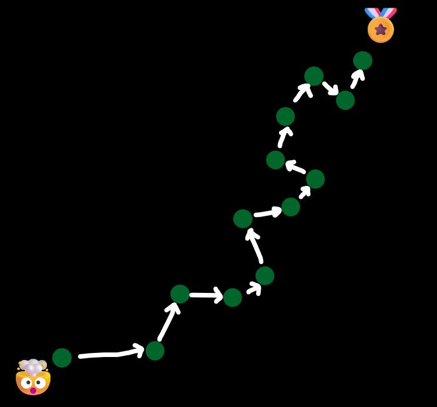
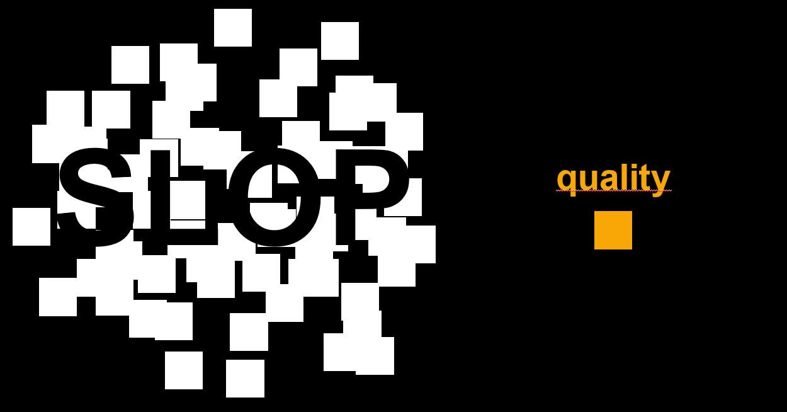

# Intro to Data Science & Machine Learning

This course builds practical data science skills for students from engineering backgrounds. You will learn to run a full data science project from question to conclusion, guided by the CRISP-DM process map throughout. By the end, you will be able to clean and explore a real dataset, train and evaluate models, and communicate results honestly.

---

## Parts

| Part | Topics | Nuggets |
|------|--------|---------|
| [Part I: The Big Picture](part-01-the-big-picture/00-index.md) | AI and data science definitions, CRISP-DM process map, academia vs. business DS | 5 |
| [Part II: Personal Data-Science Projects](part-02-personal-projects/00-index.md) | Why a personal project, idea generation, feasibility checking, scoping a result | 4 |
| [Part III: Data Understanding](part-03-data-understanding/00-index.md) | Data work reality, attribute types, exploratory data anlysis (EDA) | 9 |
| [Part IV: Data Preparation](part-04-data-preparation/00-index.md) | Train-test splits, transformations, cleaning and encoding, data-processing pipelines | 6 |
| [Part V: 1st Pass: Supervised Learning](part-05-supervised-learning/00-index.md) | Regression, decision trees, classification evaluation, random forests | 8 |

TBD

---

## About Learning: Becoming Good at Something

When learning something new and challenging, consistency is key.

There's no _magic_ abbreviation to learning skills: unlike the magic trick I showed you in class.

- Even "intelligent" AI tools don't provide a shortcut to **your personal** skill mastery, which needs to be earned the classic way: taking on the cognitive challenges that the learning journey brings to the table.
- This is true for this course and data science. In fact, it is true for any skill.

Grow beyond yourself. But while doing so, it's important to enjoy the journey.

Therefore, as always: Happy learning, happy life! 🫶

---

## How to Read This Course

### Linear Path

Following the parts in order, nuggets in sequence within each part. This is the safest path through the material.

### Reading with a Goal

- For project reference, use the Part indexes to find the nugget that covers your current problem step.
- For exam preparation... well, we'll come to that.

---

## AI Usage: Transparency Note (human-written)

_Parts_ of this course have been edited and pre-drafted using AI. This allowed me to scale my writing efforts: without, I wouldn't be able to present this script, certainly not yet.
When using AI tools, I aim at carefully reviewing content. I usually let AI execute steps following precise instructions - and have it take care of overall formating and consistency. The overall course structure is not AI at all: It's guided by  purely human intend. I baked into this course what my experience called out to be necessary for **practical** learning.

Using AI to write, draft, and edit texts is a process that needs careful consideration and rigorous quality checks. It's much like what you'll learn yourself in this course: For anything to be done, **the process matters a lot**. A good process is a gate for quality. Done carelessly, it's easy to arrive at what's called "AI slop".

I'm trying to teach you to choose your side wisely.

We'll discuss AI policy in class, too. In general, AI usage is allowed, as long as it does not hinder learning goals, specifically your hands-on understanding.

In this light, writing this course script with AI help, also has to be a good "leading example". After all, using AI tools is something that I expect to remain in the future of work. Let's just try to do it the good way.

> In any case, this script may contain errors. I as human take full responsibility. If you notice errors or inconsistencies, please let me know. I'm happy to revise.